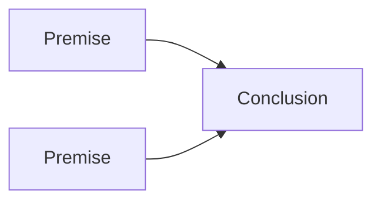

# Logic Is the Skill Under Everything

## You already do this all day

You reason constantly. You probably haven't noticed, because it happens
underneath your attention, like breathing.

A bug appears in your app. Your first thought: "It worked yesterday, and the only
thing that changed is the new code, so the bug must be in there." You read a
headline and something flags it as unfair before you can say why. You write
`if (user.isLoggedIn)` and your brain accepts that the two branches cover every
case. None of that felt like a special skill. It felt like thinking.

You've done this your whole life, and almost certainly no one ever told you what
it actually *is*. You learned arithmetic. You learned grammar. But the thing
running under both — the machinery that decides whether one thought *earns* the
next — usually gets skipped.

This guide is about that machinery.

## What logic actually is

Logic is the study of **what follows from what**.

That's the whole center of it. Given that some things are true, what *else* must
be true? If you accept these starting points, are you forced to accept this
conclusion — or did someone slip something past you?

📝 **Logic** — the study of valid inference: how conclusions follow from
statements (called *premises*) we're treating as true. It's about the *form* of
reasoning, not the subject matter.

Two things logic is *not*. Clearing these away early will save you a lot of
confusion.

Logic is **not about being clever**. Being quick, knowing a lot of facts, winning
arguments — that's something else. Plenty of brilliant people reason badly, and
plenty of careful, unflashy people reason beautifully. Logic is a discipline, not
a personality trait, which is why it can be taught and learned.

Logic is **not about the facts themselves**. This one surprises people. Logic
doesn't care, on its own, whether "it rained last night" is *true*. It cares about
the *connection*: **if** it rained last night, **then** the streets are wet — does
that hold together? The facts are the bricks. Logic is the mortar. It studies the
joints between statements, not the statements in isolation.

💡 **The mental model to keep:** logic lives in the *connections* between
statements, not in the statements. Think of a circuit. The facts are the
components; logic is whether the wires actually carry current from one to the next.

## "Following from" is not the same as "true in the world"

This distinction is the heart of everything that comes later, so let's make it
concrete now (Phase 2 goes deeper).

You can ask two completely different questions about a piece of reasoning:

1. Are the starting statements actually *true*? (That's about evidence, facts,
   knowledge of the world.)
2. *If* they were true, would the conclusion be *forced*? (That's logic.)

These come apart in every combination. You can reason flawlessly from a false
starting point and reach a false conclusion — the *reasoning* was still valid. You
can also stumble onto a true conclusion through garbage reasoning and get lucky.
Logic owns question 2 and only question 2.

```text
Premise:  All birds can fly.
Premise:  A penguin is a bird.
-------------------------------------------
Conclusion: A penguin can fly.
```

The conclusion is false in the real world — penguins don't fly. But notice: *if*
the two premises were true, the conclusion would be unavoidable. The reasoning is
airtight; one of the premises is wrong. That gap — between "follows correctly" and
"actually true" — is the single most useful thing logic gives you. It lets you
locate *exactly* where an argument breaks instead of vaguely feeling that
something's off.

## Reasoning versus persuasion

Something can *feel* completely convincing without being logically sound.
Confidence does it. Repetition does it — say a thing often enough and it starts to
feel established. Charisma, a good story, a clever turn of phrase, the sheer speed
of someone talking — all of these can carry a claim straight past your defenses,
and none of them have anything to do with whether the conclusion actually follows.

That's persuasion. Persuasion is about what *moves* you. Logic is about what's
*earned*. They overlap sometimes, which is why the difference is easy to miss.

⚠️ The danger isn't cartoon villains. It's that fluent, confident, emotionally
satisfying nonsense is everywhere — in ads, in arguments, in your own head at 2
a.m. — and it doesn't announce itself. The only reliable way to catch it is to
quietly ask, every time: *does the conclusion actually follow from what was given,
or does it merely feel like it should?*

This is why logic is a kind of self-defense. A person who treats "feels true" and
"is logically supported" as two separate things is genuinely harder to manipulate.
Not because they're cynical — because they have a place to *stand*. They can take a
claim apart at the joints and see whether it holds, no matter how good it sounds.

## Why it's the foundation under everything

Once you can see logical structure, you start seeing it everywhere, because it
*is* everywhere.

- **Math** is built on proof, and a proof is nothing but a chain of "this follows
  from that" pinned down so tightly there's no room to wriggle. (Its sister
  foundation, [why math isn't your enemy](/guides/why-math-isnt-your-enemy),
  comes at the same machinery from the number side.)
- **Code** is built on booleans and conditionals. `&&`, `||`, `if`, `while` — your
  programming language is a logic notation that happens to also run. More on this
  below.
- **Every argument** you'll ever evaluate — a pull-request justification, a
  political claim, a medical pamphlet, a pitch — has a logical skeleton under the
  words. Learn to see the skeleton and you can judge the argument on its merits
  instead of its volume.

Learn logic once, and it doesn't stay in one subject. It transfers. That's what
makes it worth the time: it's not another fact to memorize, it's a lens you carry
into every other thing you'll ever study.

Here's the shape of the thing itself:



*Premises flow into a conclusion through an inference — the arrow is logic itself,
the claim that these statements, if true, support that one.*

## A note for the AI era

AI systems now produce fluent, confident, well-structured text faster than any
human can. That's genuinely useful. But *fluent* is not the same as *correct*, and
a system that writes a flawless-sounding paragraph can still hand you a conclusion
that doesn't follow from its own premises — sometimes wrapped in language so smooth
the gap is hard to spot.

So the old human skill — pausing to ask "wait, does this actually follow?" —
doesn't get less important as the machines get more fluent. It gets *more*
important, because there's now far more fluent material flowing past you and the
fluency is no longer a signal of care. The ability to check the joints yourself is
the part that stays yours.

## For builders

If you write code, you already practice logic professionally, whether or not you
ever called it that.

Every `if` statement is a logical claim: *if this condition holds, that follows.*
Every test assertion says *given this input, this output must be true.* Every
boolean expression — `isAdmin && !isLocked`, `count > 0 || force` — is a small
piece of formal logic, evaluated not by a tired human nodding along but by a
machine that takes it *completely literally*.

That literalness is the gift and the trap. A program is a stack of logical claims
the computer will follow exactly, with zero charity. It won't be persuaded by what
you *meant*. If your conditional doesn't cover the empty-list case, the machine
won't politely assume you'd have handled it — it'll do exactly what the logic says
and break. Most bugs you'll ever chase are, at bottom, a place where the logic you
*wrote* and the logic you *intended* quietly disagreed.

🪖 Every senior engineer has stared at a screen muttering "but that's impossible" —
and been wrong. The machine was right; it always is about its own logic. The
conclusion really did follow from the premises. The bug was that one premise
wasn't what they thought. Learning to find *that* — the false premise hiding inside
reasoning that runs perfectly — is most of debugging, and it's pure logic.

## Recap

- Logic is the study of **what follows from what** — given some truths, what else
  is *forced*.
- It's **not** about being clever, and it's **not** about the facts themselves.
  It lives in the **connections** between statements.
- "Follows correctly" and "true in the world" are different questions. Logic owns
  the first one, and keeping them separate is what lets you find *where* an
  argument breaks.
- Persuasion is about what moves you; logic is about what's earned. Knowing the
  difference is real self-defense against fluent nonsense — human or machine.
- It's the foundation under math, code, and every argument you'll judge — and it's
  a learnable skill, not a gift.

## Open-ended exercise

Write out, in plain English, the logical structure of this argument:

> "The tests passed on staging, so the deploy is safe."

Identify the premises, the conclusion, and whether the reasoning is deductive,
inductive, or abductive. Then ask: is the conclusion *guaranteed* by the premises,
or only *supported* by them? The answer determines what kind of certainty you actually
have.

Quick gut-check before you move on:

```quiz
[
  {
    "q": "At its core, what does logic study?",
    "choices": [
      "Which facts about the world are actually true",
      "What follows from what — whether a conclusion is forced by its premises",
      "How to win arguments and sound convincing",
      "How smart or quick-witted a person is"
    ],
    "answer": 1,
    "explain": "Logic is the study of valid inference: given some statements treated as true, what else must be true. It's about the connections, not the facts themselves or cleverness."
  },
  {
    "q": "An argument is delivered with total confidence, repeated several times, and feels deeply convincing. What does that tell you about whether its conclusion logically follows?",
    "choices": [
      "It's almost certainly sound — confidence and repetition are evidence",
      "Nothing — feeling convincing is persuasion, which is separate from whether the conclusion follows",
      "It's logically valid as long as no one objects",
      "It depends on whether the speaker is an expert"
    ],
    "answer": 1,
    "explain": "Confidence, repetition, and charisma are persuasion. They can make false reasoning feel true. Logic asks only whether the conclusion is actually earned by the premises."
  },
  {
    "q": "Consider: 'All birds can fly. A penguin is a bird. Therefore a penguin can fly.' What's the most accurate description?",
    "choices": [
      "The reasoning is broken because the conclusion is false in the real world",
      "It's a good argument because penguins are birds",
      "The reasoning is valid — the conclusion follows — but a premise is false, so the conclusion is false",
      "Logic can't say anything about it without more facts"
    ],
    "answer": 2,
    "explain": "The conclusion genuinely follows from the premises, so the reasoning is valid. The problem is the premise 'all birds can fly' is false. Logic studies the connection; truth-in-the-world is a separate question."
  }
]
```

[← Guide overview](_guide.md) · [Phase 2: Statements, Truth, and Validity →](02-statements-truth-and-validity.md)