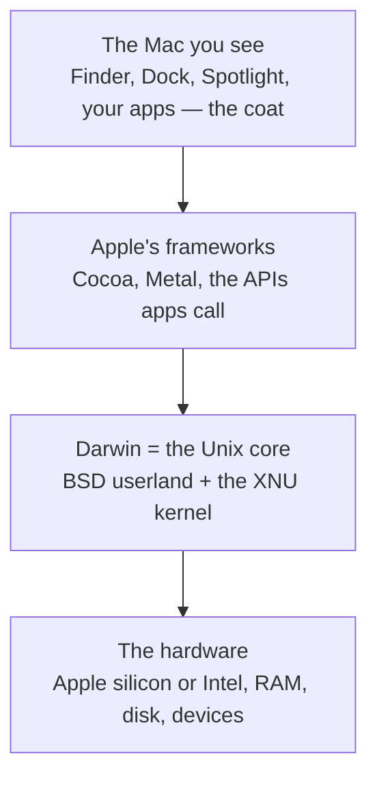

# macOS Is Unix

Here's the single idea this whole guide rests on, and it surprises almost everyone: **macOS is a real
Unix system.** Not "Unix-like as a marketing word" — it's a certified Unix that happens to ship with the
nicest desktop in the business bolted on top. The Finder, the Dock, the gorgeous animations: those are
the coat. Underneath is the same family of machine that runs most of the internet's servers.

Once you believe that, a hundred small mysteries resolve at once — why Terminal feels like Linux, why
developer tools "just work," why your files secretly live at paths like `/Users/you`. Let's build the
picture from the bottom up.

## The layers under the Mac

Apple has a name for the open-source Unix core of macOS: **Darwin**. Picture the Mac as layers, the
same three-layer stack from [What an Operating System Is](/guides/what-an-operating-system-is), but with
Apple's actual names filled in:



**What it actually is.** *Darwin* is the foundation layer — an open-source Unix operating system that
Apple develops and releases. macOS (and iOS, iPadOS, and the rest) are Darwin plus Apple's closed,
beautiful upper layers. When people say "macOS is Unix underneath," Darwin is the underneath they mean.

📝 **Terminology.** *Userland* = everything that runs in user space (the programs, command-line tools,
and libraries) as opposed to the kernel. Darwin's userland comes largely from **BSD** — a venerable
branch of the Unix family tree — which is why the commands on a Mac behave like classic Unix commands.

## The XNU kernel: where the heritage shows

At the center of Darwin is its kernel, named **XNU**. Remember from the OS guide that the kernel is the
core program that actually controls the hardware and enforces every rule. XNU is the Mac's.

**Why people get this wrong.** People assume macOS and Linux must share a kernel because the terminals
look identical. They don't. **Linux uses the Linux kernel; macOS uses XNU.** What they *share* is the
Unix design and the BSD-style commands sitting on top — the userland, not the engine. That distinction
matters later: a binary compiled for Linux won't run directly on macOS, even though `ls` and `grep` feel
the same, because the kernel underneath is different.

📝 **Terminology.** *XNU* is the macOS kernel. (The name is a self-deprecating recursive joke from its
authors — "X is Not Unix.") It blends a Mach microkernel core with BSD components, which is why Darwin
carries so much BSD DNA.

💡 **Key point.** macOS and Linux are **siblings, not the same person.** Both are Unix-family systems
with similar command-line worlds, but they have *different kernels*. Learn the shared Unix model once and
you can move between them fluently — just don't expect their internals (or their binaries) to be
interchangeable.

## The real filesystem hiding under Finder

Open a Finder window and you see Documents, Desktop, Downloads, AirDrop, iCloud — a friendly,
curated view. That view is a *lie of kindness*. Finder is deliberately hiding the actual Unix filesystem
underneath, because most people never need it. But it's right there, and it's a textbook Unix layout.

Open Terminal and ask where the top of the world is:

```console
$ cd /
$ ls -F
Applications/   System/         private/        usr/
Library/        Users/          sbin/           var@
bin/            opt/            tmp@
cores/          dev/            etc@
```
*What just happened:* You moved to `/` — the **root** of the filesystem, the single top folder
everything else hangs beneath. (Unix has no `C:` drive; there's one tree, and `/` is its trunk.) The
`/` after a name means "this is a folder"; the `@` means "this is a symbolic link" — a signpost pointing
elsewhere. Several of these are pure classic Unix.

Here's what the important ones are, in plain terms:

| Path | What lives there |
|---|---|
| `/` | **Root** — the top of the single filesystem tree. Everything is under here. |
| `/Users` | Home folders — yours is `/Users/yourname` (what Finder calls "Home"). |
| `/Applications` | Your `.app` programs (more on what those *really* are in Phase 2). |
| `/System` | Apple's own OS files. Protected and read-only — you can't edit these (Phase 3 explains why). |
| `/Library` | System-wide app support, preferences, and fonts shared by all users. |
| `/usr` | Classic Unix: command-line programs and libraries. `/usr/bin` holds `ls`, `grep`, `python3`… |
| `/bin`, `/sbin` | The most essential commands (`bash`, `ls`, `cp`) and system binaries. |
| `/etc` | System configuration files (it's a symlink to `/private/etc` on macOS). |
| `/var`, `/tmp` | Variable data (logs, caches) and temporary scratch space (both symlinks to `/private/...`). |
| `/opt` | Optional add-on software — Homebrew lives here on Apple silicon (Phase 2). |
| `/dev` | "Devices as files" — your disks and terminals appear here as file-like entries. |

⚠️ **Gotcha: this is the same layout you'd see on Linux — with a Mac accent.** `/usr`, `/etc`, `/var`,
`/bin` are straight out of the Unix tradition and mean the same thing on a Linux server. But macOS adds
its own capitalized folders (`/Users`, `/Applications`, `/Library`, `/System`) where Linux would use
lowercase (`/home`, and no direct equivalents). So it's *recognizably* Unix, not *identically* Linux.
Don't assume a path you memorized on Linux (`/home/you`) exists here — on a Mac it's `/Users/you`.

🪖 **War story.** The first script I copied from a Linux tutorial onto my Mac failed instantly: it wrote
to `/home/me/output.log`, and there is no `/home` on a stock Mac. Two minutes of confusion, then the
realization — *oh, my home is `/Users/me`.* That one swap (`/home` → `/Users`) is the single most common
papercut for a Linux person sitting down at a Mac, and now it'll never get you.

You can prove your home folder to yourself:

```console
$ echo $HOME
/Users/ada
$ cd ~
$ pwd
/Users/ada
```
*What just happened:* `$HOME` is the environment variable holding your home folder's path, and `~` is
shorthand for it. On this machine the user is `ada`, so home is `/Users/ada` — exactly the friendly
"Home" Finder shows you, just spelled in its true Unix path. Finder and the Terminal are looking at the
*same* filesystem; they're only two windows onto one tree.

**Why this saves you later.** Every confusing macOS moment that follows — "where did Homebrew put that?",
"why can't I edit this file?", "what's a `.plist`?" — is really a question about *this* filesystem. Once
you can see the real tree instead of Finder's curated highlights, you can navigate the Mac the way a
senior does: by knowing where things actually are.

## Recap

1. macOS is a **real Unix system**: Apple's open-source core is called **Darwin**, and the Mac is Darwin
   plus Apple's beautiful upper layers.
2. Darwin's kernel is **XNU** (Mach + BSD). It is *not* the Linux kernel — macOS and Linux are Unix
   **siblings with different kernels**, which is why the terminals feel alike but binaries don't transfer.
3. The Terminal feels like Linux because Darwin's **userland is BSD/Unix** — the same commands and the
   same filesystem shape.
4. Beneath Finder's friendly view is a **real Unix filesystem**: one tree rooted at `/`, with `/Users`,
   `/usr`, `/etc`, `/System` and friends. Your home is `/Users/you`, not `/home/you`.

Next, we'll use this map to answer the most surprising "where do things live?" question on the Mac — what
a `.app` *actually* is, and the maze of `Library` folders.

---

[← Guide overview](_guide.md) · [Phase 2: Apps, Bundles & Where Things Live →](02-apps-bundles-and-where-things-live.md)
