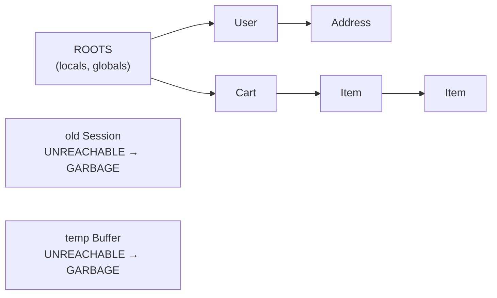
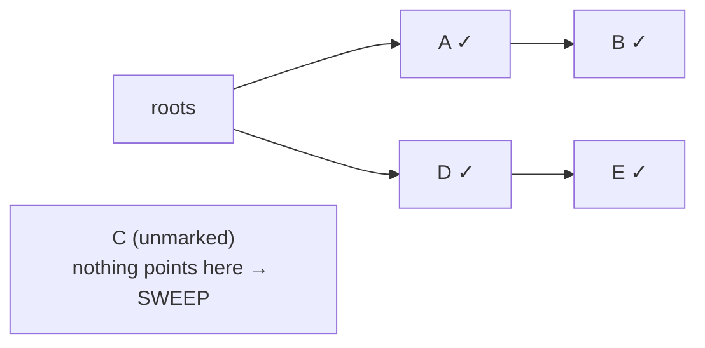

# How Garbage Collection Actually Works

We've established *that* a garbage collector reclaims unused objects for you. Now the question that makes the whole thing click: how does it know which objects are unused? It can't read your intentions. It can't tell that you're "done" with an object. So it uses a definition that's both simpler and more reliable than intention — and once you have that definition, GC pauses and the surprising persistence of memory leaks both fall right out of it.

## The core idea: reachability

**What it actually is.** The garbage collector doesn't ask "is this object still *needed*?" — it can't know that. It asks a question it *can* answer mechanically: **"can the program still reach this object?"** If there's any chain of references leading from a live variable to the object, it's kept. If no such chain exists, the program has no way to ever touch that object again — so it's **garbage**, and safe to reclaim.

The chains start from a set of always-live places called the **roots**: your currently-running functions' local variables (the stack), global variables, and a few other runtime-held references. The collector starts at the roots and follows every reference, and every reference *those* objects hold, and so on — tracing the whole web of things you can still get to.

📝 **Terminology.** *Reachable* = there exists a chain of references from a root to the object. *Roots* = the starting points the collector trusts as live (local variables on the stack, globals, etc.). *Garbage* = a heap object that is **not** reachable from any root.



💡 **Key point.** Garbage isn't "stuff you're finished with." It's "stuff you can no longer *reach*." Those are usually the same thing — but the gap between them is exactly where leaks hide, as we'll see at the end.

## Mark-and-sweep, gently

The oldest and most intuitive way to act on reachability is **mark-and-sweep**. Real collectors today are far more elaborate, but almost all of them are sophisticated variations on this same two-step dance, so it's the right thing to picture.

**Step 1 — Mark.** Start at the roots. Follow every reference, marking each object you reach as "in use." Follow the references *those* objects hold, and so on, until you've visited everything reachable. When you're done, every reachable object wears a mark; everything unmarked is, by definition, unreachable.

**Step 2 — Sweep.** Walk through the heap and reclaim every object that *isn't* marked. Those are the unreachable ones — the garbage. Their memory goes back to the pool for reuse. Then clear all the marks, ready for next time.



*MARK: trace from the roots and flag everything reachable (A, B, D, E get a ✓). SWEEP: reclaim everything without a ✓ — here, C — and its memory is free again.*

*What this buys you:* the collector never has to understand your program's logic. It just answers "reachable or not?" mechanically and reclaims the rest. That's why you can create objects with abandon and trust they'll be cleaned up — the cleanup rule doesn't depend on you remembering anything.

## Why a garbage-collected program can hiccup

Here's where the cost from Phase 2 gets concrete. To trace reachability *correctly*, the collector often needs the object graph to hold still while it works — if your code kept rearranging references mid-trace, the collector could miss things or reclaim something live. The simplest way to guarantee a stable snapshot is to briefly **stop your program from running** while the collector does its job. That moment is a **stop-the-world pause** (often shortened to "GC pause").

📝 **Terminology.** A *stop-the-world pause* is a moment when the runtime suspends your application code so the garbage collector can work on a stable view of memory. Your program is frozen for the duration — usually milliseconds, but real.

**Why this matters in real life.** This is the precise reason a Java service can show a latency *spike* under load while its average is fine, or why a game written in a GC language can drop a frame now and then. The program isn't broken and it isn't slow on average — every so often it's paused while the collector runs, and any request that lands during that pause waits it out.

⚠️ **Gotcha.** Don't picture an old "freeze for a full second" collector — modern collectors (Go's, the JVM's G1/ZGC, V8's in Node and browsers) work *hard* to keep pauses tiny, doing much of their work concurrently while your program runs and only stopping the world for brief moments. The pauses are usually small enough to ignore. But "usually small" isn't "never" — and when you're chasing a rare tail-latency spike, "is this a GC pause?" is a question worth asking, not dismissing.

This is also the honest answer to "is a garbage collector slower?" Not in a way most programs notice. But it spends some CPU on collection and introduces those occasional pauses — which is exactly the timing cost we put on the trade-off table in Phase 2.

## The uncomfortable truth: leaks still happen

Here's the part that surprises people, and it's the most useful thing in this guide. A garbage collector frees you from use-after-free and double-free — but it does **not** make memory leaks impossible. Go back to the key point: the collector keeps everything **reachable**. So if your program holds a reference to an object you're truly finished with, the collector sees a live chain to it and dutifully keeps it. Forever, if you let it.

A leak in a GC language isn't "forgot to free." It's **"forgot to let go."** You're keeping a reference, somewhere, to something you no longer need — so it stays reachable, so it never gets collected, so memory creeps up.

**The classic cause: the collection that only grows.** The textbook example is a long-lived container that you keep adding to and never remove from:

```javascript
const cache = {};   // lives for the whole life of the program

function handleRequest(req) {
  // We stash every request's data, keyed by a unique id...
  cache[req.id] = req.payload;
  // ...but we never delete old entries. cache grows forever.
}
```
*What just happened:* Every request adds an entry to `cache`, and nothing ever removes one. Because `cache` is reachable from a root (it's a global-ish long-lived variable) and `cache` references every payload it ever stored, *every payload stays reachable* — so the collector, correctly, never reclaims any of them. The garbage collector is doing its job perfectly. Your program is the one holding on. Memory climbs request after request: a textbook leak, in a "memory-safe" language.

This is the GC-language version of the slow-growth-then-crash you can read about in [What "Out of Memory" Really Means](/guides/processes-memory-and-cpu) — resident memory that climbs and never comes back down even when the app is idle.

🪖 **War story.** A long-running Node service got mysteriously slower and heavier every day until a nightly restart "fixed" it. No crash, no error — just memory creeping up and GC working harder and harder over a bigger and bigger live heap. The cause was a module-level object used as a cache, keyed by user session, that nobody ever evicted from. Each day's users were, technically, still reachable. The collector was blameless; the code never let go. The fix wasn't "tune the GC" — it was bounding the cache (evict old entries / use a size limit). Once you know leaks come from *holding references*, you go looking for the thing that's holding on, not for a flag to flip.

**The cure.** Because the disease is "holding a reference too long," the cures are all variants of "let go":

- **Remove entries** from long-lived collections when you're done with them (`delete cache[id]`, `map.remove(key)`, clear the list).
- **Bound your caches** — cap the size, or use an eviction policy (LRU) so old entries leave on their own.
- **Drop listeners and callbacks** you registered. A forgotten event listener keeps its whole closure — and everything *that* references — alive. (This is the most common leak in front-end JavaScript.)
- **Use weak references** where the language offers them (`WeakMap`/`WeakSet` in JS, weak references in Java/Python) when you want to reference an object *without* keeping it alive on that account.

⚠️ **Gotcha.** The tell for this kind of leak is the same one from the OOM guide: not a big number at a single moment, but **resident memory that climbs and never falls** even when the app is idle. If a long-running process gets heavier over hours or days, suspect a collection or a listener list that only ever grows.

## Recap

1. **Reachability is the whole idea.** The collector keeps every object reachable from a **root** (locals, globals) and treats the rest as **garbage** — not "what you're done with," but "what you can no longer reach."
2. **Mark-and-sweep** is the intuitive mechanism: trace from the roots and mark everything reachable, then sweep away everything unmarked. Modern collectors are clever variations on this.
3. **GC pauses** (stop-the-world) happen because the collector needs a stable view of memory; they're why a GC'd program can hiccup. Modern collectors keep them small, but "small" isn't "zero."
4. **Leaks still happen in GC languages** — not from forgetting to free, but from **forgetting to let go**: a live reference (an ever-growing cache, a forgotten listener) keeps an object reachable, so it's never collected.
5. **The cure is to release references:** remove from long-lived collections, bound caches, drop listeners, reach for weak references. The tell is resident memory that climbs and never comes back down.

You now have the mental model the whole topic rests on. When you create an object, you can picture where it lives (the heap), who's responsible for cleaning it up (you, or the collector), and — in the automatic world — exactly how the collector decides what to keep and why your program might occasionally pause or quietly leak. None of it is folklore anymore.

> **Where next.** This guide is the concept level. The deep, practical layer — reading GC logs, generational collection, choosing and tuning a collector, sizing a heap — is genuinely language-specific and deserves its own follow-up. For the foundations beneath this one, the rest of [What Actually Happens When Your Code Runs](/guides/what-happens-when-code-runs) and [Processes, Memory & the CPU](/guides/processes-memory-and-cpu) are the right neighbors.

---

Allocate objects, drop a root, then run the collector to see mark-and-sweep decide what lives and what gets freed:

```playground-gc
```

[← Phase 2: Manual vs Automatic Memory](02-manual-vs-automatic.md) · [Guide overview](_guide.md)
