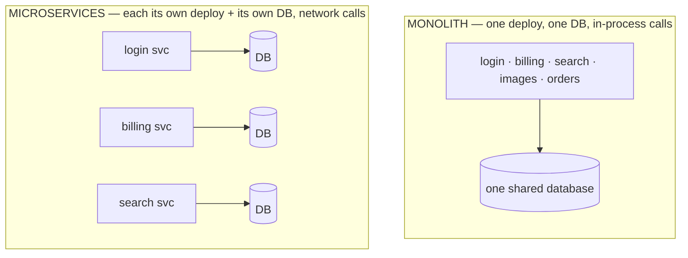

# Microservices

If the monolith strains when one big team shares one deploy and one part needs different scaling, the obvious move is to *split it up*. That's what microservices are: a direct answer to those two strains. The answer works — and it arrives with a bill that the brochures tend to leave off. Let's read both halves honestly.

## What microservices actually are

**What it actually is.** Microservices are **many small applications, each built, deployed, scaled, and owned independently**, that talk to each other over the network. Instead of one process with a billing module, you have a *billing service* — its own codebase, its own deploy, often its own database — that other services call over HTTP or a message queue.

**Why people get this wrong.** The wrong picture is "microservices are just a monolith chopped into folders." The defining change isn't the chopping — it's that **the calls between pieces are now network calls between separately-deployed programs**, not function calls in one process. That single shift is the source of every benefit *and* every cost on this page. Hold onto it.

Here is the same checkout system from Phase 1, now as services:



The lines that used to be free function calls inside one box are now arrows crossing a network between boxes. Everything that follows comes from that.

## Where microservices genuinely shine

These are real wins, and they map directly onto the monolith's two strains plus one bonus.

**Independent scaling.** That CPU-hungry image-processing endpoint from Phase 1? As its own service, you run more copies of *just it* — and leave login and billing at one copy each. You pay for the resources the hungry part needs, and nothing else.

```console
$ kubectl scale deployment image-service --replicas=10
deployment.apps/image-service scaled
$ kubectl get deployments
NAME            READY
image-service   10/10
billing-service 1/1
login-service   1/1
```
*What just happened:* You scaled only the image service to ten copies; billing and login stayed at one each. This is the headline benefit — resources go exactly where the load is, instead of duplicating the whole app to feed one hungry slice.

**Independent deploys and team autonomy.** Each service ships on its own schedule. The billing team can deploy ten times a day without touching the search team's code or release. A risky change in one service can't block an urgent fix in another, because they're different artifacts. For a large organization, this is often the *real* reason to adopt microservices — it's an org-structure win as much as a technical one.

**Fault isolation.** If the search service crashes, it crashes alone. The rest of the system can keep serving — checkout still works, login still works — as long as you've designed the callers to tolerate search being down. In a monolith, a memory leak in one module can take down the whole process; here, the blast radius is one service.

## The costs people underplay

This is the half that gets skipped, and it's where teams get hurt. None of these are dealbreakers — they're the price of admission, and you should know the price before you buy.

**Network calls everywhere.** Every arrow in that diagram is now a network round-trip that can be slow, can time out, or can fail entirely while the rest keeps running. A function call in a monolith either returns or throws. A network call has a third outcome the monolith never had: *no answer at all.*

```console
$ curl http://billing-service/charge
curl: (28) Operation timed out after 30000 milliseconds
```
*What just happened:* The order service asked billing to charge a card and got... nothing — not success, not a clean failure, just silence. Did the charge go through? You genuinely don't know. Every service-to-service call needs timeouts, retries, and a plan for "I'm not sure what happened," which is code and complexity that doesn't exist in a monolith.

**Distributed debugging.** Remember the single clean stack trace from Phase 1? It's gone. One user request now hops through five services, each with its own logs, on its own machine. To reconstruct what happened you need to stitch those logs together — which means every request must carry a shared **correlation ID** so you can find all its pieces.

> 📝 **Correlation ID** — a unique value attached to a request when it enters the system and passed along to every service it touches, so you can search all the scattered logs for that one ID and reassemble the request's full journey. In a monolith you never needed one; across services it's mandatory.

```console
$ grep "req-9f2a1c7" logs-from-all-services/*.log
gateway.log:  req-9f2a1c7  POST /checkout  -> order-service
order.log:    req-9f2a1c7  calling billing-service
billing.log:  req-9f2a1c7  charge OK
order.log:    req-9f2a1c7  calling inventory-service
inventory.log:req-9f2a1c7  TIMEOUT
```
*What just happened:* You searched every service's logs for one correlation ID and reassembled the request by hand. The failure was inventory timing out — but finding that took grepping five log files instead of reading one stack trace. This is doable with good tooling (distributed tracing), but it's real work you now have to build and maintain.

**Data consistency across services.** This is the deepest cost, and the one that quietly wrecks projects. In a monolith, "charge the card *and* save the order, or do neither" was one database transaction (Phase 1). When billing and orders are separate services with separate databases, **no single transaction can span both.** You can charge the card, then have the order save fail — and now reality is inconsistent.

```text
   MONOLITH                      MICROSERVICES
   one DB, one transaction       two DBs, NO shared transaction

   BEGIN                         billing-svc: charge card    ✓ done
     charge card                 order-svc:  save order      ✗ failed
     save order                  ──────────────────────────────────
   COMMIT  (both or neither)     card charged, no order — inconsistent!
                                 you must detect and undo this yourself
```

Fixing this means giving up the database's automatic guarantee and building your own: patterns like *sagas* (a sequence of steps each with a compensating "undo"), or making operations safe to retry, or accepting that the system is only *eventually* consistent. All of that is design and code you didn't need before.

**Operational overhead.** A monolith is one thing to deploy and watch. Microservices are many — and you now also own the *spaces between them*: service discovery (how does order-service find billing-service?), inter-service authentication, a CI/CD pipeline per service, monitoring per service, and often a whole orchestration platform to run it all. This is real, ongoing staffing cost. A common rule of thumb among practitioners is that you shouldn't adopt microservices until you can comfortably operate the platform they require — though where exactly that line falls is judgment, not a measured number.

⚠️ **The costs are not optional add-ons.** Network failure handling, correlation IDs, cross-service consistency, and the ops platform aren't "nice to haves you'll get to later." They're load-bearing. Skip them and you don't get microservices — you get an *unreliable* monolith spread across a network, which has every cost on this page and none of the benefits. ([Phase 3](03-how-to-actually-choose.md) names that trap directly.)

## Recap

1. **Microservices** are many small applications, each independently deployed and owned, talking over the **network** — that network boundary is the source of everything that follows.
2. Real strengths: **independent scaling** (feed only the hungry part), **independent deploys + team autonomy**, and **fault isolation**.
3. Underplayed costs: **network calls can vanish silently**, **debugging is now distributed** (correlation IDs, tracing), **no transaction spans services** (you build consistency yourself), and **ops overhead multiplies**.
4. Those costs are **mandatory**, not optional — skipping them gives you the worst of both worlds.

You've now seen both architectures fairly, with their wins and their bills laid side by side. The last phase is the one that actually helps: how to choose for *your* team, and the two traps that catch people who choose for the wrong reasons.

> The "talk over the network" glue — message queues, event-driven communication, and how services stay loosely coupled — is its own topic. See [Webhooks and Message Queues](/guides/webhooks-and-message-queues). For how to scale any single service well (which a monolith needs too), see [Designing for Scale](/guides/designing-for-scale).

---

[← Phase 1: The Monolith](01-the-monolith.md) · [Guide overview](_guide.md) · [Phase 3: How to Actually Choose →](03-how-to-actually-choose.md)
