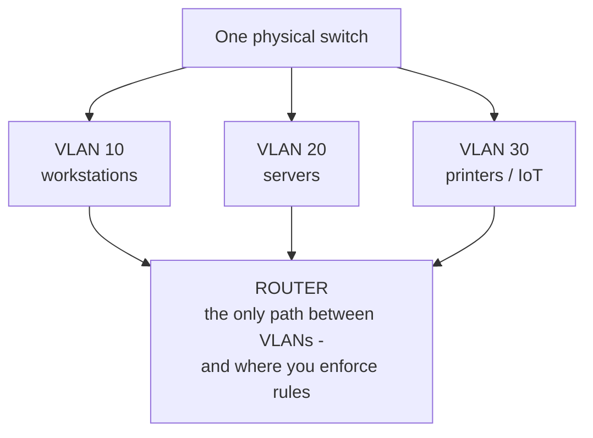
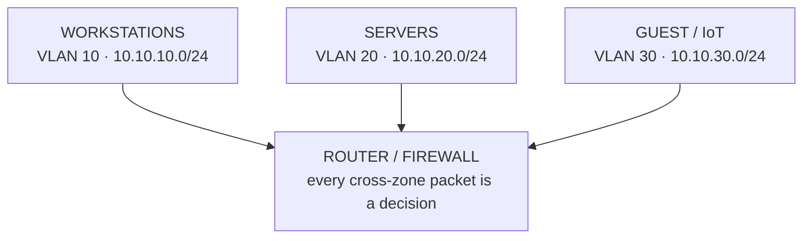

# Segmentation

Keeping a growing network flat - one address range, every device able to reach every other - feels simple. It's also the source of nearly every scaling pain ahead: broadcast chatter that grows with every device, the printer in accounting reachable from guest Wi-Fi, one compromised laptop that can knock on every server's door.

Segmentation fixes all three: **a network you can't divide is a network you can't contain.** Split one big network into deliberate zones, and a problem in one zone - a traffic flood, a misconfigured host, an attacker's foothold - stays there instead of becoming everyone's problem.

## Why a flat network stops scaling

Every device on a flat network shares one **broadcast domain** - a region where a message addressed "to everyone here" reaches every device. Broadcasts are how devices find each other (ARP asking "who has this address?", DHCP discovery). Fine with twenty devices; with two thousand, everyone is constantly interrupted by traffic meant for someone else, and everyone is, by default, reachable by everyone else.

📝 **Terminology.** *Broadcast domain* = the set of devices that receive each other's broadcast traffic. *Blast radius* = how far damage spreads when something goes wrong - segmentation exists to shrink it.

Two costs grow together on a flat network: **contention** (shared broadcast traffic and bandwidth slow everyone down) and **exposure** (flat means reachable, and reachable means attackable - one foothold sees the entire estate). You don't fix either with faster hardware. You fix them by dividing the network.

## Subnets - dividing by address

A **subnet** is a slice of address space the network treats as one group: carve a large IP range into smaller ranges, and each becomes its own logical network. Traffic *within* a subnet flows directly; traffic *between* subnets goes through a router - exactly the choke point where you decide "can sales reach finance? no."

📝 **Terminology.** *Subnet* = a logically subdivided range of an IP network. *Router* = forwards traffic *between* networks, unlike a switch, which forwards *within* one.

You'll see subnets written like `10.20.0.0/24`. That `/24` is **CIDR notation**, answering one question: how many leading bits are fixed as the network identity, leaving the rest for hosts? An address is 32 bits; the number after the slash names how many belong to the network, the remainder to devices.

```text
   10.20.0.0/24   →  first 24 bits = network, last 8 bits = hosts
                     ┌──────────────────────────┬──────────┐
                     │   network: 10.20.0        │ host: .x │
                     └──────────────────────────┴──────────┘
                     usable host addresses: .1 through .254   (256 minus network + broadcast)

   smaller /26     →  26 network bits, 6 host bits  →  62 usable hosts per subnet
   larger  /16     →  16 network bits, 16 host bits →  ~65,000 hosts (usually too big to want)
```

Rule of thumb: **a bigger number after the slash means a smaller subnet.** A `/24` gives 254 usable addresses - comfortable for one department. The two reserved addresses are the network address itself (all host bits `0`) and the broadcast address (all host bits `1`).

A Linux host can tell you which subnet it considers itself part of:

```console
$ ip -4 addr show dev eth0
2: eth0: <BROADCAST,MULTICAST,UP,LOWER_UP> mtu 1500 ...
    inet 10.20.0.37/24 brd 10.20.0.255 scope global eth0
```

*What just happened:* this host is `10.20.0.37`, and `/24` tells it everything from `10.20.0.1` to `10.20.0.254` is local - reachable directly. Anything outside that range (say `10.30.0.5`) has to go through the router. `brd 10.20.0.255` is this subnet's broadcast address.

**Address planning - the part people skip and regret.** Decide a scheme for the *whole* organization before assigning a single subnet; renumbering later is painful once devices, firewall rules, and DNS entries depend on the old ranges. A scheme that reads at a glance pays off for years:

```text
   10.<site>.<purpose>.0/24

   10.10.10.0/24   site 10 (HQ),  purpose 10 = user workstations
   10.10.20.0/24   site 10 (HQ),  purpose 20 = servers
   10.10.30.0/24   site 10 (HQ),  purpose 30 = printers / IoT
   10.20.10.0/24   site 20 (branch), purpose 10 = user workstations
```

Now an address tells you what it is - `10.20.30.x`? Branch site, printers. That legibility beats squeezing addresses tightly, so leave room to grow: the private ranges (`10.0.0.0/8`, `172.16.0.0/12`, `192.168.0.0/16`) are generous. Plan for the company you'll be.

With this in place, keeping finance unreachable from guests is one rule at the router between two subnets, not a per-device chore.

## VLANs - dividing without rewiring

Subnets divide by *address*. But in a real building, the accountant and the engineer often plug into the same switch, sometimes the same row of ports - you can't run separate cabling for every group.

A **VLAN** (Virtual LAN) lets one physical switch behave as several separate switches. Tag each port or device as belonging to a VLAN, and the switch refuses to let traffic cross between VLANs on its own, even though every cable runs into the same box.

📝 **Terminology.** *VLAN* = a logical LAN segment defined in switch configuration rather than physical wiring. *Tag* = an 802.1Q label added to a frame identifying its VLAN, surviving across switches.

Map each VLAN to a subnet - VLAN 10 carries `10.10.10.0/24` (workstations), VLAN 20 carries `10.10.20.0/24` (servers) - and both ride the same hardware without mixing. Traffic that does need to cross is forced up to a router, where you decide.



⚠️ **Gotcha.** A VLAN is a *configuration*, not a physical wall. A misconfigured trunk port, a port left in the wrong VLAN, or weak switch management access can leak traffic between VLANs you believed were isolated. Treat VLAN boundaries as real security boundaries only when the switch's management plane is locked down - otherwise an attacker steps over the line by reconfiguring the switch.

When a new IoT device shows up - a smart TV, a badge reader, a camera - don't trust it on the laptops' network. Drop it on the IoT VLAN, where it reaches only what it needs. If that device turns out to have a backdoor, the blast radius is one VLAN, not the company.

## Bringing the two together

Subnets and VLANs aren't competitors - the same dividing line drawn at two layers. The VLAN separates traffic on the wire; the subnet separates addresses; map one to the other so a "zone" means the same thing at the switch port and at the IP address. The router between zones is where both lines converge, and where the next two phases hang their work.



## Recap

1. A **flat network** doesn't scale: broadcast **contention** grows with every device, and flat means every host is **reachable** - and attackable - by every other.
2. **Segmentation** carves the network into zones so a failure or breach has a small **blast radius** instead of taking down everything.
3. **Subnets** divide by address; **CIDR** (`/24`, `/26`…) says how many leading bits name the network, leaving the rest for hosts. A bigger slash number means a smaller subnet.
4. **Plan addresses for the whole org up front** with a legible scheme (`10.<site>.<purpose>.0/24`) - renumbering later is painful.
5. **VLANs** divide one physical switch into several logical LANs, so you separate groups without separate cabling. Map one VLAN to one subnet per zone.
6. A VLAN is only as strong as the switch's management security - treat it as a real boundary only when the switch itself is locked down.
7. The **router between zones** is where every cross-zone decision lives - and where scaling and security build next.

Next, keeping all those zones standing when traffic surges and hardware fails: **scaling and reliability**.

---

[← Guide overview](_guide.md) · [Phase 2: Scaling & Reliability →](02-scaling-and-reliability.md)
