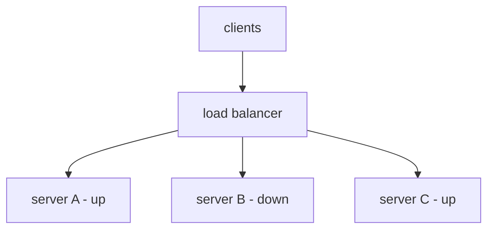
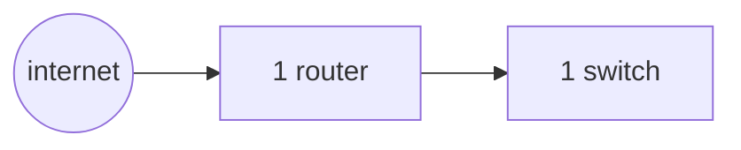
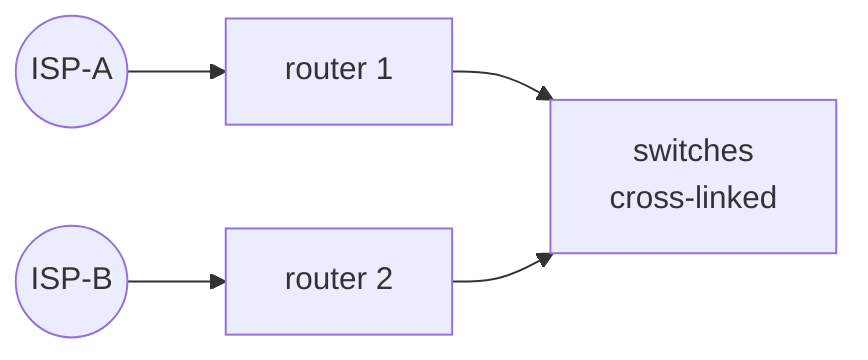

# Scaling & Reliability

You've divided the network into clean zones. Now: what happens when one gets busy, or a piece of it dies? A home network shrugs - reboot the router, wait a minute. An enterprise can't: a traffic surge shouldn't take a service down, and one failed switch, cable, or power supply shouldn't take the business down.

The mental model: **anything you depend on, you must be able to lose.** Reliability means assuming each component will eventually fail and arranging for the network to keep working anyway - by spreading work across many things, and by having more than one of everything that matters. Underneath both sit the quiet services that make the network self-operating.

## Load balancers - spreading the work

A **load balancer** sits in front of a group of identical servers and distributes incoming requests across them. To the outside world there's one address to talk to; behind it, the balancer chooses which real server handles each request.

The common assumption is that load balancing is purely about *performance* - "too much traffic for one server, so we added a balancer." That's half of it. The bigger half is *availability*: the balancer constantly checks which backends are healthy and stops sending traffic to one that's crashed or being updated. A server can go down for maintenance at 2pm and nobody files a ticket.

📝 **Terminology.** *Backend/upstream* = one of the real servers behind the balancer. *Health check* = a periodic probe deciding whether a backend is fit for traffic. *Virtual IP (VIP)* = the single front-facing address the balancer answers on.

Requests arrive at the balancer's one address; it forwards each to a healthy backend, often round-robin or by least-busy. Add a server to handle more load and you've scaled *horizontally* - across more machines - rather than *vertically* (one ever-bigger machine, which has a ceiling and is itself a single point of failure).



Here's a health-check transition in an NGINX-style upstream log:

```console
$ tail -f /var/log/lb/health.log
2026-06-19T14:02:11Z upstream backend-b (10.10.20.12:443) check ok
2026-06-19T14:02:16Z upstream backend-b (10.10.20.12:443) check FAILED (timeout)
2026-06-19T14:02:21Z upstream backend-b (10.10.20.12:443) check FAILED (timeout)
2026-06-19T14:02:21Z upstream backend-b marked DOWN, removed from rotation
2026-06-19T14:02:21Z traffic now distributed across: backend-a, backend-c
```

*What just happened:* the balancer was probing `backend-b` every few seconds. Two timeouts in a row and it **removed the server from rotation** - new requests go only to the healthy two. No human acted; no client saw an error. When `backend-b` passes checks again, it's added back in. That automatic in-and-out is the reliability payoff, not the speed.

This is why deployments stop being terrifying: take backends out of rotation one at a time, update them, put them back - a rolling update with zero downtime, instead of a midnight maintenance window.

## Redundancy - more than one of everything that matters

A load balancer spreads work across many servers - but what happens when the *load balancer itself* fails? If the answer is "everything behind it goes dark," you've just moved the single point of failure, not removed it.

📝 **Terminology.** *Single point of failure (SPOF)* = any one component whose failure takes down the whole system. Reliability work is largely hunting down SPOFs and giving each a partner.

**Redundancy** means provisioning more than one of any component you can't afford to lose, arranged so one takes over if the other fails: two internet connections, two routers, two switches, dual power supplies, multiple paths between the same two points. It comes in two flavors:

- **Active-passive (failover):** one component works, a standby takes over on failure. Simpler, but you pay for idle hardware, and the failover moment can blip.
- **Active-active:** both carry traffic at once - extra capacity *and* resilience, but harder to set up correctly.

*Single point of failure - one router, one switch; either dying takes everything down:*

*Redundant - two of each, so losing one is survivable:*


⚠️ **Gotcha.** Redundancy you've never tested is a guess, not a guarantee. The classic disaster: during a real outage you discover the "standby" was misconfigured, its software had drifted out of sync, or failover never triggered. Two of everything only helps if you periodically pull the plug on the primary on purpose and confirm the secondary takes over cleanly.

That's the payoff: a backhoe cuts your primary fiber - a genuinely common outage cause - and traffic quietly shifts to the second ISP. A switch's power supply dies and its partner keeps the zone alive. The failures still happen; they just stop being *events*.

## The infrastructure services a real network runs

Segmentation and redundancy shape the network; two background services make it usable without a human assigning everything by hand. Easy to overlook when healthy - impossible to overlook the day they break, because everything seems to break at once.

### DHCP - addresses without a clipboard

**DHCP** (Dynamic Host Configuration Protocol) hands a device its network settings the moment it connects - IP address, subnet mask, default gateway, DNS servers. Without it, a human assigns every one of those by hand on every device.

A laptop joins and broadcasts "I need an address." The DHCP server answers with an address from the right subnet's pool, leased for a set time. This is where the address planning from Phase 1 pays off: one DHCP scope per VLAN/subnet, and devices land automatically in the correct zone.

```console
$ journalctl -u dhcpd --no-pager | tail -n 4
dhcpd[812]: DHCPDISCOVER from 3c:22:fb:1a:9e:40 via eth0.10
dhcpd[812]: DHCPOFFER on 10.10.10.52 to 3c:22:fb:1a:9e:40 via eth0.10
dhcpd[812]: DHCPREQUEST for 10.10.10.52 from 3c:22:fb:1a:9e:40 via eth0.10
dhcpd[812]: DHCPACK on 10.10.10.52 to 3c:22:fb:1a:9e:40 via eth0.10
```

*What just happened:* the four-step handshake people call **DORA** - DISCOVER, OFFER, REQUEST, ACK. A new device arrived on VLAN 10 (`eth0.10`), the server offered `10.10.10.52` from the workstation pool, the device asked to keep it, the server confirmed. ⚠️ That first DISCOVER is a *broadcast*, and broadcasts don't cross subnets - so each segmented zone needs its own reachable DHCP service or a "DHCP relay" (ip helper) on the router forwarding those requests. This trips people up the first time they segment a previously flat network.

### Internal DNS - names for the inside

You know DNS as the internet's phone book, turning `example.com` into an address. **Internal DNS** is that same machinery pointed inward - resolving names like `fileserver.corp.internal` that the public internet neither knows nor should.

Without it, people and scripts hard-code IP addresses, and the day you renumber a server (or fail over to its redundant partner) everything referencing the raw address breaks. With internal DNS, services refer to each other by name; change the address once and every reference follows - a name can even point at a load balancer's VIP instead of any one fragile server.

⚠️ **Gotcha.** DHCP and DNS must not be single points of failure - run two of each. When DNS is down, machines can't find each other even though the network is technically fine, and "everything is broken" is wildly out of proportion to "one small service stopped." Apply this phase's own redundancy lesson to the services that make the network work.

## Recap

1. The posture: **assume every component fails eventually**, and arrange for the network to keep working when it does.
2. **Load balancers** spread requests across many backends - partly speed (scale *horizontally*), largely **availability**, since health checks pull dead backends from rotation automatically.
3. **Redundancy** gives every component you can't lose a partner, killing **single points of failure** - active-passive (standby) or active-active (both live).
4. **Untested failover is a guess** - deliberately fail the primary and confirm the secondary takes over.
5. **DHCP** hands devices their settings automatically (the **DORA** handshake), landing each in the correct subnet - but segmented zones need a DHCP service or relay per zone, because the request is a broadcast.
6. **Internal DNS** gives private systems names, so addresses can change underneath without breaking every reference.
7. Run **two of every infrastructure service** - DHCP and DNS failing looks like the whole network failing.

Next, the edge: how the network meets the outside world without letting the outside in - **security and the edge**.

---

[← Guide overview](_guide.md) · [Phase 3: Security & the Edge →](03-security-and-the-edge.md)
