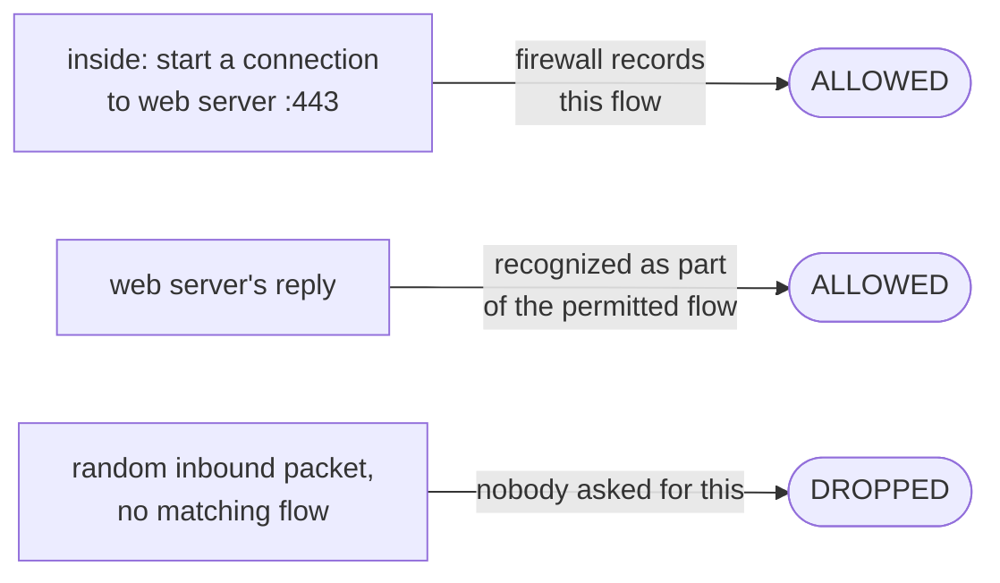
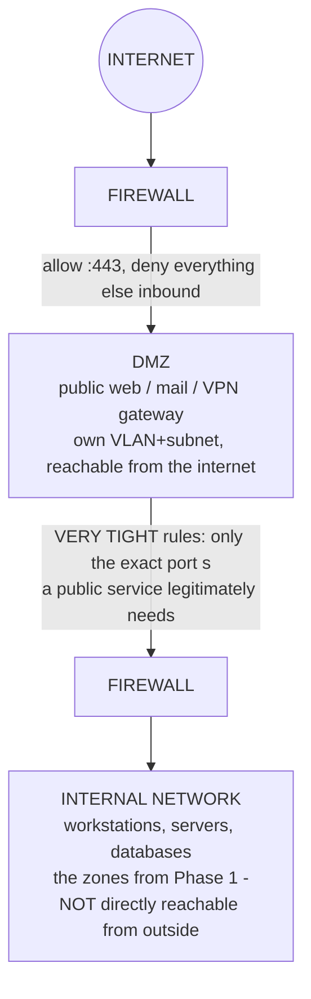

# Security & the Edge

Everything so far has been about *shape* - dividing the network and keeping it standing. This phase is about *defense*: where your network meets the internet, and the uncomfortable realization that a single line was never going to be enough.

The old mental model was a castle: a hard wall outside, everything inside trusted because it's inside. That model has a fatal flaw: **a flat trusted interior is a breach waiting to spread.** Once an attacker is past the wall - a phished password, a compromised laptop, a vulnerable public service - a castle gives free run of everything inside. So you build a strong edge *and* stop trusting the interior blindly. The edge tools (firewall, DMZ, VPN) are the wall and its gates; zero-trust is locks on the inside doors too - exactly what Phase 1's segmentation was quietly building toward.

## Firewalls - the gate that decides

A **firewall** sits at a network boundary and decides, packet by packet, what's allowed to pass. It enforces a policy - rules saying which traffic may cross between which zones - and its default disposition, on any firewall worth the name, is *deny*: no rule permits it, it's blocked.

The naive picture is a firewall as a checklist: "allow port 443, block port 23," judging each packet alone. That's **stateless**, and it's clumsy - to allow a reply to a connection you started, you'd have to permit a wide range of inbound traffic, exactly what you don't want. Real firewalls are **stateful**.

📝 **Terminology.** *Stateless filtering* = each packet judged on its own, by fixed rules, no memory. *Stateful filtering* = the firewall tracks active connections (a "state table") and judges packets in the context of the conversation they belong to.

A stateful firewall remembers the connections it has allowed. When an internal user opens a connection to a web server, the firewall notes it; the server's replies are recognized as part of a permitted flow and let back in automatically, while an unsolicited inbound packet - one matching no established conversation - is dropped. You write rules about who may *start* a conversation; return traffic takes care of itself.



Firewall rules read as a top-to-bottom policy. Here's a small stateful ruleset:

```console
# policy: default deny; allow outbound web; allow established replies back in
$ sudo nft list ruleset
table inet filter {
    chain input {
        type filter hook input priority 0; policy drop;
        ct state established,related accept   # replies to flows we started
        ct state invalid drop                 # malformed / orphaned packets
        iif "lo" accept                       # the host's own loopback
        tcp dport 22 ip saddr 10.10.20.0/24 accept   # SSH only from the admin subnet
    }
}
```

*What just happened:* `policy drop` sets the default to **deny** - the safe starting point. `ct state established,related accept` is the stateful heart: traffic belonging to a connection already permitted is allowed back, so you never write rules for return packets. `ct state invalid drop` discards packets matching no real conversation. The last line shows segmentation and the firewall working together: SSH is permitted only when the source is the admin subnet (`10.10.20.0/24`) from Phase 1 - a rule impossible to write on a flat network where "the admin subnet" isn't a concept.

When an audit asks "what can reach the database?", the firewall policy *is* the answer, in writing. Because the default is deny, a forgotten rule fails safe: "something is blocked" (annoying) rather than "something is wide open" (catastrophic).

## The DMZ - a place for things the public must reach

Some services *have* to be reachable from the internet - a public website, a mail server, a VPN gateway. But reachable from the internet means exposed to attack. You can't put those services deep inside the trusted network (a compromise lands an attacker among your crown jewels), and you can't leave them fully outside (you still need to manage them).

A **DMZ** (demilitarized zone) is a separate, tightly-controlled segment between the internet and your internal network, holding exactly the services that must face the public. It's its own zone - its own VLAN and subnet, in Phase 1's terms - with firewall rules on *both* sides.

The firewall lets the internet reach the DMZ on specific ports (the website on 443) - that's all the internet can touch. The rules from the DMZ *into* the internal network are extremely tight: the public web server reaches the one internal database it needs, on the one port it needs, nothing else. So if that public-facing server is compromised - and public-facing servers are the likeliest to be - the attacker is stuck in the DMZ, holding a box that can't freely reach anything valuable.



⚠️ **Gotcha.** A DMZ only works if the inward rules stay tight. The slow failure is convenience creep - over months, someone needs the DMZ server to reach "just one more" internal system, then another, until the DMZ can reach half the internal network and the separation is hollow. A DMZ that can reach everything inside isn't a DMZ; it's an attacker's launchpad with extra steps. Review those inbound-to-internal rules like they matter, because they do.

## VPNs - letting the right people in from outside

Your people aren't always in the building - home, hotels, cafés - and need to reach internal systems that correctly aren't exposed to the public internet. The wrong fix is poking a firewall hole per remote person. The right fix is a VPN.

A **VPN** (Virtual Private Network) builds an encrypted tunnel across the untrusted internet, so a remote device behaves, network-wise, as if plugged in *inside* the network. Traffic in the tunnel is encrypted end to end, so nobody in between can read or tamper with it.

📝 **Terminology.** *Tunnel* = an encrypted connection carrying your private network's traffic across a public network. *VPN gateway / concentrator* = the edge device (often in the DMZ) that terminates remote VPN connections and authenticates the users behind them.

The remote user authenticates to the VPN gateway - ideally with more than a password (a code, a hardware key). Once the tunnel is up, their laptop gets an internal-style address and reaches internal resources *through the gateway*, subject to the same firewall and segmentation rules as anyone inside. The VPN doesn't bypass your security model; it extends the edge out to the remote user and applies the same rules.

⚠️ **Gotcha.** A VPN granting full, flat access to the entire internal network the instant someone connects re-creates the castle problem - now with the drawbridge handed to anyone who can phish one password. This is why a second authentication factor on the VPN is non-negotiable, and why a connected user's reach should still be limited by zone, not flung wide open.

## Zero-trust - locks on the inside doors

The castle model trusts the interior: get inside, and you're trusted. Every gotcha in this phase is a variation on the same wound - the breached DMZ server, the over-broad VPN, the compromised laptop - each catastrophic only *because* the interior is trusted and flat.

**Zero-trust** drops the assumption that "inside" equals "trusted." Every request to reach a resource is verified - who's asking, what device, whether they're authorized for that specific resource - regardless of where it comes from. The slogan: "never trust, always verify." There's no soft, trusting interior to exploit, because there's no interior the system trusts by default.

You don't reach zero-trust by buying a product; you reach it by taking Phase 1 to its conclusion. Segmentation already gave you zones with rules at every boundary. Zero-trust pushes further - smaller zones, verification at every hop rather than only the outer wall, identity checked per request - until "I'm inside the network" grants nothing on its own. The firewall, the DMZ, and the VPN are the strong edge; zero-trust is the recognition that the edge will eventually be crossed, and a breach should find another locked door at every step, not an open hallway.

> 💡 **The one idea to keep.** A strong perimeter is necessary and not sufficient. Build the wall - *and* assume it will be breached, and make sure the breach hits a contained zone, not the whole company. That single sentence is segmentation, scaling, and security all arguing for the same thing.

## Recap

1. The shift: a **flat trusted interior is a breach waiting to spread** - build a strong edge *and* stop trusting the inside blindly.
2. **Firewalls** enforce a default-**deny** policy at boundaries; **stateful** filtering tracks connections so replies to flows you started are allowed automatically while unsolicited inbound traffic is dropped.
3. The **DMZ** isolates public-facing services in their own zone with tight rules on both sides, so a compromise of an exposed server stays trapped - *if* you resist convenience creep on the inward rules.
4. A **VPN** extends the edge to remote users with an encrypted tunnel; demand a second authentication factor and keep their reach limited by zone, never flat-and-full.
5. **Zero-trust** drops "inside = trusted" and verifies every request - it's segmentation taken to its conclusion, so a breach meets another locked door at every hop.
6. The whole guide, in one line: **divide it, keep it standing, and assume the wall will fall - so the blast radius is one zone, not everything.**

You can now look at a real enterprise network diagram and reason about why each box sits where it does. For the machinery beneath this model - routing protocols, switch-loop prevention, and vendor configuration - see the follow-up guides noted in the overview.

---

[← Guide overview](_guide.md) · [Phase 2: Scaling & Reliability ←](02-scaling-and-reliability.md)
