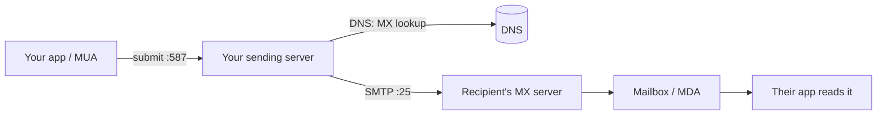

# The Journey of One Email

You hit Send. A second later it's in their inbox. That smoothness hides a surprising amount of machinery — and one design flaw from the 1980s that explains nearly every deliverability headache you'll ever have.

So let's slow the whole thing down and watch a single email make its trip. Once you've seen the route, the rest of this guide is mostly "here's how we bolted security onto a system that originally had none."

## The cast: four players, not one

When you picture email, you probably picture two things: you and the person you're emailing. There are actually four roles in the room, and confusing them is where most people get lost.

- **MUA — Mail User Agent.** Your email *app*. Gmail's web UI, Outlook, Apple Mail, the code in your app that sends a receipt. This is what *you* touch.
- **MSA / outgoing server — your sending server.** The machine your MUA hands the message to. For Gmail that's Google's servers; for an app it might be SendGrid, Postmark, Amazon SES, or your own.
- **MTA — Mail Transfer Agent.** The relay servers that pass the message across the internet, server to server, until it reaches the destination. Your sending server is the first MTA in the chain.
- **MDA — Mail Delivery Agent.** On the receiving side, the part that drops the message into the right mailbox, where the recipient's app finally reads it.

Hold onto one distinction above all: **the app you click in is not the server that sends.** The server is where authentication lives. That's the whole game.

## SMTP: the language servers speak

Every hop where mail moves *toward* the recipient uses one protocol: **SMTP** — Simple Mail Transfer Protocol. It runs on **port 25** between servers (and **587** when your app submits a new message to its sending server). It's a plain-text conversation, and reading one demystifies email faster than any diagram.

Here's a sending server talking to the recipient's server, lightly trimmed. Lines the client sends are plain; the server's numeric replies are the responses.

```text
S: 220 mx.recipient.com ESMTP ready
C: EHLO mail.yourcompany.com
S: 250-mx.recipient.com at your service
C: MAIL FROM:<alice@yourcompany.com>
S: 250 2.1.0 OK
C: RCPT TO:<bob@recipient.com>
S: 250 2.1.5 OK
C: DATA
S: 354 Go ahead, end with <CRLF>.<CRLF>
C: From: "Alice" <alice@yourcompany.com>
C: To: "Bob" <bob@recipient.com>
C: Subject: Lunch?
C:
C: Are you free Thursday?
C: .
S: 250 2.0.0 OK: queued as 9F2A1
C: QUIT
S: 221 Bye
```

*What just happened:* the two servers had a structured chat — greet (`EHLO`), declare the sender (`MAIL FROM`), declare the recipient (`RCPT TO`), then hand over the message body after `DATA`. Each `250` is the server saying "got it." The message body itself, including the `From:` header Bob will *see*, is nothing but text the sender typed.

## The hop-by-hop trip

Stitch the players and the protocol together and you get the journey. Notice the recipient's server doesn't magically know who to talk to — it's found through DNS, specifically the destination domain's **MX record** (Mail eXchanger), which says "mail for recipient.com goes to *this* server."



*What just happened:* your app submits the message once, to your server. Your server looks up the recipient domain's MX record in DNS to learn *where* their mail lives, then speaks SMTP to that server, which files it into the mailbox. The recipient's app reads it later. The address book is DNS; the conversation is SMTP.

## The open door: anyone can say they're you

Now look back at that SMTP transcript and ask the uncomfortable question: **what stopped the sender from typing a different `From:` line?**

Nothing.

SMTP was designed in an era when every server on the network was run by someone trustworthy. There was no built-in check that the machine claiming to send for `yourcompany.com` had any right to. The `From:` your recipient sees is decorative text inside `DATA` — the sending server fills it in with whatever it likes.

```text
C: MAIL FROM:<attacker@randomhost.ru>
...
C: From: "Your Bank" <security@yourbank.com>
C: Subject: Urgent: verify your account
```

*What just happened:* a server with no connection to `yourbank.com` declared itself as the bank in the visible `From:` line, and classic SMTP accepted it without protest. This is **spoofing**, and it's not a hack or an exploit — it's email working exactly as originally designed. Phishing lives in this gap.

> The trust problem isn't "can someone break in." It's that email, by default, has **no way to prove a message really came from the domain it claims.** Everything in Phase 2 exists to close that one gap.

## For builders

If your app sends mail — password resets, receipts, notifications — you are operating a sending server (or paying one like SES or Postmark to be yours). That means *your domain's* reputation is on the line every time. The receiving side can't see your good intentions; it can only check whether your domain has told the world which servers are allowed to send for it. That "telling the world" is three DNS records, and it's the difference between the inbox and the spam folder.

```quiz
[
  {
    "q": "In the SMTP world, which component is the server that actually transmits your message toward the recipient — not the app you click in?",
    "choices": ["The MUA", "The sending server / MTA", "The DNS resolver", "The MDA"],
    "answer": 1,
    "explain": "The MUA is your app. The sending server (an MTA) is what speaks SMTP to other servers — and where authentication lives."
  },
  {
    "q": "Why is spoofing the visible From: address possible in classic SMTP?",
    "choices": ["A bug in modern mail servers", "The From: header is just text the sending server fills in, with no built-in proof of identity", "Because port 25 is unencrypted", "Only if DNS is misconfigured"],
    "answer": 1,
    "explain": "SMTP was built for a trusted network. The From: line is decorative text inside DATA; nothing in the base protocol verifies the sender owns that domain."
  },
  {
    "q": "How does your sending server know which machine to deliver mail to for recipient.com?",
    "choices": ["It guesses based on the domain name", "It looks up the domain's MX record in DNS", "The recipient's app tells it", "It always uses port 587"],
    "answer": 1,
    "explain": "The MX (Mail eXchanger) record in the recipient domain's DNS names the server that accepts its mail. DNS is email's address book."
  }
]
```

[← Overview](_guide.md) | [Phase 2: The Three Proofs →](02-spf-dkim-dmarc.md)
