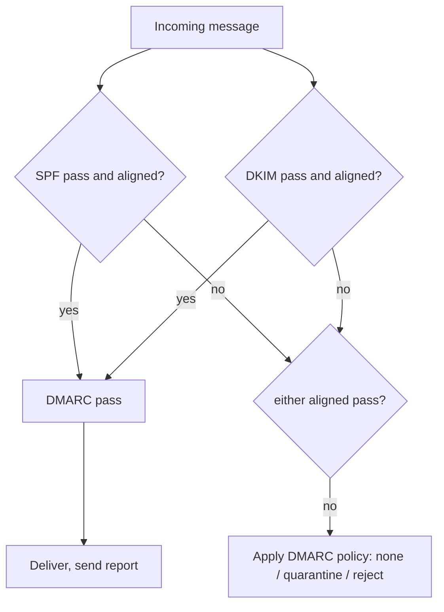

# The Three Proofs: SPF, DKIM, DMARC

Phase 1 left us with one gap: email has no built-in way to prove a message came from the domain it claims. The fix isn't a new protocol — it's three DNS records, each answering a different question. Once you see *which* question each one answers, the acronyms stop blurring together.

- **SPF** answers: *which servers are allowed to send mail for my domain?*
- **DKIM** answers: *was this specific message actually signed by my domain, and untampered?*
- **DMARC** answers: *if SPF or DKIM fails, what should the receiver do — and tell me about it?*

Think of it as a guest list (SPF), a wax seal (DKIM), and a house policy with a logbook (DMARC). You need all three, and the reason will be obvious by the end.

## SPF — the guest list

**SPF (Sender Policy Framework)** is a single TXT record in your domain's DNS that lists which servers may send mail on your behalf. When a receiving server gets a message, it looks up your SPF record and checks: *did this connection come from one of the listed servers?*

```text
yourcompany.com.  TXT  "v=spf1 include:_spf.google.com include:sendgrid.net ~all"
```

*What just happened:* you published a guest list. `v=spf1` marks it as SPF. `include:_spf.google.com` and `include:sendgrid.net` pull in the server ranges of Google and SendGrid — saying "those vendors send for me." The `~all` at the end is the catch-all verdict for *everyone else*: `~` means **softfail** (treat as suspicious), `-` means **hardfail** (reject outright), `+` would mean allow-all (never use it).

The crucial detail most people miss: **SPF checks the `MAIL FROM` envelope address from the SMTP conversation, not the `From:` your recipient sees.** A spoofer can pass SPF for *their own* domain while still showing your name in the visible header. SPF alone proves "this server is allowed to send for *some* domain," not "this matches what the human reads." Hold that thought — DMARC fixes it.

> One real-world trap: SPF allows a maximum of **10 DNS lookups** when evaluating includes. Stack too many `include:` vendors and SPF returns a `permerror` — silently failing for everyone. Keep the list lean.

## DKIM — the wax seal

**DKIM (DomainKeys Identified Mail)** adds a cryptographic signature to each message. Your sending server signs key parts of the email (headers and body) with a **private key**; you publish the matching **public key** in DNS. The receiver verifies the signature against that public key.

This proves two things SPF can't: the message genuinely came from your domain, *and* it wasn't altered in transit.

The signature rides along as a header inside the message:

```text
DKIM-Signature: v=1; a=rsa-sha256; d=yourcompany.com; s=mail2024;
  h=from:to:subject:date; bh=2jUSOH9NhtVGCQWNr9...;
  b=Cs4Hd9aP1n0kFqL7mZ...signature...
```

*What just happened:* the sending server stamped the message. `d=yourcompany.com` is the signing domain; `s=mail2024` is the **selector** (a label that lets you run multiple keys). `bh=` is a hash of the body; `b=` is the actual signature over the chosen headers (`h=`). If anyone changed the body or a signed header in transit, the hash won't match and DKIM fails.

The receiver fetches the public key from a predictable DNS name built from the selector and domain:

```text
mail2024._domainkey.yourcompany.com.  TXT  "v=DKIM1; k=rsa; p=MIGfMA0GCSq...public-key...AQAB"
```

*What just happened:* the receiver took `s=mail2024` and `d=yourcompany.com` from the signature, looked up `mail2024._domainkey.yourcompany.com`, and got your public key (`p=...`). It uses that key to verify the `b=` signature. Match means the message truly came from a holder of your private key and arrived intact.

Because the private key never leaves your sending infrastructure, a spoofer **cannot forge a valid DKIM signature for your domain.** This is the strongest of the three proofs.

## DMARC — the policy and the logbook

SPF and DKIM each check *a* domain — but, as noted, that domain doesn't have to be the one the human sees in `From:`. **DMARC (Domain-based Message Authentication, Reporting & Conformance)** closes that loophole with one idea: **alignment.**

DMARC says: SPF or DKIM must pass *and* the domain it passed for must **match the visible `From:` domain.** That's the piece that finally protects the address your recipient actually reads.

It also does two more things SPF and DKIM can't: it tells receivers **what to do** when checks fail, and it asks them to **send you reports.**

```text
_dmarc.yourcompany.com.  TXT  "v=DMARC1; p=quarantine; rua=mailto:dmarc@yourcompany.com; adkim=s; aspf=s; pct=100"
```

*What just happened:* you published a policy. `p=quarantine` is the instruction for failing mail — `none` (monitor only), `quarantine` (send to spam), or `reject` (refuse it). `rua=mailto:...` is where aggregate reports get sent — your logbook. `adkim=s` and `aspf=s` demand **strict alignment** (exact domain match; `r` for relaxed allows subdomains). `pct=100` applies the policy to all mail.

Here's the relationship in one picture:



*What just happened:* DMARC passes if **either** SPF **or** DKIM passes *and* is aligned with the visible `From:` domain. Only one needs to succeed. If neither does, the receiver applies your `p=` policy and logs it in the report it sends to your `rua` address.

## Why you need all three

Each plugs the other's hole:

- **SPF alone** proves a server is authorized, but checks the hidden envelope address — a spoofer slips past it on the visible `From:`.
- **DKIM alone** proves authenticity and integrity, but it doesn't say what to do when a message *isn't* signed, and on its own it doesn't require alignment with the visible `From:`.
- **DMARC alone** is meaningless — it has nothing to evaluate. It's the referee that needs SPF and DKIM to be the players.

Together: SPF and DKIM provide the evidence, and DMARC enforces that the evidence matches what the human sees, tells receivers what to do, and reports back so you can see who's sending as you.

## For builders

When you onboard a new sending vendor (a new transactional email provider, a marketing tool), you touch all three: add the vendor's `include:` to SPF, publish the DKIM public key the vendor gives you under a selector, and confirm your DMARC alignment still holds. Forget the DKIM step and your mail passes SPF but fails alignment under a strict DMARC policy — straight to spam, with no error you'd notice unless you read the reports. That report-reading is Phase 3.

```quiz
[
  {
    "q": "What does an SPF record actually list?",
    "choices": ["The cryptographic signature of each message", "Which servers are authorized to send mail for your domain", "What to do when authentication fails", "The recipient's mail server"],
    "answer": 1,
    "explain": "SPF is a guest list of authorized sending servers, published as a TXT record and checked against the connecting server."
  },
  {
    "q": "What can DKIM prove that SPF cannot?",
    "choices": ["Which port the mail used", "That the message is cryptographically signed by the domain and was not altered in transit", "Which servers are allowed to send", "The recipient's identity"],
    "answer": 1,
    "explain": "DKIM signs the message with a private key; the public key in DNS verifies both origin and integrity. A spoofer can't forge it."
  },
  {
    "q": "What is DMARC's core requirement on top of SPF and DKIM?",
    "choices": ["That both SPF and DKIM must pass", "That SPF or DKIM passes AND aligns with the visible From: domain, plus a policy and reports", "That the message is encrypted", "That port 25 is used"],
    "answer": 1,
    "explain": "DMARC needs only one of SPF/DKIM to pass, but it must be aligned with the From: the human sees. It also defines the failure policy and requests reports."
  }
]
```

[← Phase 1: The Journey of One Email](01-the-journey-of-one-email.md) | [Overview](_guide.md) | [Phase 3: Fixing Deliverability →](03-fixing-deliverability.md)
