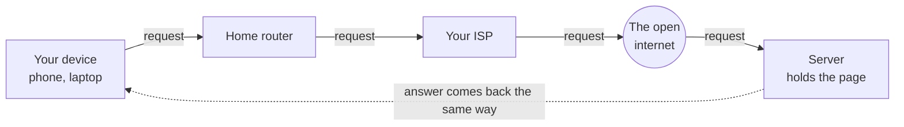

# The Journey of One Request

You type a web address and press Enter. For the next half-second, something genuinely remarkable happens - and it's completely understandable once you watch it step by step. Let's follow a single request all the way out and all the way back. We won't worry yet about *how* your device knows where the page lives, or how it phrases the request - that's the next two phases. Right now, just the shape of the journey.

## The cast of characters

Meet the players first. Each has one small, specific job.



- **Your device** - the phone or laptop in your hand, wanting a web page.
- **Your home router** - the box everything in your home connects to over Wi-Fi or cable. It's the on-ramp from your home to the wider internet.
- **Your ISP** - your Internet Service Provider (Comcast, Vodafone, your phone carrier). They run the cables and equipment connecting your neighborhood to the rest of the world.
- **The internet itself** - not one thing, but a vast mesh of cables, routers, and exchange points owned by many companies, all agreeing to pass each other's traffic along. *Internet* literally means "network of networks."
- **The server** - a computer, somewhere, that holds the page and is always on, always listening, waiting to hand it out to anyone who asks.

📝 **Terminology.** *Server* = a computer whose job is to wait for requests and respond. *Client* = the computer making the request (yours). More on this pairing in [Phase 3: Client, Server & Talking the Same Language](03-client-server-and-protocols.md).

## The journey, step by step

Read it once top to bottom - it's a single continuous motion, out and back.

1. **You press Enter.** Your device builds a request - "please send me the page at this address."
2. **It goes to your router.** Your device hands the request to your home router over Wi-Fi or cable - the only thing in your home that knows how to reach the outside world.
3. **The router passes it to your ISP.** This is the moment your request leaves your home.
4. **The ISP launches it into the internet.** It forwards your request router to router - each one a signpost pointing "the thing you're looking for is roughly *that* way" - hop by hop across the world.
5. **It arrives at the server**, after some number of hops.
6. **The server answers**, and the reply makes the same kind of journey in reverse: server, internet, your ISP, your router, your device.
7. **Your browser draws the page.**

You can watch some of those hops yourself. `tracert` (it's `traceroute` on macOS and Linux) asks each router along the way to identify itself:

```console
C:\> tracert example.com

Tracing route to example.com [93.184.216.34]
over a maximum of 30 hops:

  1     2 ms     1 ms     1 ms  192.168.1.1
  2    12 ms    11 ms    10 ms  10.0.0.1
  3    14 ms    13 ms    14 ms  ae-1.bras.example-isp.net
  4    22 ms    21 ms    23 ms  core1.lax.example-isp.net
  5    71 ms    70 ms    72 ms  edge.example.com [93.184.216.34]

Trace complete.
```

*What just happened:* each numbered line is one "hop." Hop 1 (`192.168.1.1`) is your own home router; hop 2 is the first machine inside your ISP; the middle hops are routers passing your traffic across the country; the last hop is the server. The millisecond numbers are roughly the round trip to each stop - notice they climb as the stops get farther away. You're literally seeing the path your requests take.

⚠️ **Gotcha.** Don't read that hop list as "my data always goes through exactly these machines." The internet picks routes dynamically - if a cable is cut or a router is busy, traffic quietly takes a different path. Run `tracert` twice and you may see different hops. That flexibility is a feature: it's central to how the internet survives outages.

## Packets: data travels in labeled chunks

The single most important idea in this guide: when the server sends your page back, it does **not** send one continuous stream. It chops the page into small chunks called **packets**, and sends each separately.

📝 **Terminology.** *Packet* = a small chunk of data with a label on front, saying where it's going, where it came from, and which piece of the whole it is (piece 3 of 17, say).

Think of mailing a long book to a friend, but you can only use small envelopes. You tear the book into numbered pages, put each in its own envelope with your friend's address and yours, and drop them all in the mailbox. The envelopes travel independently - different routes, out-of-order arrival - but since each is numbered, your friend stacks them back into the original book.

```text
   one web page                          travels as many packets
   ┌─────────────────┐                   ┌────┐ ┌────┐ ┌────┐ ┌────┐
   │                 │   ── chopped ──▶  │ #1 │ │ #2 │ │ #3 │ │ #4 │  ...
   │  <html> ...     │      into         └────┘ └────┘ └────┘ └────┘
   │  a whole page   │                     each has a label:
   │                 │                     to: YOU
   └─────────────────┘                     from: SERVER
                                           piece: 3 of 17

   packets may take different paths and arrive out of order,
   then your device reassembles them in order by their labels:

   #3  #1  #4  #2   ──▶  reassembled  ──▶   #1 #2 #3 #4  ──▶  the page
```

Why do it this way? It makes the internet more robust and more fair:

- **Resilience.** If one packet gets lost (an overwhelmed router, a cable hiccup), only that tiny piece needs resending - not the whole page. Packets flow around trouble spots independently.
- **Sharing.** Millions of people's packets share the same cables. Breaking data into small chunks lets the network interleave your packets with everyone else's, instead of making you wait for one giant transfer to finish.
- **Independence.** No packet needs to know the whole route in advance - each just gets passed toward its destination, hop by hop, by routers reading its label.

⚠️ **Gotcha.** Because packets travel independently, they can arrive out of order, and occasionally one goes missing. Left unhandled, that corrupts your page - so the fix is to *expect* it: the receiving side puts packets back in order by their numbers and asks for any missing ones to be resent. That reliability layer is **TCP**, met in [Phase 3](03-client-server-and-protocols.md). For now: data moves as labeled chunks, reassembled at the end.

Once "everything is packets" is in your head, a lot of everyday computer life stops being mysterious. A video call gone choppy on bad Wi-Fi? Packets arriving late or dropped. A download that resumes after a blip instead of restarting? It only needed the packets it was missing.

## Recap

1. Opening a web page sends a **request** on a journey: your device, your home router, your ISP, across the internet, to a **server** - and the answer returns the same way.
2. The **internet is a network of networks** - many companies' equipment cooperating to pass traffic along, hop by hop, choosing routes flexibly.
3. Data doesn't travel as one big stream. It's broken into **packets** - small labeled chunks that travel independently and get **reassembled** at the destination.
4. Packets make the network **resilient** (lose one, resend one) and **fair** (everyone's chunks share the cables) - at the cost of arriving out of order, which the receiving side sorts out.

Next, a question the journey left open: when you typed that web address, how did your device know *which* server, out of the millions on Earth, to send the request to? That's about addresses and names.

---

[← Guide overview](_guide.md) · [Phase 2: Addresses & Names →](02-addresses-and-names.md)

## See it move

Step through the whole journey - the DNS lookup, the request travelling out, and the response coming back:

```playground-network
```
