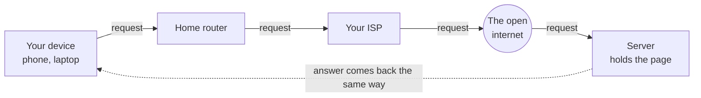

# The Journey of One Request

Let's start with the one story that explains most of the internet. You open a browser, type a web address, and press Enter. For the next half-second, something genuinely remarkable happens - and it's completely understandable once you watch it step by step. So let's follow a single request all the way out and all the way back.

We won't worry yet about *how* your device knows where the page lives, or *how* it phrases the request. Those are the next two phases. Right now we just want the shape of the journey.

## The cast of characters

Before we trace the trip, meet the players. Each one has a small, specific job.



- **Your device** - the phone or laptop in your hand. It wants a web page.
- **Your home router** - the box (often from your internet provider) that everything in your home connects to over Wi-Fi or a cable. It's the on-ramp from your home to the wider internet.
- **Your ISP** - your *Internet Service Provider* (Comcast, Vodafone, your phone carrier, whoever you pay for internet). They run the cables and equipment that connect your neighborhood to the rest of the world.
- **The internet itself** - not one thing, but a vast mesh of cables, routers, and exchange points owned by many different companies, all agreeing to pass each other's traffic along. The word *internet* literally means "network of networks."
- **The server** - a computer, somewhere, that holds the web page and is waiting to hand it out to anyone who asks. It's just a computer that's always on and always listening.

📝 **Terminology.** *Server* = a computer whose job is to wait for requests and respond to them. *Client* = the computer making the request (yours). We'll come back to this pairing properly in [Phase 3: Client, Server & Talking the Same Language](03-client-server-and-protocols.md).

## The journey, step by step

Here's the whole trip. Read it once top to bottom - it's a single continuous motion, out and back.

1. **You press Enter.** Your device builds a request - essentially the message "please send me the page at this address."
2. **It goes to your router.** Your device hands the request to your home router over Wi-Fi (or a cable). The router is the only thing in your home that knows how to reach the outside world.
3. **The router passes it to your ISP.** Your router sends the request up the line to your ISP's equipment. This is the moment your request leaves your home.
4. **The ISP launches it into the internet.** Your ISP knows how to reach other networks. It forwards your request from router to router - each one a signpost pointing "the thing you're looking for is roughly *that* way" - hop by hop across the world.
5. **It arrives at the server.** After some number of hops, the request reaches the server holding the page.
6. **The server answers.** The server puts together the page and sends it back - and the answer makes the *same kind* of journey in reverse: server, internet, your ISP, your router, your device.
7. **Your browser draws the page.** Your device receives the answer and paints it on your screen.

**A real example.** You can actually watch some of those hops yourself. The `tracert` command (it's `traceroute` on macOS and Linux) asks each router along the way to identify itself:

```console
C:\> tracert example.com

Tracing route to example.com [93.184.216.34]
over a maximum of 30 hops:

  1     2 ms     1 ms     1 ms  192.168.1.1
  2    12 ms    11 ms    10 ms  10.0.0.1
  3    14 ms    13 ms    14 ms  ae-1.bras.example-isp.net
  4    22 ms    21 ms    23 ms  core1.lax.example-isp.net
  5    71 ms    70 ms    72 ms  edge.example.com [93.184.216.34]

Trace complete.
```

*What just happened:* Each numbered line is one stop on the journey - a "hop." Hop 1 (`192.168.1.1`) is your own home router. Hop 2 is the first machine inside your ISP. The middle hops are routers passing your traffic across the country. The last hop is the server you were trying to reach. The numbers in milliseconds are roughly how long a round trip to each stop took - notice they climb as the stops get farther away. You're literally seeing the path your requests take.

⚠️ **Gotcha.** Don't read that hop list as "my data goes through exactly these machines, always." The internet picks routes dynamically - if a cable is cut or a router is busy, your traffic quietly takes a different path. Run `tracert` twice and you may see slightly different hops. That flexibility is a feature, not a bug, and it's central to how the internet survives outages.

## Packets: data travels in labeled chunks

Now the single most important idea in this whole guide. When the server sends your web page back, it does **not** send it as one big continuous stream. It chops the page into many small chunks called **packets**, and sends each one separately.

📝 **Terminology.** *Packet* = a small chunk of data with a label on the front. The label says, among other things, where the packet is going, where it came from, and which piece of the whole it is (piece 3 of 17, say).

Think of mailing a long book to a friend, but you're only allowed to use small envelopes. So you tear the book into numbered pages, put each page in its own envelope, write your friend's address and your return address on every one, and drop them all in the mailbox. The envelopes travel independently - some might take different routes, some might arrive out of order - but because each is numbered, your friend can stack them back into the original book.

```text
   one web page                          travels as many packets
   ┌─────────────────┐                   ┌────┐ ┌────┐ ┌────┐ ┌────┐
   │                 │   ── chopped ──▶  │ #1 │ │ #2 │ │ #3 │ │ #4 │  ...
   │  <html> ...     │      into         └────┘ └────┘ └────┘ └────┘
   │  a whole page   │                     each has a label:
   │                 │                     to: YOU
   └─────────────────┘                     from: SERVER
                                           piece: 3 of 17

   packets may take different paths and arrive out of order,
   then your device reassembles them in order by their labels:

   #3  #1  #4  #2   ──▶  reassembled  ──▶   #1 #2 #3 #4  ──▶  the page
```

**Why on earth do it this way?** Because it makes the whole internet more robust and more fair:

- **Resilience.** If one packet gets lost (a router was overwhelmed, a cable hiccuped), only that one tiny piece has to be sent again - not the entire page. And packets can flow around trouble spots independently.
- **Sharing.** Millions of people's packets share the same cables. Because everything is broken into small chunks, the network can interleave your packets with everyone else's instead of making you wait for one giant transfer to finish.
- **Independence.** No packet needs to know the whole route in advance. Each one just gets passed toward its destination, hop by hop, by routers reading its label.

**The gotcha.** Because packets travel independently, they can arrive out of order, and occasionally one goes missing entirely. Left unhandled, that would corrupt your page. The fix isn't to prevent it - it's to *expect* it: the receiving side puts packets back in order by their numbers and asks for any missing ones to be resent. That reliability layer has a name, **TCP**, and we'll meet it in [Phase 3](03-client-server-and-protocols.md). For now, just hold the picture: data moves as labeled chunks, reassembled at the end.

**Why this saves you later.** Once "everything is packets" is in your head, a lot of everyday computer life stops being mysterious. A video call that gets choppy on bad Wi-Fi? Packets arriving late or getting dropped. A download that resumes after a blip instead of starting over? It only needed the packets it was missing. The phrase "lost packets" in a network diagnostic? Now you know exactly what was lost and why it matters.

## Recap

1. Opening a web page sends a **request** on a journey: your device, your home router, your ISP, across the internet, to a **server** - and the answer returns the same way.
2. The **internet is a network of networks** - many companies' equipment cooperating to pass traffic along, hop by hop, choosing routes flexibly.
3. Data doesn't travel as one big stream. It's broken into **packets** - small labeled chunks that travel independently and get **reassembled** at the destination.
4. Packets make the network **resilient** (lose one, resend one) and **fair** (everyone's chunks share the cables) - at the cost of arriving out of order, which the receiving side sorts out.

Next, a question the journey left open: when you typed that web address, how did your device know *which* server, out of the millions on Earth, to send the request to? That's about addresses and names.

---

[← Guide overview](_guide.md) · [Phase 2: Addresses & Names →](02-addresses-and-names.md)

## See it move

Step through the whole journey - the DNS lookup, the request travelling out, and the response coming back:

```playground-network
```
