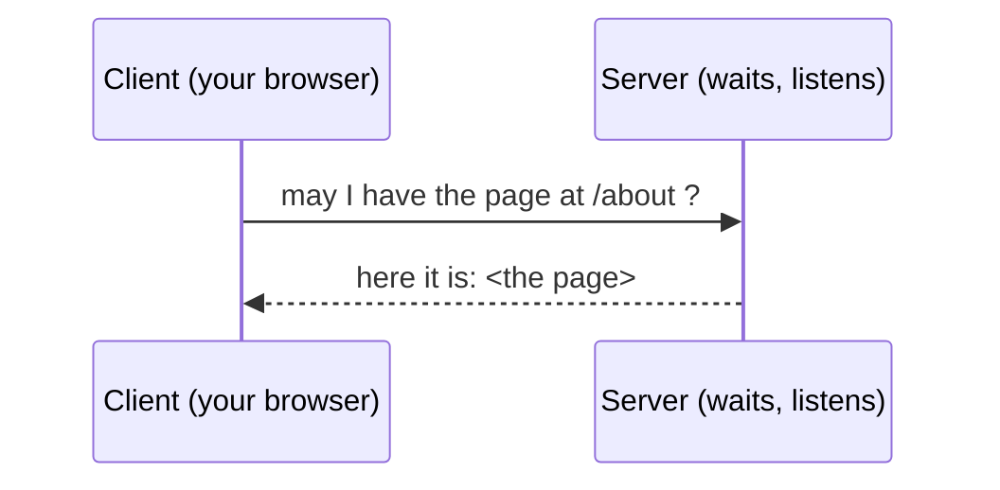

# Client, Server & Talking the Same Language

We have a request that travels (Phase 1) and a way to find the right machine (Phase 2). Now the last piece: when your request arrives at that machine, how do the two computers actually understand each other? They've never met. They might be made by different companies, running different software, on different continents. And yet they cooperate flawlessly. The answer is the quiet genius of the whole internet - and it's not magic, it's *agreements*.

## The client/server model

**What it actually is.** Almost everything on the internet is one machine **asking** and another machine **answering**. The one that asks is the **client**. The one that answers is the **server**. That's the whole pattern.



📝 **Terminology.** *Client* = the machine that initiates a request (your phone, your browser). *Server* = the machine that waits for requests and responds. A single computer can be both at different moments - but in any one exchange, one side asks and one side answers.

**Why people get this wrong.** It's tempting to imagine two computers in a balanced back-and-forth "conversation," like two people chatting. It's more lopsided than that, and more orderly: the server doesn't reach out to you. It sits there, doing nothing, *waiting*. It only ever speaks when spoken to. Your browser starts every exchange. This is why a server can quietly serve millions of different clients - it's not pursuing anyone; it's a shop with the lights on, answering whoever walks in.

## Protocols: agreeing how to talk

For the asking and answering to work, both sides have to agree - in exact detail - on how a request and a response are shaped. That shared agreement is called a **protocol**.

**What it actually is.** A protocol is a **rulebook for a conversation**: what you're allowed to say, in what order, and what each thing means. Both machines are built to follow the same rulebook, so they understand each other even though they've never met and share nothing else.

📝 **Terminology.** *Protocol* = an agreed set of rules for how two machines communicate. The internet is built from many protocols, each handling one part of the job.

Here's the everyday analogy. When you call a restaurant, there's an unwritten protocol: they say "Hello, Mario's"; you say "I'd like to order"; they say "go ahead"; you give your order; they read it back. If both sides follow the same script, it works - even between total strangers. Break the script (you start reciting your order before they pick up) and the conversation falls apart. Machines are even stricter about following the script, because they can't improvise.

The two protocols you'll meet first are **HTTP** and **TCP**, and they do two different jobs.

### HTTP - the language for asking for web pages

**What it actually is.** HTTP is the protocol for *web* conversations specifically. It defines how a client asks for a page and how a server answers. When you opened a page in Phase 1, the request your device built was an HTTP request - something close to "GET me the page at this path" - and the server's reply was an HTTP response carrying the page plus a status (like the famous `404 Not Found`).

📝 **Terminology.** *HTTP* = *HyperText Transfer Protocol*, the agreement web browsers and web servers use to request and deliver pages. The `s` in `https` means the same thing, encrypted so others can't read it in transit.

You can see HTTP's reply with your own eyes. This command asks a server for a page and prints just the response's opening lines (its *headers*):

```console
$ curl -I https://example.com

HTTP/1.1 200 OK
Content-Type: text/html; charset=UTF-8
Content-Length: 1256
Date: Fri, 19 Jun 2026 12:00:00 GMT
```

*What just happened:* Your machine acted as a client and spoke HTTP to `example.com`. The server answered in the same protocol. `HTTP/1.1 200 OK` is the server saying "I understood your request, and here's a successful response" - `200` is HTTP's code for success, the happy cousin of `404`. The other lines describe what's coming back (it's HTML, it's 1256 bytes long, here's the date). Both machines understood each other perfectly because both follow the HTTP rulebook. The full shape of these requests and responses is the subject of [HTTP Explained](/guides/http-explained).

### TCP - the agreement that delivers it reliably

HTTP describes *what* to say. But remember from Phase 1 that the message travels as packets, which can arrive out of order or go missing. Something has to make sure the whole message actually shows up, intact and in order. That something is **TCP**.

**What it actually is.** TCP is the protocol that turns the unreliable flurry of packets into a reliable, in-order stream. It numbers the packets, puts them back in the right order at the other end, notices if any went missing, and asks for those to be resent. HTTP rides *on top of* TCP: HTTP writes the message, TCP guarantees its delivery.

📝 **Terminology.** *TCP* = *Transmission Control Protocol*, the agreement that delivers data reliably and in order across a network, hiding the messy reality of lost and out-of-order packets.

So the two work as a team:

```text
   HTTP   "GET /about"           ← what to say (the web request)
     │
     ▼  handed to TCP to deliver
   TCP    [#1][#2][#3][#4]...     ← reliable, in-order delivery
          numbers the packets, resends any that get lost,
          reassembles them in order at the far end
```

This is one example of a much bigger idea: protocols are **stacked**. Each one trusts the layer below it to handle its job, so each layer can stay simple. HTTP doesn't worry about lost packets - that's TCP's problem. TCP doesn't worry about which physical cable the packet takes - that's a job for the layer below *it*. The full stack, named the **TCP/IP model**, is laid out in [The TCP/IP Model](/guides/tcp-ip-model). For now, the takeaway is just the shape: simple agreements, stacked, each handling one thing.

⚠️ **Gotcha.** TCP makes delivery *reliable*, not *instant* or *private*. "Reliable" here means "complete and in order" - it does not mean fast, and plain TCP does not mean encrypted. (Privacy is what the `s` in `https` adds, layered on top.) Don't read "reliable" as "secure" - they're different promises from different layers.

## So... is the internet magic?

No. And this is the reassuring part to end on. Everything you've seen in this guide is a small, sensible agreement, stacked on top of another small, sensible agreement:

- Data travels as **packets** - labeled chunks (Phase 1).
- Machines are found by **IP address**, a number, and **DNS** translates human names into those numbers (Phase 2).
- One machine asks (**client**), another answers (**server**) (this phase).
- They understand each other because they share **protocols** - **HTTP** for the web request, carried reliably by **TCP**, which rides on **IP** below it.

No single piece is complicated. The internet feels like magic only because so many simple agreements run at once, invisibly, in a fraction of a second. Pull any one out and look at it - as you just did - and it's understandable. That's the real secret: **the internet is not one incomprehensible thing. It's a lot of simple agreements, stacked up.** And every one of them is something you can learn.

## Recap

1. The internet runs on the **client/server model**: one machine asks (client), another waits and answers (server).
2. A **protocol** is a shared rulebook for a conversation - it lets machines that have never met understand each other exactly.
3. **HTTP** is the protocol for asking for and delivering web pages; **TCP** is the protocol that carries it reliably, putting packets back in order and resending lost ones.
4. Protocols are **stacked** - each layer handles one job and trusts the layer below - which is the heart of the **TCP/IP model**.
5. The internet isn't magic. It's many **simple agreements stacked up**, each one learnable on its own.

---

[← Guide overview](_guide.md) · Next up: go deeper with [IP, DNS & Ports](/guides/ip-dns-and-ports), [HTTP Explained](/guides/http-explained), and [The TCP/IP Model](/guides/tcp-ip-model).
