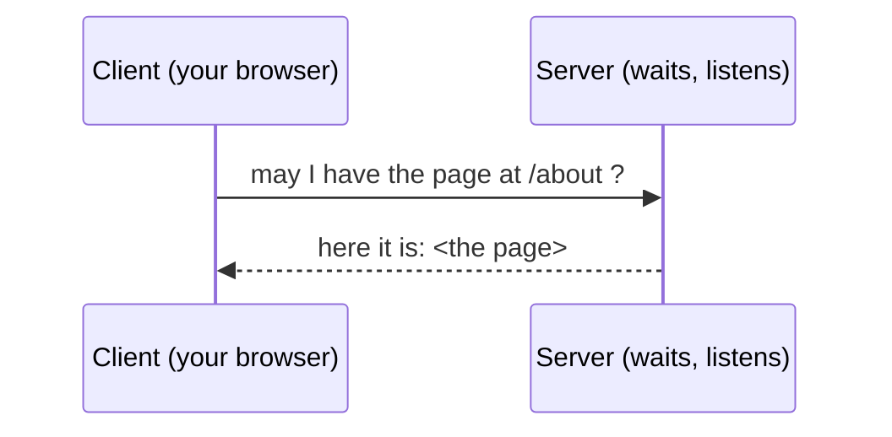

# Client, Server & Talking the Same Language

We have a request that travels (Phase 1) and a way to find the right machine (Phase 2). Last piece: when your request arrives, how do the two computers actually understand each other? They've never met, may run different software on different continents - yet they cooperate flawlessly. Not magic - *agreements*.

## The client/server model

Almost everything on the internet is one machine **asking** and another **answering**. The one that asks is the **client**; the one that answers is the **server**. That's the whole pattern.



📝 **Terminology.** *Client* = the machine that initiates a request (your phone, your browser). *Server* = the machine that waits for requests and responds. A single computer can be both at different moments - but in any one exchange, one side asks and one side answers.

It's tempting to imagine two computers in a balanced back-and-forth "conversation." It's more lopsided than that: the server doesn't reach out to you - it sits doing nothing, *waiting*, and only speaks when spoken to. Your browser starts every exchange. That's why a server can quietly serve millions of clients - it's not pursuing anyone; it's a shop with the lights on, answering whoever walks in.

## Protocols: agreeing how to talk

For the asking and answering to work, both sides have to agree - in exact detail - on how a request and response are shaped. That shared agreement is a **protocol**: a rulebook for a conversation - what you're allowed to say, in what order, and what it means. Both machines follow the same rulebook, so they understand each other despite sharing nothing else.

📝 **Terminology.** *Protocol* = an agreed set of rules for how two machines communicate. The internet is built from many protocols, each handling one part of the job.

Calling a restaurant has an unwritten protocol: they say "Hello, Mario's"; you say "I'd like to order"; they say "go ahead." Both sides follow the script and it works, even between strangers - break it (order before they pick up) and it falls apart. Machines are stricter still, because they can't improvise.

The two protocols you'll meet first are **HTTP** and **TCP**, doing two different jobs.

### HTTP - the language for asking for web pages

HTTP is the protocol for *web* conversations. It defines how a client asks for a page and how a server answers. The request your device built in Phase 1 was an HTTP request - roughly "GET me the page at this path" - and the server's reply was an HTTP response carrying the page plus a status (like the famous `404 Not Found`).

📝 **Terminology.** *HTTP* = *HyperText Transfer Protocol*, the agreement browsers and servers use to request and deliver pages. The `s` in `https` means the same thing, encrypted so others can't read it in transit.

You can see HTTP's reply yourself. This asks a server for a page and prints just the response's opening lines (its headers):

```console
$ curl -I https://example.com

HTTP/1.1 200 OK
Content-Type: text/html; charset=UTF-8
Content-Length: 1256
Date: Fri, 19 Jun 2026 12:00:00 GMT
```

*What just happened:* your machine spoke HTTP to `example.com`, and it answered in kind. `HTTP/1.1 200 OK` is the server saying "I understood your request, and here's a successful response" - `200` is HTTP's code for success, the happy cousin of `404`. The other lines describe what's coming back (it's HTML, 1256 bytes, dated). Both machines understood each other because both follow the HTTP rulebook. The full shape of requests and responses is [HTTP Explained](/guides/http-explained).

### TCP - the agreement that delivers it reliably

HTTP describes *what* to say. But the message travels as packets, which can arrive out of order or go missing (Phase 1) - something has to make sure the whole message shows up intact. That's **TCP**.

TCP turns the unreliable flurry of packets into a reliable, in-order stream: it numbers them, puts them back in order at the other end, notices any missing, and asks for those to be resent. HTTP rides *on top of* TCP - HTTP writes the message, TCP guarantees delivery.

📝 **Terminology.** *TCP* = *Transmission Control Protocol*, the agreement that delivers data reliably and in order, hiding the messy reality of lost and out-of-order packets.

```text
   HTTP   "GET /about"           ← what to say (the web request)
     │
     ▼  handed to TCP to deliver
   TCP    [#1][#2][#3][#4]...     ← reliable, in-order delivery
          numbers the packets, resends any that get lost,
          reassembles them in order at the far end
```

This is one example of a bigger idea: protocols are **stacked**. Each trusts the layer below to handle its job, so each stays simple. HTTP doesn't worry about lost packets - that's TCP's problem. TCP doesn't worry about which cable the packet takes - that's the layer below *it*. The full stack, the **TCP/IP model**, is laid out in [The TCP/IP Model](/guides/tcp-ip-model). For now, the shape is what matters: simple agreements, stacked, each handling one thing.

⚠️ **Gotcha.** TCP makes delivery *reliable*, not *instant* or *private*. "Reliable" means "complete and in order" - not fast, and plain TCP isn't encrypted (that's what the `s` in `https` adds). Don't read "reliable" as "secure" - different promises from different layers.

## So... is the internet magic?

No - and that's the reassuring part. Everything in this guide is a small, sensible agreement stacked on another:

- Data travels as **packets** - labeled chunks (Phase 1).
- Machines are found by **IP address**, and **DNS** translates human names into those numbers (Phase 2).
- One machine asks (**client**), another answers (**server**) (this phase).
- They understand each other through **protocols** - **HTTP** for the web request, carried reliably by **TCP**, riding on **IP** below it.

No single piece is complicated. The internet feels like magic only because so many simple agreements run at once, invisibly, in a fraction of a second. Pull any one out and look at it, as you just did, and it's understandable. **The internet is not one incomprehensible thing. It's a lot of simple agreements, stacked up** - and every one is learnable.

## Recap

1. The internet runs on the **client/server model**: one machine asks (client), another waits and answers (server).
2. A **protocol** is a shared rulebook for a conversation - it lets machines that have never met understand each other exactly.
3. **HTTP** is the protocol for asking for and delivering web pages; **TCP** is the protocol that carries it reliably, putting packets back in order and resending lost ones.
4. Protocols are **stacked** - each layer handles one job and trusts the layer below - the heart of the **TCP/IP model**.
5. The internet isn't magic. It's many **simple agreements stacked up**, each one learnable on its own.

---

[← Guide overview](_guide.md) · Next up: go deeper with [IP, DNS & Ports](/guides/ip-dns-and-ports), [HTTP Explained](/guides/http-explained), and [The TCP/IP Model](/guides/tcp-ip-model).
