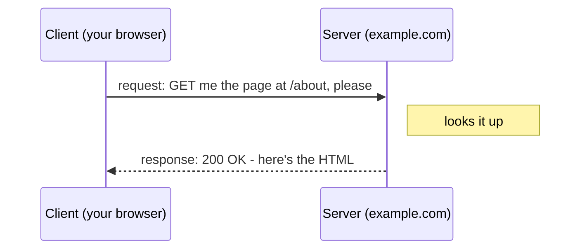

# Request & Response - the core model

Here's the secret that makes all of HTTP click: it's just one move, repeated forever. One side asks;
the other answers. Your browser sends a **request**, and a server sends back a **response**. That's
it. Every page you've ever loaded, every image, every login - all of it is this same back-and-forth
happening over and over, faster than you can see.

Once you can picture that one exchange, nothing else in this guide is mysterious. So let's look at it
closely.

## The two roles: client and server

**What they actually are.** A **client** is whoever starts the conversation - almost always your web
browser, but it could be a phone app or a tiny script. A **server** is the computer that's sitting
there waiting to answer. The client speaks first, always. The server never randomly calls you up; it
only ever replies to something that was asked.

📝 **Terminology.** **Client** = the side that asks (your browser). **Server** = the side that
answers (the machine hosting the website). The whole pattern is called **request–response**.

**Why people get this wrong.** It's tempting to imagine the website "sending you" a page out of the
blue, like a TV channel broadcasting. It doesn't work that way. Nothing arrives until your browser
asks for it. When a page seems to update on its own, what's really happening is your browser quietly
sending more requests in the background - still the same one move.

Here's the shape of it:



One arrow out, one arrow back. Hold onto this picture - everything below is just filling in what those
two arrows actually contain.

## A real request and response

Let's make it concrete. When you visit a page, your browser sends a request that - written out in
plain text - looks roughly like this:

```http
GET /about HTTP/1.1
Host: example.com
User-Agent: Mozilla/5.0
Accept: text/html
```
*What just happened:* Your browser asked for one specific thing. The first line is the heart of it:
`GET` is the **method** (the verb - "fetch me this," covered in [Phase 2](02-methods-and-status-codes.md)),
`/about` is the **path** (which page), and `HTTP/1.1` is the version of the language being spoken. The
lines below are **headers** - little extra notes, like `Host` (which site, since one server can host
many) and `Accept` (what format the browser would like back). We'll dig into headers in
[Phase 3](03-headers-cookies-and-https.md); for now, just see that a request is the verb, the path,
and some notes.

The server reads that, finds the page, and sends a response:

```http
HTTP/1.1 200 OK
Content-Type: text/html
Content-Length: 1256

<!DOCTYPE html>
<html>
  <head><title>About Us</title></head>
  <body>...</body>
</html>
```
*What just happened:* The server answered. The first line is its verdict: `200 OK` means "found it,
here you go" (status codes are all of [Phase 2](02-methods-and-status-codes.md)). Then a couple of
headers describing the answer - `Content-Type: text/html` says "what follows is a web page" - a blank
line, and then the **body**: the actual HTML your browser will draw on screen. Request had a verb and
a path; response has a status and a body. That symmetry is the whole protocol.

💡 **Key point.** A request is essentially *"verb + address + notes."* A response is *"status +
notes + the actual content."* If you can read those two messages, you can read HTTP.

## The anatomy of a URL

Every request starts with an address - a **URL** - and that address is more structured than it looks.
Learning to read it is like learning to read a postal address: once you see the parts, you know
exactly where a request is headed.

📝 **Terminology.** **URL** stands for Uniform Resource Locator. In everyday speech it's just "the
link" or "the web address" - the thing in your browser's address bar.

Take this one apart:

```text
   https://shop.example.com/products/shoes?color=blue&size=10
   └─┬─┘   └──────┬───────┘└─────┬──────┘└────────┬─────────┘
   scheme       host           path             query
```

- **Scheme** (`https`) - *how* to talk. `https` means "HTTP, but encrypted" (the whole point of
  [Phase 3](03-headers-cookies-and-https.md)); plain `http` means unencrypted. The scheme tells the
  browser which rules to use before it says a word.
- **Host** (`shop.example.com`) - *who* to talk to. This is the server's name. Behind the scenes it
  gets translated into a numeric address so your request can find the machine - that translation is
  DNS, and it has its own guide: [IP, DNS, and Ports](/guides/ip-dns-and-ports).
- **Path** (`/products/shoes`) - *which thing* on that server you want. Think of the host as a building
  and the path as the room number. `/about`, `/products/shoes`, `/login` - each path is a different
  resource the server can hand back.
- **Query** (`?color=blue&size=10`) - *extra instructions* tacked on. It starts with a `?`, and each
  instruction is a `name=value` pair joined by `&`. Here it's saying "the shoes page, but filtered to
  blue, size 10." The query is how a request carries little parameters without changing which path
  it's asking for.

**Why this saves you later.** The next time a link looks like a wall of `?utm_source=...&ref=...&id=842`,
you won't be intimidated. You'll see it for what it is: a path, then a `?`, then a list of
`name=value` instructions. And when a developer says "pass it as a query parameter," you'll know
exactly which part of the URL they mean.

⚠️ **Gotcha.** The query string is *visible* - it sits right there in the address bar, in your browser
history, and often in the server's logs. That makes it perfectly fine for things like a search term or
a filter, but a poor place for anything secret. Putting a password or a private token in the query
(`?password=hunter2`) means it gets written down in several places you don't control. Secrets travel
in headers or the request body instead, both of which we meet in [Phase 3](03-headers-cookies-and-https.md).

## Recap

1. HTTP is one repeated move: the **client** (your browser) sends a **request**, the **server** sends
   a **response**.
2. A **request** is a verb + a path + some header notes. A **response** is a status + some headers +
   the body (the actual content).
3. A **URL** breaks into **scheme** (how), **host** (who), **path** (which thing), and **query**
   (extra `name=value` instructions after a `?`).
4. The query string is visible to many eyes - fine for filters, wrong for secrets.

You now have the skeleton. Next, let's name the verbs a request can use, and learn to read the
three-digit replies a server sends back - including the famous `404`.

Watch it animated: [an HTTP request/response](/explainers/HTTPRequest.dc.html)

---

[← Guide overview](_guide.md) · [Phase 2: Methods & Status Codes →](02-methods-and-status-codes.md)

## See it move

Step through the journey of one request - the DNS lookup, the request out, and the response back:

```playground-network
```
