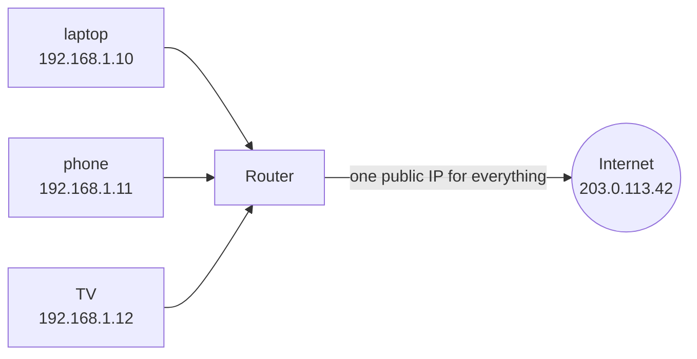

# IP Addresses - A Machine's Number

Every machine that talks on a network needs a way to be found. When you mail a letter, the postal system needs an address. When two computers talk, they need the same thing - a number that says "deliver this here, and nowhere else." That number is an **IP address**, and once you see it as nothing more than a mailing address, the whole topic settles down.

📝 **Terminology.** *IP* stands for *Internet Protocol* - the agreed-upon rules for addressing and delivering data between machines. An *IP address* is one machine's address under those rules.

## What an IP address actually is

**What it actually is.** An IP address is a number assigned to a device on a network so other devices can send data to it specifically. That's the whole job: identify one endpoint so traffic reaches it and not the machine next to it.

**Why people get this wrong.** People often think an IP address is glued to a device forever, like a serial number etched in the factory. It usually isn't. Your laptop gets an IP when it joins a network and may get a different one tomorrow. The address describes *where you are on the network right now*, not *who you are* - closer to a hotel room number than a passport.

**What it looks like.** The familiar form is four numbers separated by dots, each from 0 to 255:

```text
   203.0.113.42
   └─┬─┘ └─┬─┘
   network part   host part      (roughly - the split varies)
```

You read it left to right like a postal address narrowing down: the left portion points at a network, the right portion points at a specific machine within it.

## IPv4 vs IPv6 - why we made a second kind

**The problem that forced a change.** The original scheme, **IPv4**, uses those four dotted numbers. Four slots of 0–255 gives about 4.3 billion possible addresses. In the 1980s that sounded endless. Then every phone, laptop, thermostat, doorbell, and server wanted one, and 4.3 billion stopped being enough. We genuinely ran out.

📝 **Terminology.** *IPv4* = Internet Protocol version 4, the original dotted-decimal addresses. *IPv6* = version 6, the newer, much larger scheme. (There was no widely deployed "version 5" - the number was already used for something else, so the next version became 6.)

**The fix.** **IPv6** uses much longer addresses written in hexadecimal, separated by colons:

```text
   IPv4:  203.0.113.42
   IPv6:  2001:0db8:85a3:0000:0000:8a2e:0370:7334
```

The exact count isn't worth memorizing - the point is that IPv6 has so many addresses that running out is no longer a practical worry. The two systems run side by side today; most devices speak both, and a single machine often has an IPv4 *and* an IPv6 address at the same time.

⚠️ **Gotcha.** IPv6 addresses can be shortened: long runs of zeros collapse to `::`, and leading zeros in a group are dropped. So `2001:0db8:0000:0000:0000:0000:0000:0001` may appear as `2001:db8::1`. Same address, two spellings - that surprises everyone the first time they compare two logs.

## Public vs private - your devices share one address

This is the part that quietly confuses almost everyone, so let's go slowly.

**Two worlds, two kinds of address.** Your home has many devices - phone, laptop, TV, console. Each gets a **private IP address**, handed out by your router, that only means something *inside your home network*. Out on the public internet, your whole home appears as a *single* **public IP address**, the one your internet provider gave your router.



📝 **Terminology.** *Private IP addresses* come from reserved ranges (you'll often see `192.168.x.x` or `10.x.x.x`) that are reused in every home and office worldwide - they're meaningful only inside their own network. *Public IP addresses* are unique across the whole internet.

**How one public IP serves a whole house.** Your router keeps a little ledger. When your laptop asks for a web page, the router notes "this reply belongs to the laptop," sends the request out under the *public* IP, and routes the answer back to the right device when it returns. That translation trick is called **NAT** (Network Address Translation). It's also one reason IPv4 survived running out of addresses - a thousand homes can hide behind far fewer public addresses.

**Why this saves you later.** "What's my IP?" has two honest answers, and now you can tell them apart. The address a website sees is your *public* one (shared by your household). The address your laptop calls itself on the home network is a *private* one. When a tutorial says "connect to `192.168.x.x`," it means a device on your own network - not something out on the internet.

## See it for yourself

Let's make this concrete. First, find a public IP by asking your computer to look up a name (more on *how* that lookup works in the next phase - for now, just watch the number come back):

```console
$ ping example.com
PING example.com (93.184.215.14): 56 data bytes
64 bytes from 93.184.215.14: icmp_seq=0 ttl=56 time=11.3 ms
64 bytes from 93.184.215.14: icmp_seq=1 ttl=56 time=10.9 ms
^C
--- example.com ping statistics ---
2 packets transmitted, 2 packets received, 0.0% packet loss
round-trip min/avg/max = 10.9/11.1/11.3 ms
```

*What just happened:* You asked to "ping" a name. Your computer first turned `example.com` into an IP address (`93.184.215.14`), then sent tiny "are you there?" messages to that address. The server answered each one, and `time=11.3 ms` is how long the round trip took. The number in parentheses is the thing this phase is about - the actual address the name points to. (Press Ctrl-C to stop pinging; on Windows, `ping` sends four messages and stops on its own.)

⚠️ **Gotcha.** A failed `ping` does *not* always mean a site is down. Many servers are deliberately configured to ignore pings while happily serving web pages. `ping` is a quick liveness probe, not a verdict on whether a service works.

Now look at your laptop's *private* address on the home network:

```console
$ ipconfig getifaddr en0
192.168.1.10
```

*What just happened:* You asked your machine which IP it's using on its active network connection, and it answered with a private `192.168.x.x` address - the room number inside your house, not the street address the world sees. (On Windows, run `ipconfig`; on Linux, `ip addr` - the command differs, the idea doesn't.)

## Recap

1. **An IP address is a machine's number on a network** - where it is right now, not a permanent identity.
2. **IPv4** (dotted numbers like `203.0.113.42`) ran out of addresses, so **IPv6** (long, colon-separated) was created with far more.
3. **Private IPs** are meaningful only inside your own network; **public IPs** are unique on the internet.
4. **All your home devices share one public IP**, with your router using **NAT** to route replies back to the right device.

You now have the *number*. But you didn't type a number - you typed a name. Next, the system that translates one into the other.

---

[← Guide overview](_guide.md) · [Phase 2: DNS - Names to Numbers →](02-dns.md)

## Try it yourself

Change the address or drag the prefix - see the network, broadcast, and host range update live:

```playground-subnet
192.168.1.10/24
```
