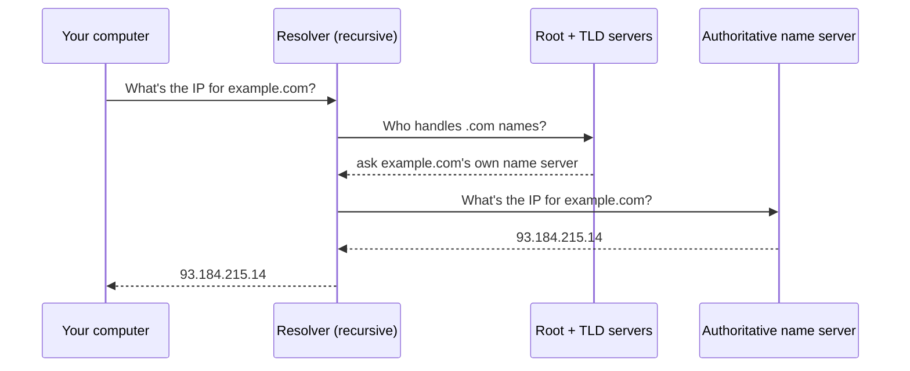

# DNS - Names to Numbers

In the last phase you saw that machines find each other by number. But you don't type numbers - you type `example.com`, `github.com`, the name of your bank. Names are for humans; numbers are for machines. Something has to translate between the two, every single time, before any connection can happen. That something is **DNS**, and it runs so smoothly that most people never learn it exists - until it breaks, and a perfectly healthy website appears to vanish.

📝 **Terminology.** *DNS* stands for *Domain Name System*. Think of it as the internet's phone book: you know the name, DNS gives you the number.

## What DNS actually does

**What it actually is.** DNS is a lookup service. You hand it a name (`example.com`) and it hands back an IP address (`93.184.215.14`). Your browser then connects to that address. The name is a convenience for you; the address is what the network actually uses.

**Why people get this wrong.** It's tempting to imagine one giant computer somewhere holding a master list of every name on earth. There isn't one - there couldn't be. DNS is *distributed*: the answer for any name is spread across a chain of servers, each responsible for one slice of the job. No single machine knows everything, and that's the design, not a flaw.

**What it does in real life.** Every time you visit a site, follow a link, or load an image from another domain, a DNS lookup happens first (or a cached answer is reused - more on that shortly). It's the quiet first step of nearly every internet action.

## The lookup chain - who answers, in order

When your computer needs the IP for a name it hasn't seen recently, it doesn't ask one server - it walks a short chain. You don't have to memorize the machinery, but seeing the shape of it makes the failures later make sense.



📝 **Terminology.** A *resolver* (or *recursive resolver*) is the helper that does the legwork - it asks the other servers for you and returns the final answer. An *authoritative name server* is the one that actually *owns* the answer for a given domain. The intermediate steps (*root* and *TLD* servers, where *TLD* = top-level domain like `.com` or `.org`) just point the resolver toward the right authoritative server.

The key idea: each server in the chain doesn't know the final answer, but it knows *who to ask next*. The resolver follows that trail of pointers until it reaches the authoritative server, then hands the IP back to you.

## Caching - why it's fast the second time

If every lookup walked that whole chain, the internet would feel sluggish. It doesn't, because of **caching**: once an answer is found, it's remembered for a while at several points along the way - your computer, your resolver, even your browser.

📝 **Terminology.** *Caching* means storing an answer so the next request can reuse it instead of looking it up again. Each DNS answer carries a **TTL** (*time to live*) - a countdown in seconds saying how long it's safe to remember before checking again.

**Why this matters in real life.** The first visit to a site does the full lookup; the next visits reuse the cached answer and skip straight to connecting. It's why a site you just visited loads faster than one you haven't.

⚠️ **Gotcha.** Caching is also why changes don't take effect instantly. If a site moves to a new IP address, machines that cached the old one keep using it until the TTL expires. This is the source of the classic "it works on my machine but not yours" during a migration - one of you has a stale cached answer. Clearing your DNS cache or waiting out the TTL fixes it.

## See a lookup happen

You can watch the translation directly. The `dig` tool (Domain Information Groper) shows you exactly what DNS returns:

```console
$ dig example.com

; <<>> DiG 9.18.18 <<>> example.com
;; global options: +cmd
;; Got answer:
;; ->>HEADER<<- opcode: QUERY, status: NOERROR, id: 35012
;; flags: qr rd ra; QUERY: 1, ANSWER: 1

;; QUESTION SECTION:
;example.com.            IN  A

;; ANSWER SECTION:
example.com.    3600    IN  A   93.184.215.14

;; Query time: 12 msec
;; SERVER: 1.1.1.1#53(1.1.1.1)
```

*What just happened:* You asked DNS for the address of `example.com`. The QUESTION SECTION echoes what you asked (an `A` record - the record type that maps a name to an IPv4 address). The ANSWER SECTION is the payoff: `example.com` is `93.184.215.14`, and the `3600` is the TTL - this answer is good to cache for 3600 seconds (one hour). The `SERVER` line shows which resolver answered (`1.1.1.1`) and that DNS rode on port `53` - a detail that connects straight to the next phase.

If you're on a system without `dig`, `nslookup` does a similar job:

```console
$ nslookup example.com
Server:     1.1.1.1
Address:    1.1.1.1#53

Non-authoritative answer:
Name:   example.com
Address: 93.184.215.14
```

*What just happened:* Same translation, plainer output. "Non-authoritative answer" means it came from your resolver's cache or its legwork, not directly from the domain's own authoritative server - which is completely normal and not a problem.

## "It's probably DNS" - why outages hide here

There's a running joke among engineers that whenever something breaks mysteriously, "it's probably DNS." It's a joke because it's so often true.

Here's why. DNS is the *first* step of almost every connection. If the lookup fails or returns a wrong/stale address, your browser never even reaches the real server - so the symptom looks identical to the site being down. The server may be perfectly healthy, serving everyone else, while *you* can't load it because your translation step failed.

🪖 **War story.** A team once spent an hour convinced their app server had crashed - it was unreachable, pages timed out, panic rising. The server was fine the whole time. A DNS change had propagated unevenly: their office resolver still cached the old IP, pointing them at a machine that no longer existed. Everyone outside the office loaded the site normally. The fix was waiting out a TTL, not restarting anything.

**How to tell DNS apart from a real outage.** If `ping example.com` or `dig example.com` can't resolve the name at all, but pinging a known IP directly works, the problem is name resolution, not connectivity. That single distinction will save you from restarting things that were never broken.

## Recap

1. **DNS is the internet's phone book** - it translates names you type into the IP addresses machines use.
2. **No single server knows everything**; a **resolver** walks a chain (root → TLD → authoritative) following pointers to the final answer.
3. **Caching** (with a **TTL** countdown) makes repeat lookups fast - and makes changes take time to spread.
4. **When DNS fails, healthy sites look dead** to you, because the lookup is the first step of every connection. Check whether the *name* resolves before assuming the *server* is down.

You can now turn a name into a number. But an address gets your request to the right *machine* - how does it reach the right *service* on that machine? That's ports.

Follow a single lookup as it travels from your machine out to the root, TLD, and authoritative servers:

```playground-dns
```

---

[← Phase 1: IP Addresses](01-ip-addresses.md) · [Guide overview](_guide.md) · [Phase 3: Ports - One Machine, Many Doors →](03-ports.md)
