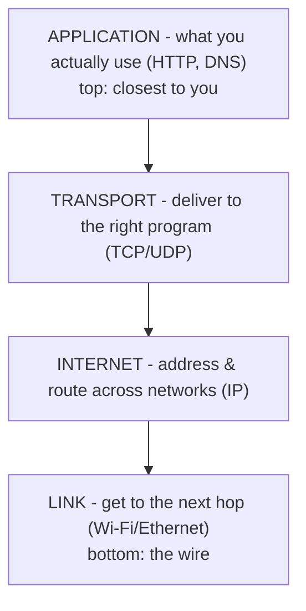
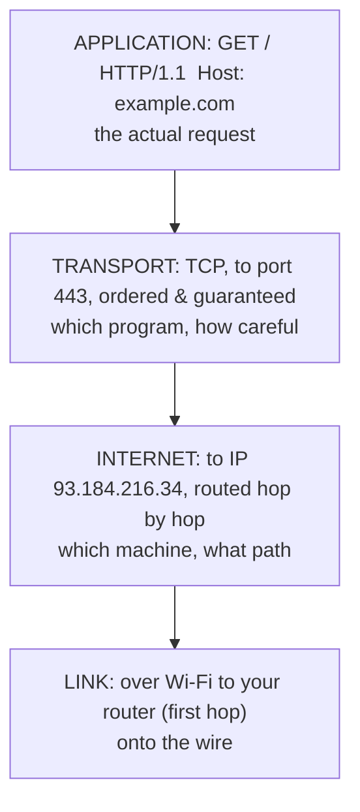

# The Four Layers

Now that you know *why* there are layers - one job each, trust below, wrapping on the way down - the four names finally have somewhere to land. The TCP/IP model has four of them, and they stack from the wire up to your app:

Read it as a journey getting *more abstract* as you go up. The bottom layer thinks about voltage and radio; the top layer thinks about web pages. Let's take them from the bottom, because that's the order your data is wrapped on the way out.

## Link: get it to the next hop

**What it actually is.** The Link layer is your machine's connection to the *one* device immediately next to it on the network - your Wi-Fi router, the switch under your desk, the cable in the wall. Its entire world is a single hop: "get this from here to the thing right next to me." It speaks the language of physical networks - Ethernet, Wi-Fi - and deals in **MAC addresses**, the hardware ID burned into each network card.

📝 **Terminology.** A *hop* is one step between two directly-connected devices. Your laptop to your router is one hop. Your router to your ISP is the next hop. A packet crossing the internet takes many hops; the Link layer only ever cares about the *next* one.

**What it does in real life.** Your network card takes the package handed down from above, wraps it for the local network, and puts it on the wire (or into the air) addressed to the next device - usually your router. That's it. The Link layer has no idea where the data is *ultimately* going. It's the mail carrier who knows the route to the local post office and nothing beyond.

**Why people get this wrong.** People assume their machine "connects to the website." It doesn't - not directly. Your machine connects to the *next hop*, which connects to *its* next hop, and so on. The Link layer is deliberately short-sighted, and that short-sightedness is what lets the same laptop work on Wi-Fi at home and Ethernet at the office: swap the Link layer, everything above it is untouched.

## Internet: address & route across networks

**What it actually is.** The Internet layer is where **IP** lives - the layer that gives every machine an address and figures out the path across the whole tangle of networks between you and the destination. If Link knows the next hop, the Internet layer knows the *whole route*, hop after hop, across networks it has never seen before.

📝 **Terminology.** *IP* (Internet Protocol) does two jobs: **addressing** (every machine gets an IP address, like `93.184.216.34`) and **routing** (each router along the way reads the destination IP and forwards the packet one hop closer). The unit it works with is the **packet**.

**What it does in real life.** The Internet layer stamps your data with a source IP (you) and a destination IP (the server) and hands it to the Link layer for the first hop. At every router along the way, the router reads that destination IP, consults its routing table, and sends the packet out the next hop toward the target. This is the layer that makes "the internet" a single network instead of millions of isolated ones.

⚠️ **Gotcha.** IP makes **no promises**. It will *try* to deliver each packet, but it doesn't guarantee arrival, doesn't guarantee order, and won't tell you if a packet vanished. This is called *best-effort* delivery, and it isn't a bug - it's a deliberate choice that keeps routers simple and fast. The job of *fixing* lost or out-of-order packets belongs to the layer above. Hold that thought; it's the entire reason TCP exists in [Phase 3](03-tcp-udp-and-the-round-trip.md).

## Transport: deliver to the right program

**What it actually is.** The Internet layer gets data to the right *machine*. But your machine is running dozens of programs at once - browser, email client, a music stream, three terminal tabs. The Transport layer's job is to deliver data to the right *program* on that machine, using **ports**.

📝 **Terminology.** A *port* is a number that identifies one program's "mailbox" on a machine. The IP address gets you to the building; the port number gets you to the right apartment. A web server listens on port `443` (HTTPS) or `80` (HTTP); your browser opens a temporary port for the reply. (See [/guides/ip-dns-and-ports](/guides/ip-dns-and-ports) if ports are still fuzzy.)

**What it does in real life.** Transport tags the data with a source port and a destination port so both ends know which program the bytes belong to. This is also the layer that decides *how careful* to be about delivery - and that's the big fork in the road. There are two main Transport protocols:

- **TCP** - careful: it sets up a connection, makes sure every byte arrives, and puts everything back in order.
- **UDP** - quick: it fires the data off with no connection and no guarantees.

Which one a program picks shapes everything about how it behaves. That choice is important enough that we give it [Phase 3](03-tcp-udp-and-the-round-trip.md) all to itself.

**Why this saves you later.** When you see `Connection refused` versus `Connection timed out`, that's the Transport layer talking. "Refused" means the machine answered but nothing was listening on that port (right building, no one home in that apartment). "Timed out" means nothing answered at all (you couldn't even reach the building - look lower, at Internet or Link). Knowing which layer owns the error tells you where to point your attention.

## Application: what you actually use

**What it actually is.** The Application layer is the top - the protocols you name out loud: **HTTP** for the web, **DNS** for name lookups, SMTP for email, SSH for remote shells. This is where your data *means something*: a request for a page, a query for an address, a chunk of video. Everything below exists to carry these messages faithfully.

**What it does in real life.** Your browser builds an HTTP request - "GET me this page" - and hands it down. From the Application layer's point of view, it's writing a letter and dropping it in the mailbox; it trusts the three layers below to handle envelopes, addresses, and trucks. It never thinks about IP addresses, ports, or Wi-Fi. (How HTTP itself is shaped is its own story: [/guides/http-explained](/guides/http-explained).)

**Why people get this wrong.** Because HTTP and DNS are the layer you touch, it's tempting to think they *are* networking. They're the visible tip. The reason a developer can write `fetch('https://example.com')` and ignore routing tables and radio frequencies is that the three layers underneath quietly do their one job each - exactly the payoff layering promised in [Phase 1](01-why-layers.md).

## One real request, mapped onto all four

Here's a single web request - your browser loading `https://example.com` - placed on the stack so you can see each layer's contribution:

*What just happened:* (an illustrative breakdown, not a packet capture) Top to bottom, each layer added the one thing it's responsible for. The Application layer wrote the request. Transport said "send it to the program on port 443, and be careful - it's TCP." The Internet layer said "that's IP `93.184.216.34`, here's the route." The Link layer said "first hop: my router, over Wi-Fi." Four jobs, four wrappers, one request on its way.

## Recap

1. **Link** - gets data to the *next hop* over Wi-Fi/Ethernet, using MAC addresses. Short-sighted on purpose.
2. **Internet (IP)** - *addresses* every machine and *routes* packets across networks. Best-effort: no delivery guarantee.
3. **Transport (TCP/UDP)** - delivers to the right *program* via ports, and decides how careful to be about delivery.
4. **Application (HTTP/DNS/…)** - the protocols you actually use, where the data *means* something.
5. **A real request touches all four**, each adding exactly its own piece on the way down.

You've met the four layers and seen them carry a request. The one question we kept deferring - *careful TCP or quick UDP?* - is next, along with a frame-by-frame trip of a single packet down the stack and back up.

---

[← Phase 1: Why Layers?](01-why-layers.md) · [Guide overview](_guide.md) · [Phase 3: TCP vs UDP & a Packet's Round Trip →](03-tcp-udp-and-the-round-trip.md)
