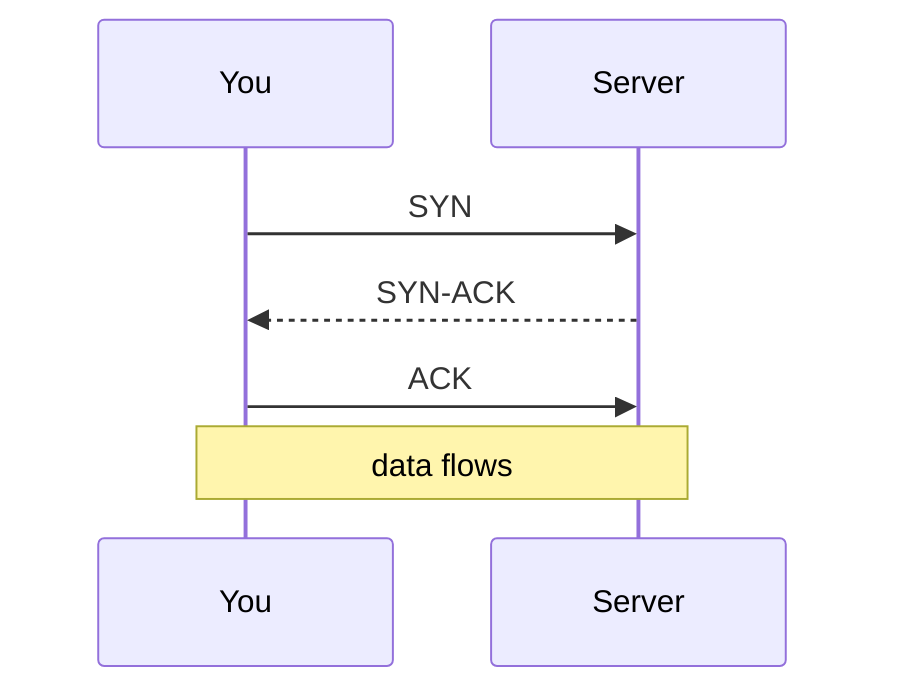
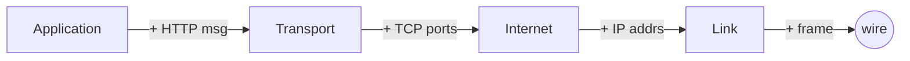
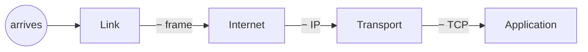

# TCP vs UDP & a Packet's Round Trip

We've deferred one question twice: at the Transport layer, your data rides on **TCP** or **UDP**. They solve the same surface problem - get bytes to the right program - in opposite ways, and the difference shapes how everything from video calls to web pages behaves. Once you understand the trade-off, you'll know *why* a glitchy video call recovers and a glitchy file download doesn't.

Then the satisfying part: take one packet and watch it travel all the way down your stack on the way out, and back up on the way in - encapsulation from [Phase 1](01-why-layers.md) and the four layers from [Phase 2](02-the-four-layers.md), finally in motion.

## TCP: reliable, ordered, connected

TCP (Transmission Control Protocol) is the careful courier. Before sending a single byte, it establishes a *connection* with the other end, then guarantees three things: every byte arrives, in order, and anything missing gets re-sent. IP underneath makes no such promises (Phase 2) - TCP is the layer that *builds* reliability on top of unreliable IP.

**The connection starts with a handshake.** TCP can't just start talking; both sides first agree to. This is the **three-way handshake** - three short messages before any real data flows:



📝 **Terminology.** *SYN* = "synchronize" (let's start, here's my sequence number). *ACK* = "acknowledge" (I received yours). Every chunk TCP sends gets acknowledged; if an ACK doesn't come back in time, TCP assumes the chunk was lost and re-sends it - that ACK-and-retransmit loop is the whole reliability machine.

Loading a web page, downloading a file, sending an email - all TCP. These are cases where a single wrong or missing byte ruins everything: a half-downloaded program won't run, a corrupted page won't render. You want *correct* more than *instant*.

⚠️ **Gotcha.** All that care has a cost: the handshake adds a round trip *before* your data even starts, and waiting to re-send lost pieces adds delay. Fine for a file download. For a live video call, that same "stop and re-send the missing piece" behavior would make the call stutter and lag - exactly where UDP comes in.

## UDP: fast, fire-and-forget

UDP (User Datagram Protocol) is the opposite philosophy: no handshake, no connection, no guarantees. It takes your data, stamps on the ports, and throws it at the destination. If a packet gets lost, UDP neither knows nor cares - a postcard with no tracking versus TCP's signature-required parcel.

This sounds reckless until you meet the cases it's *perfect* for: live video and voice calls, online games, DNS lookups. In a video call, a packet that arrives late is *worthless* - the moment it describes already passed. You'd rather drop it and show the next frame than freeze the picture waiting for a re-send. That's the UDP bargain: speed and freshness over completeness.

💡 **Key point.** The choice isn't "TCP good, UDP bad." It's a trade-off matched to the job. *Does a late or missing piece ruin the result (file, page) or is it just stale (a video frame, a game position)?* Ruined → TCP. Merely stale → UDP.

Here's the honest side-by-side:

```text
                    TCP                         UDP
   Connection?      yes - handshake first       no - just send
   Lost packets?    detected and re-sent        ignored
   Order?           guaranteed in order         may arrive out of order
   Speed/overhead?  slower, more overhead       fast, minimal overhead
   Best for         web, downloads, email       video/voice, games, DNS
   The bargain      correctness over speed      freshness over completeness
```

📝 **Terminology.** TCP's unit is called a *segment*; UDP's is called a *datagram*. Both get wrapped by IP into a *packet* for the trip - different names for "the chunk this layer is handling."

## A packet's round trip: down on send, up on receive

This is where every idea in the guide comes together. Watch a single request go **down** your stack as it leaves, and the reply come **up** the other machine's stack as it arrives. Encapsulation on the way down; the reverse - *de*-encapsulation - on the way up.

### On send: wrapping, top to bottom


*What just happened:* your HTTP request started as plain text at the top and picked up one wrapper per layer on the way down - TCP's ports, IP's addresses, the Link layer's next-hop info - the nested-envelopes picture from [Phase 1](01-why-layers.md). Your original request sits untouched at the center the whole time. The fully-wrapped bundle goes out as a *frame* on the wire.

### Across the middle: routers peek, don't unwrap

The packet hops across the internet. Each router along the path strips and rebuilds *only the Link-layer wrapper* (each hop is a different physical link), reads the IP header to decide the next hop, and forwards it. The TCP segment and your HTTP request inside stay sealed - no router opens them. The outer envelope changes at each hop; the inner letter never does.

### On receive: unwrapping, bottom to top


*What just happened:* the receiving machine peeled the envelopes in exact reverse order - Link first, Application last - each layer reading the wrapper meant *for it* and handing the rest up. The server's Application layer receives the identical request your browser wrote, then builds a response and sends it down its own stack, wrapping it all over again for the trip home. That's the full round trip: down, across, up - and back.

## ⚠️ The OSI-7-vs-TCP/IP-4 confusion, settled

If you've read other material, you've seen a **seven**-layer model called **OSI**, not four. Here's the short version:

- The **TCP/IP model (4 layers)** describes how the internet *actually* works - the practical one, and what this guide taught.
- The **OSI model (7 layers)** is an older, more academic reference framework. It splits the work into finer slices - its bottom two map to TCP/IP's Link layer, and its top three (Session, Presentation, Application) fold into TCP/IP's single Application layer.

| OSI (7 layers, reference) | TCP/IP (4 layers, real) |
|---|---|
| Application · Presentation · Session | Application |
| Transport | Transport |
| Network | Internet |
| Data Link · Physical | Link |

💡 **Key point.** They describe the *same reality* at different resolutions - OSI just has more lines on the diagram. You'll hear engineers say "that's a layer 7 problem" (the application) or "a layer 3 issue" (IP/routing) - those numbers are OSI's. The mapping above lets you translate on the fly.

## Recap

1. **TCP** sets up a connection (the three-way handshake), then guarantees every byte arrives, in order, re-sending losses. Use it when a missing piece *ruins* the result: web, downloads, email.
2. **UDP** is fire-and-forget - no connection, no guarantees, minimal overhead. Use it when a missing piece is merely *stale*: video, voice, games, DNS.
3. **The choice is a trade-off:** correctness vs. freshness, matched to the job.
4. **On send, data is wrapped top-to-bottom (encapsulation); on receive, unwrapped bottom-to-top.** Routers in the middle touch only the outer Link wrapper and leave the rest sealed.
5. **OSI's 7 layers and TCP/IP's 4 describe the same reality** at different resolutions - OSI's numbers are the ones engineers quote ("layer 7", "layer 3").

That's the model, end to end: why layers exist, what the four are, and how a packet actually travels. The next time "TCP/IP" comes up, it won't be acronym soup - it'll be a picture you can reason from.

Walk the three-way handshake one packet at a time:

```playground-tcp
```

## Watch latency happen

Round-trip time isn't a fixed number - it wobbles, and on a bad connection packets get dropped outright. Watch a live connection and turn the dials:

```explainer-latency
```

Watch it animated: [the TCP handshake](/explainers/TCPHandshake.dc.html)

---

[← Phase 2: The Four Layers](02-the-four-layers.md) · [Guide overview](_guide.md)

**Related guides:** [How the Internet Works](/guides/how-the-internet-works) · [IP, DNS, and Ports](/guides/ip-dns-and-ports) · [HTTP Explained](/guides/http-explained)
