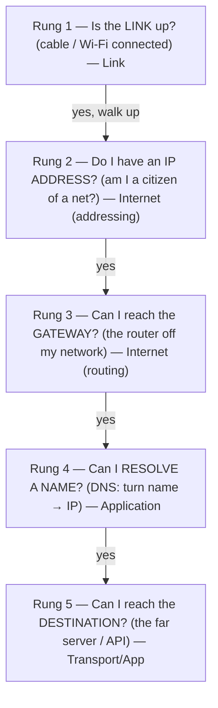

# Work Up the Layers

When the network is down, the room fills with theories. "It's the DNS." "It's the firewall." "It's their server." Everyone's guessing, and every guess costs a restart, a config change, a few more minutes of the page still not loading. The reason it feels chaotic is that a network connection isn't one thing — it's a tall stack of things, each one quietly depending on the one beneath it. A guess picks a rung at random.

Here's the mental shift that makes you calm: **you don't have to guess which rung broke — you can test them one at a time, from the bottom up, and stop at the first failure.** Each rung is a single yes/no question. Once you hit a "no," you're done diagnosing: everything *below* that rung is proven healthy, everything *above* it is irrelevant until you fix this one. That's the whole method. The tools in [Phase 2](02-the-core-tools.md) just answer these questions for you.

## The symptom cheat-card

> **Read your symptom, jump to the rung it points at, breathe. You're not guessing anymore.**

| The symptom | What it usually means | Start at |
|---|---|---|
| **Nothing loads** — every site, every app, all at once | Something low broke: no link, no IP, or no gateway | Rung 1 → 2 → 3 (§ below) |
| **One site/service is down**, everything else is fine | The low layers are healthy; it's name resolution or that one destination | Rung 4 (DNS), then Rung 5 |
| **Names fail but raw IPs work** (a URL hangs, but pinging an IP succeeds) | Classic DNS failure — the lookup, not the network | Rung 4 (DNS) |
| **Everything is slow / times out intermittently**, but does eventually work | The path exists but a hop is congested or lossy | Rung 5 (latency + path) — `ping`/`traceroute` |
| **"It's down" but you can't even tell where** | You don't have a fact yet | Rung 1 and walk up — collect facts, not theories |

Now the rungs themselves, bottom to top.

## The layers you're walking up

Each rung maps onto a layer of the TCP/IP model — the model that says a network is built in stacked levels, each one relying on the level below. (If that model is new to you, [The TCP/IP Model](/guides/tcp-ip-model) is the grounding; you can also just follow the picture below.)



📝 **Terminology.** Your *gateway* (or *default gateway*) is the router that connects your local network to everything else. Anything not on your own network goes out through it — so if you can't reach the gateway, you can't reach the internet at all, no matter how healthy your laptop is.

### Rung 1 — Is the link up?

**The question:** Is there a physical (or Wi-Fi) connection at all? An unplugged cable, a dropped Wi-Fi association, a disabled interface — the network equivalent of "is it plugged in." It's first because *nothing* above it can work without it, and it's the one people skip because it feels too dumb to check. Check it anyway.

```console
$ ip link show
1: lo: <LOOPBACK,UP,LOWER_UP> mtu 65536 ...
2: wlan0: <BROADCAST,MULTICAST,UP,LOWER_UP> mtu 1500 ...
```
*What just happened:* `ip link show` lists your network interfaces and their state. `wlan0` is the Wi-Fi adapter; the flags in angle brackets are the story. `UP` means the interface is administratively enabled, and **`LOWER_UP` means the physical/radio link is actually live** — a cable is seated, or Wi-Fi is associated with an access point. If `LOWER_UP` were missing (or you saw `state DOWN`), you'd stop right here: the cable's out or Wi-Fi dropped, and there's no point checking anything higher. (On Windows the equivalent is `ipconfig`; on macOS, `ifconfig` or the Wi-Fi menu.)

⚠️ **Gotcha.** `lo` (loopback) is *always* `UP` — it's the interface your machine uses to talk to itself (`127.0.0.1`). Seeing `lo: UP` tells you nothing about your real connection. Look at the named adapter (`wlan0`, `eth0`, `en0`), never loopback.

### Rung 2 — Do I have an IP address?

**The question:** Did I get an address on this network? The link can be up, but if your machine never got an IP (usually handed out automatically by DHCP), it isn't a participant — it can send and receive nothing useful.

```console
$ ip addr show wlan0
2: wlan0: <BROADCAST,MULTICAST,UP,LOWER_UP> mtu 1500 ...
    inet 192.168.1.74/24 brd 192.168.1.255 scope global dynamic wlan0
```
*What just happened:* The `inet 192.168.1.74/24` line is the thing you're looking for: a real, routable-on-your-LAN address. `scope global` and `dynamic` mean it's a normal address handed out by DHCP. You have an IP. Move up. (Addresses shown here are illustrative private-range examples.)

⚠️ **Gotcha.** If the only address you see starts with **`169.254.x.x`** (or `fe80::` for IPv6 link-local), that's a *self-assigned* address — your machine asked for a real one via DHCP, got no answer, and made one up. That's not "you have an IP," it's "you failed to get one." Treat `169.254.*` as a Rung-2 failure: the DHCP server (often the router) didn't respond. (📝 *DHCP* = the service that automatically leases IP addresses to devices that join the network.)

### Rung 3 — Can I reach the gateway?

**The question:** Can I talk to the router that's my door to the outside world? You have an address; now prove you can reach the one machine that everything off-network depends on. Find the gateway, then ping it.

```console
$ ip route show
default via 192.168.1.1 dev wlan0 ...
$ ping -c 3 192.168.1.1
PING 192.168.1.1 (192.168.1.1) 56(84) bytes of data.
64 bytes from 192.168.1.1: icmp_seq=1 ttl=64 time=2.31 ms
64 bytes from 192.168.1.1: icmp_seq=2 ttl=64 time=1.98 ms
64 bytes from 192.168.1.1: icmp_seq=3 ttl=64 time=2.10 ms

--- 192.168.1.1 ping statistics ---
3 packets transmitted, 3 received, 0% packet loss, time 2003ms
```
*What just happened:* `ip route show` told you the `default` route — the gateway — is `192.168.1.1`. Then `ping` sent three small probes to it and got three replies back, `0% packet loss`. Your conversation with the router works. The problem, if there is one, is *above* this rung — out past your own network. (Ping is covered properly in [Phase 2](02-the-core-tools.md); for now, replies = reachable.) If those pings had timed out instead, the break is local — your router or the link to it — and you'd stop here rather than blaming some distant server.

### Rung 4 — Can I resolve a name? (DNS)

**The question:** Can I turn a human name like `example.com` into an IP address? Almost everything you type is a name, and names mean nothing until DNS translates them. This rung is special because it's the single most common cause of "the internet is broken" that *isn't* the network — the path is fine, the lookup is what failed.

The clean test is to compare a *name* against a raw *IP*:

```console
$ ping -c 2 example.com
ping: example.com: Name or service not known
$ ping -c 2 93.184.216.34
64 bytes from 93.184.216.34: icmp_seq=1 ttl=56 time=11.4 ms
64 bytes from 93.184.216.34: icmp_seq=2 ttl=56 time=11.2 ms
```
*What just happened:* Pinging the *name* failed with `Name or service not known` — the resolver couldn't find an address for `example.com`. But pinging a raw IP directly *worked*. That split is the signature of a DNS problem: the network can carry packets fine (the IP ping proves it), it's the **name-to-address lookup** that's broken. When raw IPs work and names don't, you've found your rung — go straight to `dig`/`nslookup` in [Phase 2](02-the-core-tools.md). (For how names, addresses, and ports fit together, see [IP, DNS, and Ports](/guides/ip-dns-and-ports).)

💡 **Key point.** "Is it DNS?" is the most useful single question in network troubleshooting, and the IP-vs-name comparison answers it in two commands. The community joke "It's always DNS" exists because this rung fails *constantly* and looks like a total outage when it isn't.

### Rung 5 — Can I reach the destination?

**The question:** With a name resolved to an IP, can I actually reach *that specific server* — and how well? This is the top of the stack: link, address, gateway, and DNS are all proven, so anything wrong now is out in the path or at the far end. Here you care about two things: does it reply at all (reachability), and how slowly/reliably (latency and loss).

```console
$ ping -c 4 93.184.216.34
64 bytes from 93.184.216.34: icmp_seq=1 ttl=56 time=11.4 ms
64 bytes from 93.184.216.34: icmp_seq=2 ttl=56 time=11.2 ms
64 bytes from 93.184.216.34: icmp_seq=3 ttl=56 time=243 ms
64 bytes from 93.184.216.34: icmp_seq=4 ttl=56 time=11.6 ms

--- 93.184.216.34 ping statistics ---
4 packets transmitted, 4 received, 0% packet loss, time 3004ms
rtt min/avg/max/mdev = 11.2/69.3/243/100.1 ms
```
*What just happened:* All four probes came back (`0% packet loss`), so the destination is reachable — but look at probe 3: `243 ms` against a baseline of ~11 ms. One slow spike like that is normal jitter; if *most* probes were that high, or some never returned, you'd have a path problem (a congested or failing hop) and you'd reach for `traceroute` to find *where* in the path it's happening. Reachability and latency are the two facts this top rung gives you, and they hand you off cleanly to the path-tracing tool.

🪖 **War story.** "The whole site is down." Walking the rungs: link up, IP fine, gateway pings in 2 ms, and a raw IP to the server pings fine too — but the site's *name* wouldn't resolve. Rung 4. The cause was a DNS record that had quietly expired; the servers, the network, and the path were all perfectly healthy the entire time. Ten minutes of "restart the load balancers" would have changed nothing. One walk up the layers pointed at the only rung that was actually broken.

## Recap

1. A connection is a **stack of layers**; debug by walking *up* it and stopping at the first "no."
2. **Rung 1 — link:** is the interface `LOWER_UP`? (Ignore `lo`.)
3. **Rung 2 — IP:** do you have a real address, not a `169.254.*` self-assigned one?
4. **Rung 3 — gateway:** can you ping the `default` route? If not, the break is local.
5. **Rung 4 — DNS:** name fails but raw IP works = it's DNS, the most common "outage" that isn't one.
6. **Rung 5 — destination:** reachable? how's the latency and loss? This hands you off to `traceroute`.

You now have the method. Next, the three tools that answer rungs 3 through 5 — and what their output is really telling you.

---

[← Guide overview](_guide.md) · [Phase 2: The Core Tools →](02-the-core-tools.md)
