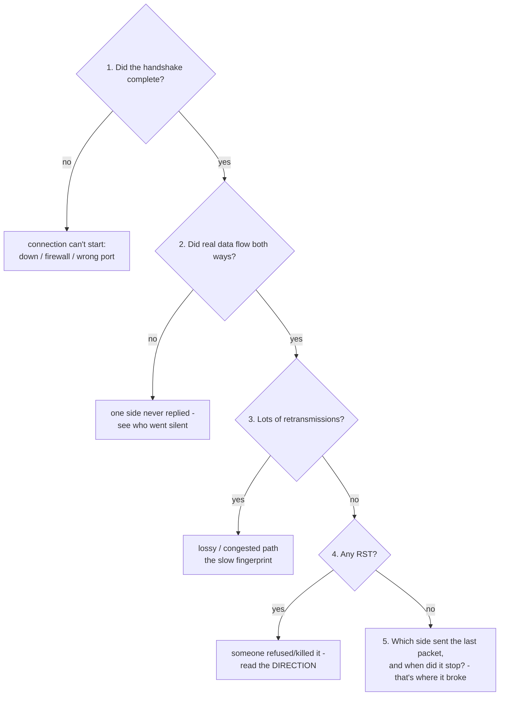

# Reading a Packet Capture

Sometimes the easy tools run out. `ping` says the host is reachable, `traceroute` says the path is clean, `dig` says the name resolves - and yet the app still hangs, the upload still stalls. Every summary tool is green, but the thing is broken. This is when you stop looking at summaries and look at the *actual conversation* - every packet, in order, on the wire. The tool for that is a **packet capture**, usually read in **Wireshark**.

This phase isn't a tour of Wireshark's buttons - those change. What matters is knowing *what a capture is* and *what to look for*, because once you can read the shape of a conversation, you can point at the exact packet where it went wrong. Not "it's broken somewhere out there," but "here, at this packet, this side stopped talking."

## What a packet capture actually is

A packet capture is a recording of **every packet that crossed a network interface**, in order, timestamped. Where `ping` and `traceroute` send their *own* probes and show summaries, a capture is passive: it watches the real traffic your applications are already sending and writes down everything it sees. The difference between asking "is the road open?" and parking by the road filming every car that drives past.

Because there's no summarizing, no guessing, no "inconclusive" - every packet is *right there*: who sent it, to whom, what kind, when. If a conversation broke, the break is *in the recording*. Your job shrinks from "diagnose an invisible problem" to "read a transcript and find the line where it went silent."

📝 **Terminology.** A *packet* is one chunk of data sent across the network, wrapped in headers saying where it's from, where it's going, what kind it is. A *capture* (or "pcap," after the file format) is an ordered list of them. *Wireshark* is the program that records and displays captures in a readable table.

```text
   What a capture looks like - one row per packet, top to bottom in time:

   No.  Time     Source         Destination    Proto  Info
   ───────────────────────────────────────────────────────────────────────
    1   0.000    192.168.1.74   93.184.216.34  TCP    50312 → 443 [SYN]
    2   0.011    93.184.216.34  192.168.1.74   TCP    443 → 50312 [SYN, ACK]
    3   0.011    192.168.1.74   93.184.216.34  TCP    50312 → 443 [ACK]
    4   0.012    192.168.1.74   93.184.216.34  TLS    Client Hello
    5   0.024    93.184.216.34  192.168.1.74   TLS    Server Hello
   ───────────────────────────────────────────────────────────────────────
        │        └── who sent it   └── who it's for   │      └── what happened
        └── order + timestamp                         └── protocol
```

Read it top to bottom, like a chat log between two machines. **Source** and **Destination** tell you who's talking; **Time** tells you when; **Info** tells you *what kind* of packet it is. Learning to read network trouble is mostly learning to recognize a few patterns in that `Info` column.

## Pattern 1: the handshake - does the conversation even start?

Before two machines exchange real data over TCP, they perform a three-step greeting, the **three-way handshake**: one side says "let's talk" (`SYN`), the other says "sure" (`SYN, ACK`), the first confirms "great, talking now" (`ACK`). Only then does data flow. (📝 *TCP* guarantees ordered, reliable delivery - most things you use ride on it. *SYN* and *ACK* are packet flags: "synchronize" and "acknowledge.")

Look for those exact three packets at the *start* of a conversation, in order:

```text
    1   0.000  192.168.1.74   93.184.216.34  TCP  50312 → 443 [SYN]        ← "let's talk"
    2   0.011  93.184.216.34  192.168.1.74   TCP  443 → 50312 [SYN, ACK]   ← "sure"
    3   0.011  192.168.1.74   93.184.216.34  TCP  50312 → 443 [ACK]        ← "great, go"
```
*What just happened:* your client (`192.168.1.74`) opened a connection to the server on port 443. `SYN` went out, `SYN, ACK` came back ~11 ms later, `ACK` sealed it - a clean, complete handshake. **This is the single most useful thing to check first**: if it completes, the two machines *can* reach each other and the trouble is in what comes after (data, TLS, application). If it doesn't, the problem is at the connection level and you never got to the real conversation.

```text
   The telltale broken-start: SYN with no answer, again and again

    1   0.000  192.168.1.74   203.0.113.9   TCP  50318 → 443 [SYN]
    2   1.001  192.168.1.74   203.0.113.9   TCP  [TCP Retransmission] 50318 → 443 [SYN]
    3   3.005  192.168.1.74   203.0.113.9   TCP  [TCP Retransmission] 50318 → 443 [SYN]
```
*What just happened:* your machine sent a `SYN` and got *nothing* back, so it retried after 1 second, then 3 (TCP backs off and retries). The server never completes the greeting - the far end is down, a firewall is silently dropping the `SYN`, or it's the wrong address/port. This is invisible to `ping` if the host answers pings but blocks port 443 - the capture shows the truth summary tools missed.

## Pattern 2: retransmissions - the conversation is struggling

TCP guarantees delivery, so when a packet goes unacknowledged (lost or too slow), the sender **retransmits** it. A retransmission isn't itself a failure - it's TCP doing its job. But *lots* of them is the fingerprint of a lossy or congested path, the network equivalent of "sorry, you cut out, say that again" happening over and over.

Wireshark flags these in the `Info` column:

```text
   42  2.104  192.168.1.74   93.184.216.34  TCP  [TCP Retransmission] 50312 → 443
   43  2.339  93.184.216.34  192.168.1.74   TCP  [TCP Dup ACK] 443 → 50312
   44  2.610  192.168.1.74   93.184.216.34  TCP  [TCP Retransmission] 50312 → 443
```
*What just happened:* the same data sent more than once (`[TCP Retransmission]`) and the receiver repeatedly saying "I'm still missing that piece" (`[TCP Dup ACK]`). A handful is normal; a capture *littered* with these means packets are being lost in the path - the "40% packet loss" you might have seen in `ping`, now shown packet by packet. The connection still *works*, but it's slow and stuttering because TCP is spending its time re-sending. This is what "the network is slow" looks like up close.

## Pattern 3: the reset - someone hung up hard

A normal connection closes politely with a `FIN` ("I'm done, let's wrap up") from each side. A **`RST` ("reset")** is the opposite: an abrupt "this is over, *now*," no negotiation - a door slammed rather than closed. Something *actively refused* or *killed* the connection.

Look for an `RST` packet, especially right after a request - and *which side sent it*:

```text
   18  0.140  192.168.1.74   203.0.113.9   HTTP  GET /api/orders HTTP/1.1
   19  0.151  203.0.113.9    192.168.1.74  TCP   443 → 50320 [RST, ACK]
```
*What just happened:* the client sent a real request (`GET /api/orders`), and the **server immediately answered with `RST`** instead of data. The far end didn't time out or lose packets - it *deliberately* tore the connection down. Common causes: nothing is listening on that port, a firewall is configured to reject (not silently drop), or the server's application crashed/refused the request. The crucial detail is **direction**: the `RST` came *from* `203.0.113.9` (the server), so the rejection is at the far end, not yours.

⚠️ **Gotcha.** Direction is everything in a capture, and it's what people misread. "Packets aren't getting through" is meaningless until you know *which side stopped sending or started rejecting*. Find the last packet *your* side sent and the last packet *their* side sent - whoever went quiet (or sent the `RST`) first is where to look. A capture's whole value is making "whose fault" a fact you can read, not an argument.

## How to read any capture: find where it went quiet

You don't need to understand every packet. The method is Phase 1's "first failure wins," applied to a transcript:


*What just happened:* you walked the conversation the same way you walked the layers - top to bottom, stopping at the first thing that's wrong. The capture's gift is that "where did it break" is no longer a theory - it's a specific row, with a sender, a timestamp, and a packet type.

🪖 **War story.** An upload "failed randomly" for one customer and no one else. Every summary tool was clean - ping fine, traceroute fine, DNS fine. The capture told the whole story in three rows: handshake completed, the client sent its data, and then the *server* sent a `RST` the instant the upload crossed a certain size. Not a network problem at all - a request-size limit on the server, rejecting big uploads with a hard reset. No amount of `ping` would ever have shown it.

## Recap

1. A **packet capture** is every packet on the wire, in time order - a transcript of the real conversation, not a summary. The break, if there is one, is *in the recording*.
2. **The handshake** (`SYN` → `SYN, ACK` → `ACK`) tells you if the connection can even start. No completion = trouble at the connection level; complete = trouble is in what follows.
3. **Retransmissions** (and `Dup ACK`s) are TCP resending lost packets - a few are normal, a flood is a lossy/congested path. This is "slow" up close.
4. **An `RST`** is an abrupt refusal - read *which side sent it* to know who killed the connection.
5. To read any capture, walk it like the layers: handshake? data both ways? retransmissions? reset? **who went quiet first?** - stop at the first wrong thing.

That's the full kit: the calm method (walk up the layers), the everyday tools that answer each rung (`ping`, `traceroute`, `dig`), and the deep tool for when the summaries lie (the packet capture). The next time something "just doesn't work," you won't be guessing - you'll be reading.

---

[← Phase 2: The Core Tools](02-the-core-tools.md) · [Guide overview](_guide.md)

Related guides: [IP, DNS, and Ports](/guides/ip-dns-and-ports) · [The TCP/IP Model](/guides/tcp-ip-model) · [How the Internet Works](/guides/how-the-internet-works)
