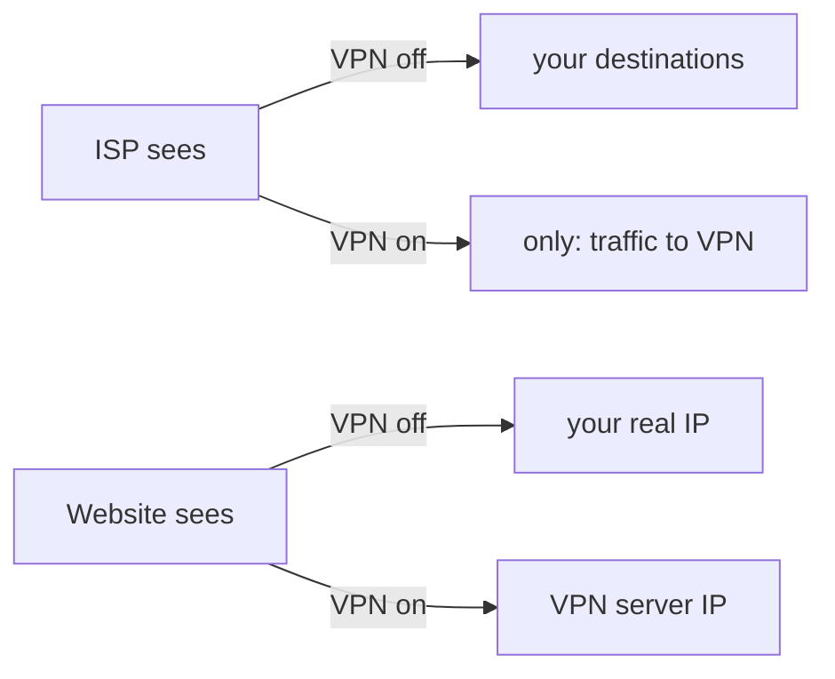

# Who Sees What — The Visibility Ledger

The single most useful question about any privacy tool is boring and specific: **who can see what, exactly?** Not "is it safe" — that word means nothing without naming a watcher. Once you list the parties watching your traffic and ask what each one observes with the VPN off versus on, the whole topic turns from vibes into a table you can read.

So let's build that table. There are only a handful of parties who can see anything, and a VPN changes precisely two columns. Knowing which two is the difference between using a VPN well and being sold one.

## The cast of watchers

Every time you load a page, a small, fixed set of parties is in a position to observe something:

```text
   You ─ Router ─ ISP ─ ( the internet ) ─ Website
                  ▲                          ▲
         your ISP / network owner      the site you visit
```

*What just happened:* Two watchers matter most for everyday privacy: **your ISP** (or whoever runs the network you're on — airport Wi-Fi, your employer, your landlord) and **the website** you're visiting. A VPN inserts a third party — the VPN provider — into this picture, and that addition is the heart of this phase.

## Column one: what your ISP sees

**With the VPN off.** Your ISP is the road every request travels. They can see the *destinations* you connect to — which sites, by address — and how much data, and when. They cannot read the *contents* of properly secured (HTTPS) pages, but the list of where you went is right there in front of them.

```text
   ISP log, VPN OFF:
   10:01  you → news-site.example      (which sites you visit:
   10:02  you → bank.example            fully visible)
   10:04  you → some-forum.example
```

*What just happened:* Even though the *contents* are encrypted by HTTPS, your ISP still sees the *list of destinations*. That list alone is revealing — the sites you read, the bank you use, the forum you frequent.

**With the VPN on.** That list collapses to one line:

```text
   ISP log, VPN ON:
   10:01  you → vpn-server.example   (encrypted)
   10:02  you → vpn-server.example   (encrypted)
   10:04  you → vpn-server.example   (encrypted)
```

*What just happened:* Your ISP now sees only repeated encrypted connections to the VPN server. The destinations vanished from their view. This is the single most real, most defensible thing a VPN does: **it takes your browsing destinations away from your ISP and the local network owner.**

⚠️ **Gotcha.** "Hidden from the ISP" does not mean "hidden from everyone." The destinations didn't disappear — they moved. Someone still sees them. Hold that thought; it's the trap the whole next phase is built around.

## Column two: what the website sees

**With the VPN off.** The website you visit sees the address you're connecting from — your public IP, the one tied to your household via your ISP. That address reveals your rough geographic area and your provider, and lets the site (and trackers on it) recognize that a series of visits came from the same place.

**With the VPN on.** The site sees the **VPN server's** address instead of yours.

```text
   What the website records as "your" address:
   VPN OFF →  203.0.113.42   (your home, your city, your ISP)
   VPN ON  →  198.51.100.7   (the VPN server, maybe another country)
```

*What just happened:* From the website's point of view, the visitor now appears to be the VPN server. This is why a VPN can make a streaming service think you're in another country, and why your home IP is no longer the thing tying your visits together. The site sees the VPN's address; your real one stays behind the tunnel.

## The ledger, side by side

Here's the entire change, in one view. These two rows are *the* thing a VPN does — no more, no less:

```text
   WATCHER          VPN OFF                    VPN ON
   ───────────────  ─────────────────────────  ─────────────────────────
   Your ISP / Wi-Fi  sees every destination     sees only "→ VPN, encrypted"
   The website       sees YOUR IP address       sees the VPN SERVER's IP
```



Notice what's *not* in this ledger: there's no row that says "no one can see anything anymore." A VPN doesn't erase visibility. It **redistributes** it — and the party that gains the view is the subject of Phase 3.

## Where this genuinely helps

This is the honest case *for* a VPN, and it's a real one:

- **Untrusted networks.** On coffee-shop, airport, or hotel Wi-Fi, the network owner is a stranger. The tunnel takes your destinations away from them. Solid, legitimate use.
- **Your ISP profiling or selling your browsing.** In places where ISPs log and monetize destination data, the tunnel removes that list from their reach.
- **Appearing to be somewhere else.** Whether for a region-locked service or to test how a site behaves from another country, swapping the visible IP does exactly that.

> **For builders:** that last point is a daily tool. Spin up a VPN exit (or an SSH tunnel) in another region to check that your CDN, your geo-routing, or your "available in your country" banner behaves correctly from there. You're using the IP-relocation property deliberately — same mechanism, professional purpose.

## Recap

1. **The useful question is always "who sees what?"** — name the watcher before judging safety.
2. **A VPN changes exactly two columns:** your ISP loses your destination list, and websites see the VPN's IP instead of yours.
3. **HTTPS already hid page *contents* from your ISP** — the VPN's contribution is hiding the *list of destinations*.
4. **Visibility isn't erased, it's redistributed** — which sets up the catch in the next phase.

```quiz
[
  {
    "q": "With a VPN on, what does your ISP see?",
    "choices": ["Every website you visit, in full", "Only repeated encrypted connections to the VPN server", "Your passwords in plain text", "Nothing — the ISP is removed from the path"],
    "answer": 1,
    "explain": "Traffic still flows through the ISP, but it's encrypted and aimed at the VPN, so they see a stream of connections to the VPN server, not your destinations."
  },
  {
    "q": "With a VPN on, what IP address does a website record for your visit?",
    "choices": ["Your real home IP address", "No IP address at all", "The VPN server's IP address", "A random address that changes every second"],
    "answer": 2,
    "explain": "Because the VPN server fetches the site on your behalf, the site sees the server's address, not yours."
  },
  {
    "q": "What's the most accurate description of what a VPN does to visibility?",
    "choices": ["It erases all visibility so no one can see anything", "It redistributes visibility — your ISP loses the view, someone else gains it", "It encrypts your traffic so even websites can't read it", "It makes your traffic invisible to the websites themselves"],
    "answer": 1,
    "explain": "A VPN doesn't make traffic unseeable; it moves who can see your destinations. That shifted view is the focus of the next phase."
  }
]
```

---

[← Phase 1: The Tunnel](01-the-tunnel.md) · [Guide overview](_guide.md) · [Phase 3: Where the Promises Break →](03-where-the-promises-break.md)
