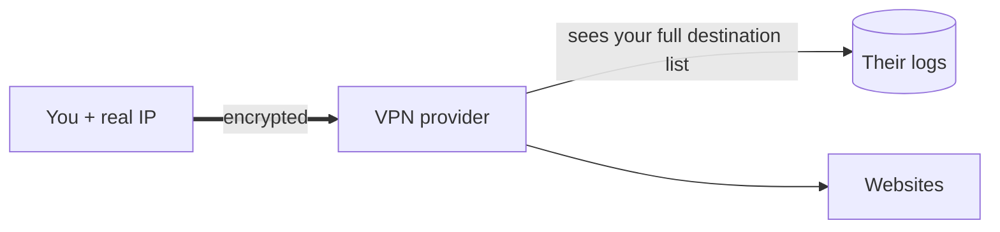

# Where the Promises Break

This is the phase the ads don't want you to read, and the one that'll actually save you money and false confidence. A VPN does something real — you saw it in Phase 2. But the gap between what it does and what it's *sold* as is enormous, and that gap is where people get hurt: they pay for a feeling of safety they don't have, and take risks they wouldn't take sober.

So let's be the friend who tells you the truth. Three big promises, examined honestly. None of this means VPNs are useless — it means you'll know exactly what you're buying.

## Promise 1: "A VPN encrypts your traffic and keeps it safe"

**The half-truth.** Yes, a VPN encrypts the tunnel between you and the VPN server. But here's the part the ad skips: **for any modern website, your traffic was already encrypted.** That's what the padlock in your browser means — HTTPS encrypts the connection between your device and the website, end to end, with or without a VPN.

```text
   On a public Wi-Fi, visiting an HTTPS site:
   No VPN:  [you]══encrypted by HTTPS══[website]   ← contents already safe
   VPN on:  [you]══tunnel══[VPN]══encrypted by HTTPS══[website]
```

*What just happened:* The contents of an HTTPS page are unreadable to the Wi-Fi snoop *either way*. The VPN adds a second wrapper around the destinations, but it did not "finally" encrypt your bank login — HTTPS did that already. The "hackers can steal everything on public Wi-Fi" pitch describes a world that mostly ended when the web moved to HTTPS.

📝 **Terminology.** *HTTPS* is the secure version of the web's protocol — the `https://` and padlock you see on nearly every site today. It encrypts the conversation between your browser and the server. If you want the full mechanism, see [HTTPS & TLS](/guides/https-and-tls). The key takeaway: your page *contents* are already protected; the VPN's real job is hiding the *list of destinations* from your ISP, not rescuing content that was exposed.

⚠️ **Gotcha.** The one place the "public Wi-Fi" worry still has teeth: if you visit a plain `http://` site (no padlock), or ignore a browser certificate warning, content *can* be exposed — and there a VPN does add protection. But the right fix is to not use unencrypted sites and never click past certificate warnings. A VPN papers over that; it doesn't make ignoring warnings safe.

## Promise 2: "A VPN makes you anonymous"

This is the big one, and it's the one most likely to get someone in trouble. **A VPN does not make you anonymous.** It changes the *address* websites see; it does not erase *who you are*.

Consider everything that still identifies you with the VPN on:

```text
   Still you, VPN or not:
   • Logged into Google / Amazon / your bank?   → they know it's you, IP irrelevant
   • Browser fingerprint (fonts, screen, etc.)  → trackers re-identify you
   • Cookies from before you connected           → still tagging you
   • The VPN provider                            → sees your real IP + your destinations
```

*What just happened:* The moment you log into any account, the new IP is meaningless — the service knows you by your login, not your address. Trackers identify browsers by dozens of subtle traits beyond IP. A VPN swaps one identifier out of many. "Anonymous" requires a completely different and far more demanding toolkit; a consumer VPN is not it.

> Think of it like wearing a different coat to the same shop where the clerk knows your name and you pay with your own card. The coat changed; everything that actually identifies you did not.

## Promise 3: "A VPN protects your privacy"

Here's the redistribution from Phase 2, coming due. Your ISP lost the view of your destinations — but that view didn't vanish. **It moved to the VPN provider.** Every site you visit now passes through their server, in the clear to them, tied to your real IP.



*What just happened:* You didn't remove a watcher — you **swapped** one. You traded an ISP you have a contract with and laws over, for a VPN company whose honesty you're taking on faith. A free VPN especially has to make money somehow, and your browsing data is the obvious product. The question "should I trust a VPN?" is really "do I trust this company *more* than my ISP, with the exact same view?" Sometimes yes. Often no. Never automatically.

⚠️ **Gotcha.** "No-logs policy" is a marketing claim, not a guarantee. A few providers have had it tested in court or by audit; most have not. You cannot verify from your couch whether a VPN keeps logs. Treat the promise as a promise, not a fact.

## So when is a VPN worth it — and when is it theater?

**Genuinely worth it:**
- You're on a network run by someone you don't trust (public, employer, landlord) and want your *destinations* hidden from them.
- Your ISP logs or sells browsing data and you'd rather hand that view to a provider you've vetted.
- You need to appear in another region — for access, testing, or routing around censorship.
- A corporate VPN to reach internal office systems. (Different goal entirely: access, not privacy.)

**Mostly theater:**
- "Protecting" HTTPS traffic from public Wi-Fi snoops — HTTPS already does that.
- Seeking anonymity while logged into your real accounts — the login gives you away.
- Believing a VPN removes all watchers — it relocates one to a company you must trust.
- A free VPN sold as privacy — you're likely the product.

> **For builders:** be precise with non-technical people who ask "should I get a VPN?" The useful answer is a question back: *"to hide what, from whom?"* If the answer is "my destinations from sketchy Wi-Fi," yes. If it's "be anonymous" or "stay safe on the internet," a VPN is the wrong tool and you'll do them a favor by saying so. Match the tool to the named threat, not to the ad.

## Recap

1. **HTTPS already encrypts your page contents** — a VPN's real contribution is hiding destinations from your ISP, not rescuing content.
2. **A VPN does not make you anonymous** — logins, cookies, and browser fingerprints still identify you.
3. **You swap watchers, not remove them** — the VPN provider inherits the destination view your ISP lost, tied to your real IP.
4. **"No-logs" is an unverifiable claim** — trust it as a promise, not a fact.
5. **Worth it for hiding destinations on untrusted networks or relocating your apparent region; theater for anonymity or "staying safe online."**

```quiz
[
  {
    "q": "Why is the 'a VPN finally encrypts your bank login on public Wi-Fi' pitch misleading?",
    "choices": ["Banks don't use the internet", "HTTPS already encrypts that connection end to end, with or without a VPN", "Public Wi-Fi can't carry encrypted traffic", "VPNs actually decrypt your traffic"],
    "answer": 1,
    "explain": "Modern sites use HTTPS, which already encrypts page contents between you and the server. The VPN adds a wrapper around destinations, not the rescue the ad implies."
  },
  {
    "q": "Why doesn't a VPN make you anonymous?",
    "choices": ["It only works on weekdays", "Logging into accounts, cookies, and browser fingerprints still identify you regardless of IP", "It shows websites your real name", "Anonymity requires two VPNs"],
    "answer": 1,
    "explain": "A VPN changes the IP websites see, but the moment you log in or get fingerprinted, your identity is known. It swaps one identifier among many."
  },
  {
    "q": "What happens to your ISP's old view of your browsing destinations when you use a VPN?",
    "choices": ["It is permanently deleted", "It moves to the VPN provider, tied to your real IP", "It is split evenly across all websites", "It becomes readable by anyone on the internet"],
    "answer": 1,
    "explain": "The destination view doesn't vanish — the VPN provider inherits it. You swap a watcher you have a contract with for a company you must trust."
  }
]
```

---

[← Phase 2: Who Sees What](02-who-sees-what.md) · [Guide overview](_guide.md)
