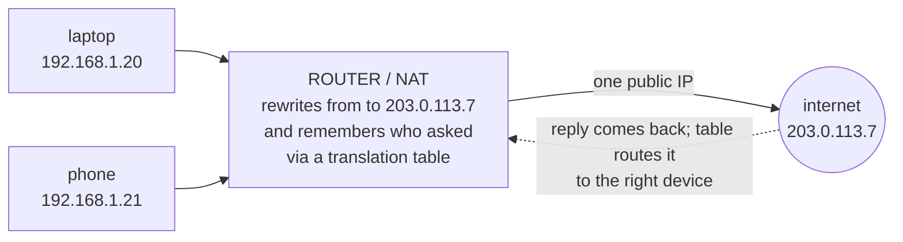

# NAT & Private IPs

If you've ever checked the IP address on your laptop and your phone, you may have noticed something odd:
they both start with `192.168`. Check a website's claim of "your IP address" and you get something
completely different - and your laptop and phone show the *same* one there. That's not a bug. It's one of
the most quietly important tricks in all of home networking, and once you see it, a lot of "why can't I…"
questions answer themselves. The trick has a name: **NAT**.

> ⏭️ If terms like "IP address" or "port" are fuzzy, [IP, DNS, and Ports](/guides/ip-dns-and-ports) grounds
> them properly. You can follow this phase without it, but it'll land harder with that foundation.

## Two kinds of address

**What it actually is.** There are two worlds of addresses, and your router lives on the border between
them.

- **Public IP** - *one* address, given to your whole home by your ISP. This is your home's address on the
  open internet, the way a street address identifies your building to the postal service. Every device in
  your home shares it.
- **Private IP** - an address that only means something *inside* your home. Your router hands one to each
  device: `192.168.1.20` for your laptop, `192.168.1.21` for your phone, and so on. These are like room
  numbers inside the building - useful internally, meaningless to the outside world.

📝 **Terminology.** Ranges like `192.168.x.x` (and also `10.x.x.x` and `172.16–31.x.x`) are reserved as
*private* address ranges. They're deliberately not routable on the public internet - millions of homes use
the exact same `192.168.1.x` numbers at the same time, and that's fine, because those addresses never leave
the building. (source: [RFC 1918](https://datatracker.ietf.org/doc/html/rfc1918))

**A real example.** Ask your laptop for its own address:

```console
$ ipconfig getifaddr en0
192.168.1.20
```
*What just happened:* Your laptop reported its **private** IP - the room number the router assigned it. Your
phone, asked the same question, would report a different one in the same range, like `192.168.1.21`. Neither
of these is the address the wider internet sees.

📝 **Terminology.** The router hands out these private addresses automatically using *DHCP* (Dynamic Host
Configuration Protocol) - the "front desk" service that assigns a free room number to each device as it
joins. It's why you don't have to configure addresses by hand; you connect, and an address appears.

## NAT - the router's translation desk

**What it actually is.** **NAT** stands for *Network Address Translation*. It's the router's job of
translating between the inside world (your many private addresses) and the outside world (your one public
address). Every time a device reaches out to the internet, the router swaps the private "from" address for
the public one, remembers it did so, and swaps it back on the reply.

**Why people get this wrong.** People assume each device needs its own internet address to get online. For a
long time the internet didn't have enough addresses to go around - and NAT is a large part of how we coped.
Your home gets one public address, and NAT quietly multiplexes all your devices through it.

**What it does in real life.** Here's the trick in one picture. Your laptop and phone both reach out; the
router rewrites their "from" address to the single public IP, and keeps a little table so it knows which
reply belongs to whom:



*The address `203.0.113.7` above is a documentation-only example IP - your real public IP will be
different.*

**A real example.** When a reply comes back from a website, it arrives at your public IP. The router checks
its translation table, sees which device started that conversation, rewrites the "to" address back to that
device's private IP, and forwards it inside. From your laptop's point of view it talked to the website
directly. It never knew a translation happened.

**The gotcha.** ⚠️ Because translation only works for conversations your devices *start*, an outsider can't
reach in and pick a device inside your home to connect to. There's no entry in the router's table for a
conversation nobody began, so the router has nowhere to send the incoming knock - it drops it. This is great
for safety (more on that in Phase 3), but it's also why "I can reach the internet, but my friend can't reach
the game server running on my PC" happens. Letting the outside in *on purpose* needs a deliberate setting
called port forwarding - a topic for a follow-up guide.

## Why you can get out but the internet can't get in

This is the part worth holding onto, because it explains a real asymmetry you'll bump into often:

- **Outbound works by default.** Your devices start conversations all day - loading pages, streaming,
  syncing. The router happily translates each one and tracks the reply. Out is easy.
- **Inbound is closed by default.** Nobody outside can start a conversation *into* a specific device,
  because the router has no translation entry telling it where such traffic should go. In is closed unless
  you open it on purpose.

That one-way default is doing quiet security work for you every single day. It's not a firewall (that's a
separate layer we'll meet next), but it has a similar effect: the inside of your home isn't directly
reachable from the open internet.

**Why this saves you later.** "Why does the website see a different IP than my laptop shows?" - because the
website sees your *public* IP and your laptop knows its *private* one. "Why do all my devices have the same
public IP?" - NAT shares one among them. "Why can't this app accept incoming connections?" - inbound is
closed by default. Three common puzzles, one mental model.

## Recap

1. Your devices have **private** IPs (`192.168.x.x`) that mean something only inside your home; your whole
   home shares **one public** IP on the open internet.
2. **DHCP** is the router service that hands each device its private address automatically.
3. **NAT** translates between the many private addresses and the one public address, using a table to route
   each reply back to the device that started the conversation.
4. Because translation only exists for conversations your devices start, **outbound works by default and
   inbound is closed** - which is quietly protecting you.

Now let's look at the part of the box you actually interact with - the Wi-Fi - and the small set of settings
that keep your network yours.

---

[← Phase 1: The Router (and the Modem)](01-the-router-and-the-modem.md) · [Guide overview](_guide.md) · [Phase 3: Wi-Fi & Keeping It Safe →](03-wifi-and-keeping-it-safe.md)
