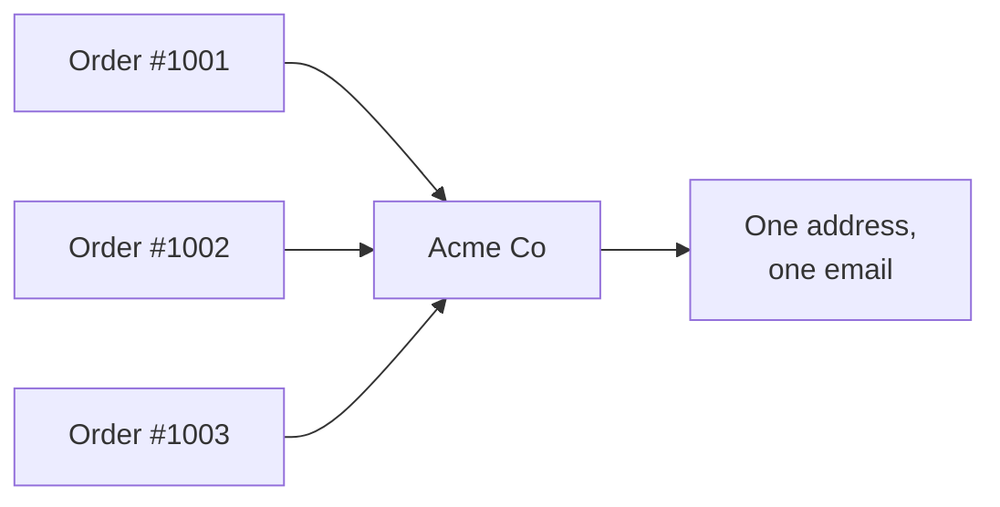

# A Spreadsheet That's Really a Database

Open Airtable and the first thing you see is a grid. Rows, columns, cells.
Your hands already know what to do. That familiarity is deliberate - and it's
also the trap, because the moment you treat it like a spreadsheet, you'll
miss the parts that actually matter.

Let's get the vocabulary straight, because Airtable renames things you
already know.

- A **base** is the whole project. Think of it as one workbook - your CRM,
  your content calendar, your inventory system. Everything for that one job
  lives inside it.
- A **table** is one sheet inside the base. A base usually has several:
  Customers, Orders, Products. Each table is one kind of thing.
- A **record** is a row. One customer. One order. One product. In a database
  you'd call it a row; Airtable calls it a record, and it's worth adopting
  the word, because a record is a thing, not a line of cells.
- A **field** is a column. Name, Email, Price, Status.

So far this is a spreadsheet with fancier names. Here's where it stops being
one.

## Fields have types, and the type is the rule

In a spreadsheet, a cell holds whatever you type. You can put "$45", "forty
five", and "TBD" in the same column and the sheet won't blink. Six months
later that column is garbage and no formula trusts it.

In Airtable, every field has a **type**, and the type decides what's allowed
in. You set it once, and the field enforces it forever after.

| Field type | What it holds | Why it helps |
|---|---|---|
| Single line text | Plain text | Names, short labels |
| Number / Currency / Percent | Real numbers | Math works; no "$" mixed with words |
| Date | A real date | Sorting and "due this week" actually work |
| Single select | One choice from a list you define | No more "Done" vs "done" vs "complete" |
| Multiple select | Several choices from a list | Tags, categories |
| Checkbox | True / false | Clean yes/no |
| Email / Phone / URL | Validated contact info | Tappable, harder to mistype |
| Attachment | Files and images | The grid holds the photo, not a link to it |

The single select field is the one that converts spreadsheet skeptics. You
define the allowed options - say, `Lead`, `Negotiating`, `Won`, `Lost` - and
from then on a status field can only ever be one of those four. No typos, no
drift, no "wait, is 'Closed' the same as 'Won'?" The data stays clean because
the field won't let it get dirty.

This is the first real database idea: **structure up front, instead of
cleanup forever.** A spreadsheet lets you put anything anywhere and makes you
pay for it later. Airtable asks you to decide what a field means once, then
holds the line for you.

## Records are objects, not lines

In a spreadsheet, a row is a horizontal strip of cells. If you want to see
one customer's full story, you scroll sideways past thirty columns and lose
your place.

In Airtable, click a record and it opens as a **card** - every field for that
one customer laid out top to bottom, like a contact in your phone. You can
attach files to it, leave comments on it, see its history. The record feels
like a thing you can hold, because that's what it is. This matters more than
it sounds: when your data is records-you-open instead of rows-you-scroll, you
start thinking about your information as objects with relationships, which is
exactly the mindset a database wants.

## Linked records: the idea that changes everything

Here's the move that a flat spreadsheet cannot make.

Imagine a sheet tracking orders. Each order needs the customer's name, email,
and shipping address. In a spreadsheet, you type those into every order row.
Customer places ten orders? You've typed their address ten times. They move?
You hunt down all ten rows and pray you found them all. The same fact lives
in ten places, and ten places means ten chances to be wrong.

Airtable's answer is the **Linked record** field. You keep one Customers
table and one Orders table. On the Orders table, instead of typing the
customer's details, you add a link field that points to the right record in
the Customers table. You're not copying the customer - you're pointing at the
one true copy.

```text
Customers table
  - Acme Co   (email, address, phone - stored ONCE)

Orders table
  - Order #1001  →  linked to: Acme Co
  - Order #1002  →  linked to: Acme Co
  - Order #1003  →  linked to: Acme Co
```

Now the customer moves. You update their address in one place - the Customers
record - and every order pointing at them reflects it instantly. Nothing to
hunt down, nothing to miss. This is the principle databases are built on:
**store each fact once, and refer to it from everywhere else.**



Links also go both ways automatically. Open the Acme Co record and Airtable
shows you every order linked to it, with no setup on your part. You get the
customer-to-orders view and the order-to-customer view from the same single
connection.

That's the whole leap from spreadsheet to database, in one feature. A
spreadsheet stores values. Airtable stores values *and the relationships
between them* - which customer placed which order, which task belongs to
which project, which invoice covers which line items. Once your data knows how
its pieces connect, you can do things a grid of disconnected cells never
could. Those things - pulling linked data across tables, summarizing it, and
making the whole base do work on its own - are where we go next.
