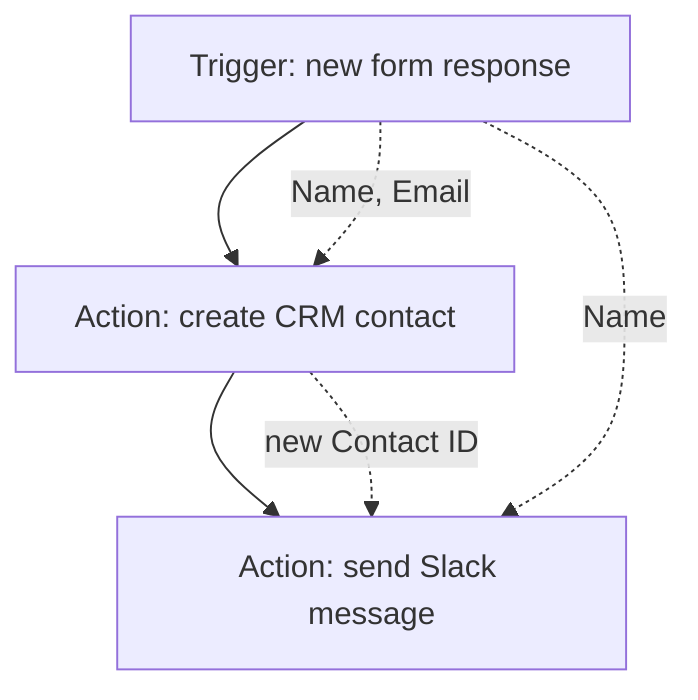

# Triggers, Actions, and the Flow

Picture a vending machine. You put in money - that's the thing that happens. The machine drops your snack - that's what it does in response. An automation is the same: one event sets it off, and one or more steps run as a result.

The vocabulary is universal, even though each tool gives it a slightly different label:

| Idea | Zapier | Make | n8n | Power Automate |
|------|--------|------|-----|----------------|
| The thing that starts it | Trigger | Trigger module | Trigger node | Trigger |
| The work it does | Action | Action module | Node | Action |
| The whole automation | Zap | Scenario | Workflow | Flow |

Learn the left column and you can read any of them.

## The trigger: the "when"

A trigger is the event you're waiting for. "When a new row is added to this spreadsheet." "When someone fills out this form." "When a payment succeeds in Stripe." "When an email lands in this inbox." Every automation has exactly one trigger, and it always sits at the top.

The trigger doesn't *do* anything. It watches. Its only job is to notice that the event happened and hand off whatever information came with it - the form answers, the payment amount, the email body - to the steps below.

## The action: the "then"

An action is a step that does work. "Add a row to a spreadsheet." "Send a Slack message." "Create a contact in the CRM." "Send an email." A flow can have one action or twenty, and they run in order, top to bottom, like a recipe.

So the smallest possible automation is two steps:

```text
WHEN  a new form response comes in        (trigger)
THEN  add a row to the Google Sheet        (action)
```

Read it out loud as "when this, then that." If you can say your automation as one of those sentences, you can build it.

## How a trigger actually fires: polling vs instant

Here's the one piece of plumbing worth understanding, because it explains a delay that confuses everyone the first time.

There are two ways a trigger learns that its event happened.

**Polling** means the automation tool checks the source on a schedule - "any new rows yet? any new rows yet?" - every few minutes. It's like a kid in the back seat asking "are we there yet" on a timer. Polling is low-tech and works with almost any app, but it's not instant. On most tools the polling interval depends on your plan: it might check every 15 minutes on a free plan and every 1–2 minutes on a paid one. So a polled automation can sit idle for several minutes after the event before it notices.

**Instant** triggers (often called *webhooks* or *real-time* triggers) work the other way: the source app actively pings the automation the moment something happens. No waiting, no checking on a timer. It fires within seconds. The catch is that the source app has to support sending these pings, so instant triggers aren't available for every app or every event.

```text
POLLING:   [tool] --"anything new?"--> [app]   ...wait...   repeat every few min
INSTANT:   [app]  --"hey, this happened!"--> [tool]         the instant it occurs
```

The practical takeaway: if your automation feels slow, check whether its trigger is polled. A few minutes of lag is usually the polling interval, not a bug. For anything time-sensitive - a customer expecting an instant confirmation - prefer an instant/webhook trigger if the app offers one.

## How data flows from step to step

This is the part that makes automations feel like magic once it clicks.

When the trigger fires, it doesn't only say "it happened." It carries a payload - a little bundle of fields describing the event. A new-form-response trigger hands down the name, email, and every answer. A new-Stripe-payment trigger hands down the amount, the customer's email, the date.

Every step *below* the trigger can reach up and grab those fields. When you set up an action like "send a Slack message," you don't type the customer's name - you insert the *Name field from the trigger*, and the tool fills in the real value at run time. Most tools show this as a little token or pill you drop into the text box, something like:

```text
New lead: {{Name}} ({{Email}}) just signed up for {{Plan}}.
```

At run time that becomes "New lead: Dana Okoye (dana@acme.co) just signed up for Pro."

And it chains. Step 2's output becomes available to step 3, step 3's to step 4, and so on. If step 2 creates a CRM contact, step 3 can use the new contact's ID. Each step adds its results to a growing pool of fields that everything downstream can pull from.



That's the whole engine. A trigger that fires and hands down a payload; a chain of actions that each grab what they need and pass their own results forward. Filters, branches, and lookups - the things we add in the next phase - are all built on top of these two pieces. Get this model solid and the rest is detail.
