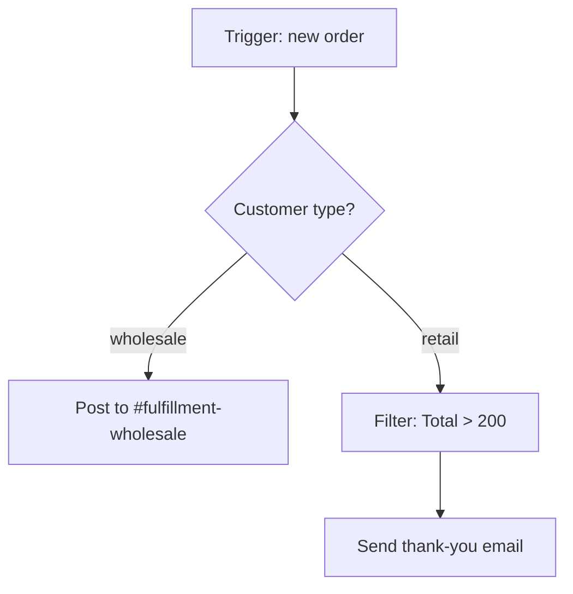

# Building a Multi-Step Flow

A two-step "when this, then that" is a fine warm-up, but real work has conditions. Only some events deserve a response. Different inputs need different handling. Data from one app rarely lines up cleanly with the next. This phase walks one realistic flow start to finish and introduces each piece as we hit the need for it.

## The scenario

You run a small online store. When someone buys, you want to:

1. Log every order in a spreadsheet for your bookkeeper.
2. For orders over $200, send the customer a personal thank-you email — not the generic receipt.
3. For wholesale customers, route the order to a different chat channel so the fulfillment team flags it for special packing.

Let's build that.

## Step 1 — the trigger

```text
WHEN  a new order is created in the store
```

The trigger hands down a payload: customer name, email, order total, line items, a customer "type" field (retail or wholesale), and a timestamp. Everything below can pull from these.

## Step 2 — the always-on action

Logging every order has no condition, so it goes right after the trigger.

```text
THEN  add a row to the "Orders" spreadsheet
```

Now the **mapping** work. The spreadsheet has columns, and you tell each column which field to pull from the trigger. This is the unglamorous heart of every automation — pointing outputs at inputs.

```text
Spreadsheet column   <-  Trigger field
Date                 <-  {{Order.Timestamp}}
Customer             <-  {{Order.CustomerName}}
Email                <-  {{Order.Email}}
Total                <-  {{Order.Total}}
```

Mapping is where most beginners stumble, and the fix is mechanical: read the column, find the matching field in the picker, drop it in. If a column has no obvious source, you may need a formatting step (more on that below).

## Filters: stop the flow when it shouldn't continue

The thank-you email is only for orders over $200. A **filter** is a gate: the flow runs up to the filter, checks a condition, and only continues if the condition passes. If it fails, the flow quietly stops right there — no error, nothing wrong, that run is done.

```text
ONLY CONTINUE IF  {{Order.Total}}  is greater than  200
```

Put the filter *before* the thank-you email and *after* the spreadsheet row, so logging always happens but the email is conditional. Order matters: anything above a filter always runs; anything below runs only when the filter passes.

```text
1. Trigger: new order
2. Action:  add spreadsheet row      <- always
3. Filter:  Total > 200              <- gate
4. Action:  send thank-you email     <- only if gate passes
```

## Branching: different paths for different inputs

The wholesale-vs-retail routing isn't a yes/no gate — it's a fork. That's a **branch** (Zapier calls these *Paths*, Make uses a *Router*, Power Automate has *Condition* and *Switch*). One incoming run, two or more possible roads, and the tool picks based on a condition.



Each branch is its own little flow with its own steps. Use a branch when the *steps themselves* differ between cases. Use a filter when you only need to decide whether to keep going at all. A useful rule: filter for "should this continue?", branch for "which version of this should run?"

## Lookups: pulling in data the trigger didn't have

Sometimes a step needs information the trigger never carried. Say your thank-you email should greet the customer by first name and mention their account manager — but the order payload only has an email address, not the account manager.

A **lookup** (often "Find a record" / "Search" actions) fixes this. You add a search step: "find the customer in the CRM where email equals `{{Order.Email}}`." That step returns the full customer record, and now downstream steps can use the account-manager field it found.

```text
3.5  Lookup:  find CRM contact where Email = {{Order.Email}}
4.   Action:  send email, signed from {{Contact.AccountManager}}
```

Lookups are how you stitch two systems together when neither one knows everything. The trigger app knows the order; the CRM knows the relationship; the lookup is the bridge.

## Formatting: making data fit

Raw fields are often the wrong shape. The timestamp comes through as `2026-06-30T14:08:55Z` but your spreadsheet wants `June 30, 2026`. The total arrives as `199.5` and you want `$199.50`. The name is `dana okoye` and you want `Dana Okoye` in the greeting.

Every tool ships **formatting** steps for exactly this — Zapier's *Formatter*, Make's built-in functions, n8n's expressions, Power Automate's expression functions. You insert a small step that takes a messy field and emits a clean one, then map the *clean* version into your action.

```text
Format date:    {{Order.Timestamp}}        ->  June 30, 2026
Format money:   {{Order.Total}}            ->  $199.50
Capitalize:     {{Order.CustomerName}}     ->  Dana Okoye
```

Common formatting jobs: dates, currency and number formatting, capitalization, trimming whitespace, splitting a full name into first/last, and find-and-replace. When an action's output looks "off," a formatting step is almost always the cure.

## The whole thing

```text
1. Trigger:  new order
2. Action:   add spreadsheet row (mapped fields)
3. Branch on customer type
   - wholesale -> post to #fulfillment-wholesale
   - retail    -> Filter: Total > 200
                  Lookup: CRM contact by email
                  Format: name + date
                  Action: send personal thank-you email
```

One trigger, a few actions, a filter to gate, a branch to fork, a lookup to enrich, formatters to tidy. That stack covers the large majority of real automations you'll ever build. Everything fancier is more of the same pieces.
