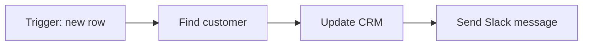

# Scenarios & Modules

A **scenario** is one automation. It has a start, a sequence of steps, and an end. If you've ever written down "when X happens, do Y, then Z," that's a scenario. In Make, you build it on a canvas - a blank space where you drop steps and connect them with lines.

Each step is a **module**. A module is one action in one app: "Watch new rows in Google Sheets," "Create a contact in HubSpot," "Send a message in Slack." Modules look like circles on the canvas, each branded with the app's logo, joined left-to-right by curved lines. Data flows along those lines in the direction of the arrows.

## The trigger comes first

The first module in a scenario is the **trigger** - the thing that kicks everything off. Triggers come in two flavors, and the difference matters more than it sounds.

A **polling trigger** checks an app on a schedule. "Watch new emails" doesn't know the instant an email arrives; it wakes up every few minutes, asks Gmail "anything new since last time?", and processes whatever it finds. You set how often it wakes up.

An **instant trigger** (Make calls these webhooks, or labels the module "instant") fires the moment something happens, because the other app pushes the news to Make. "Watch responses (instant)" in a form tool reacts within a second of submission. Instant is faster but only available where the source app supports pushing.

Most triggers process one item at a time. If your "watch new rows" trigger finds five new rows since it last ran, it runs the whole scenario five times - once per row. Hold that thought; it comes back when we talk about cost.

## Bundles: the data between modules

Here's the concept that unlocks Make. When a module runs, it hands the next module a **bundle** - a packet of data with named fields. A "Watch new rows" module outputs a bundle like:

```json
{
  "name": "Ada Lovelace",
  "email": "ada@example.com",
  "signed_up": "2026-06-30"
}
```

The next module reaches into that bundle and pulls out the fields it needs. When you set up a "Send email" module, you don't type the address - you click the email field, and a panel pops up showing every field from every earlier module. You pick `email` from the bundle, and Make wires it in. That picking-and-wiring is called **mapping**, and it's the whole job of building a scenario. Phase 2 is dedicated to it.

After a run, Make shows you the actual bundles that flowed through - click the little bubble above any module and you see exactly what data went in and came out. This is the single best thing about debugging in Make: you're never guessing what a step received.

## How a run unfolds

A scenario run is one pass through the modules, left to right. The trigger produces one or more bundles. Each bundle travels down the chain; each module does its job and passes a (possibly changed) bundle onward. When the last module finishes for the last bundle, the run is over.



If a trigger emits multiple bundles in one run, Make doesn't run four separate scenarios - it pushes each bundle through the chain in turn, within the same run. Each module "executes" once per bundle. Those executions are the unit Make charges for. (Again, phase 3.)

## How this differs from Zapier

If you've used Zapier, the mental shift is worth naming.

| | Zapier | Make |
|---|---|---|
| Layout | Vertical checklist of steps | Visual canvas with wires |
| Branching | Limited; "Paths" feel bolted on | Routers split the flow natively |
| Loops over lists | Awkward; needs sub-Zaps or line items | Iterators and aggregators built in |
| Seeing the data | Test one step at a time | Inspect every bundle after a run |
| Pricing unit | Tasks (per action) | Operations (per module execution) |
| Learning curve | Gentle | Steeper, more control |

The trade is real. Zapier gets you to "it works" faster for a straight line of three steps. Make is where you go when the job has branches ("if the deal is over $10k, notify sales; otherwise log it"), loops ("for each line item on the invoice…"), or data that needs reshaping before the next app will accept it. The visual canvas is more to learn, but when something breaks at 2am, being able to see every wire and every bundle is the difference between a five-minute fix and an hour of guessing.

One practical note: Make scenarios are saved as you build, but they don't run until you turn the scenario **ON** with the toggle in the bottom-left. A scenario you built and tested but forgot to switch on is the most common "why isn't my automation working" question on the forums. Build it, test it with **Run once**, then flip it on.

In the next phase, we get into the part that separates people who can build anything in Make from people who get stuck: mapping fields, transforming values, and handling lists.
