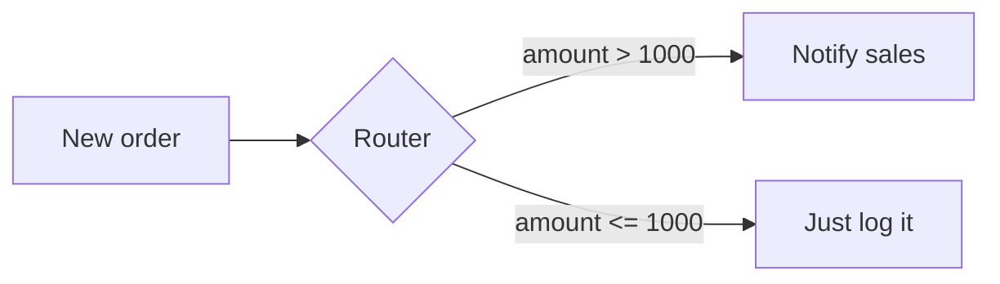
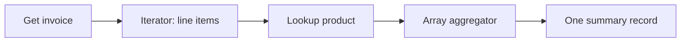

# Data Mapping, Arrays & Iterators

Building a scenario is mostly one activity: telling each module which data to use. That's mapping. Master mapping and the lists-of-things problem, and there's almost nothing in Make you can't build.

## Mapping a single field

When you open a module — say "Create a Trello card" — its fields are blank. Click into a field and Make drops down a panel showing every field from every earlier module, grouped by module. You click `email` from the trigger, and a colored token appears in the field. That token is a reference: "put the email value from step 1 here, at run time."

You can mix tokens with literal text. A subject line might read:

```text
New signup: {{name}} ({{email}})
```

Each `{{...}}` is a mapped token; the rest is typed. At run time Make substitutes the real values. If `name` is empty for a given bundle, the token resolves to nothing — Make doesn't error, it leaves a gap. That silent emptiness is a frequent source of "why is my message blank" confusion, so check your test runs.

## Functions: reshaping values inline

Often the raw value isn't in the shape the next app wants. The mapping panel has a second tab full of **functions** — small transformations you wrap around a token.

A few you'll reach for constantly:

```text
upper(name)                  → "ADA LOVELACE"
formatDate(signed_up; "MMMM D, YYYY")  → "June 30, 2026"
trim(notes)                  → strips leading/trailing spaces
if(amount > 1000; "big"; "small")      → conditional value
substring(phone; 0; 3)       → first three characters
```

Functions nest, so you can `upper(trim(name))`. The big three categories are **text** (case, trim, split, replace), **date/time** (parse and format — and dates are where most beginners get stuck, because a string from one app rarely matches what the next app expects), and **math/logic** (`if`, comparisons, rounding). You don't memorize these; you open the functions tab and skim.

## Routers: sending bundles down different paths

A **router** is a module that splits the flow into branches. Each branch can have a **filter** — a condition on the line. The bundle takes every branch whose filter passes.



Filters are how you say "only continue if." You set them by clicking the wrench on the line between two modules. A filter that fails stops that bundle on that path — quietly, not as an error. Routers are Make's answer to "if this, do that; otherwise do this other thing," and they're far cleaner than the bolt-on branching in checklist tools.

## The list problem: arrays

Real data is full of lists. An invoice has many line items. An API returns many search results. A single bundle field can itself hold an **array** — a list of items, each with its own fields.

Here's the catch: a normal module processes one item. If you map an array directly into "Create a row," you'll get unpredictable behavior, because the module expected one value and got a list. Make gives you two tools for the gap between "one thing" and "many things," and knowing which to use is the core skill of this phase.

### Iterator: split one bundle into many

An **Iterator** takes an array and breaks it into separate bundles — one per item. Feed it an array of three line items, and every module *after* the iterator runs three times, once per item.

```text
Before iterator:  1 bundle  { items: [A, B, C] }
After iterator:   3 bundles  {A}  {B}  {C}
```

Use an iterator when you have a list and want to *do something with each item* — create a row per line item, send a message per recipient.

### Array Aggregator: collapse many bundles into one

The **Array Aggregator** is the mirror image. It takes many bundles and merges them back into a single bundle holding one array.

```text
Before aggregator:  3 bundles  {A}  {B}  {C}
After aggregator:   1 bundle  { collected: [A, B, C] }
```

Use an aggregator when downstream you want *one* of something built from many — one summary email listing all items, one API call with all records attached. There's also a **Text Aggregator** for stitching many bundles into one block of text (great for "build a list and put it in one message").

The classic pattern is the pair: **iterator → process each → aggregator**. Split a list apart, do work on each piece, then gather the results back into one. When a scenario "runs too many times" or "only does the last item," the fix is almost always a missing or misplaced iterator/aggregator.



## A worked picture

Say a webhook delivers an order with three line items, and you want one Slack message summarizing them, but only for orders over $50.

1. Webhook receives the order → verify: bundle shows the `items` array.
2. Filter on the line: `total > 50` → verify: small orders stop here.
3. Iterator over `items` → verify: downstream runs once per item.
4. (Optional lookup per item) → verify: each item gets enriched.
5. Text Aggregator joins items into one block → verify: one bundle out.
6. Slack module sends the joined text → verify: one message, all items listed.

Notice the rhythm: split, work, gather. Once that pattern is in your hands, the rest of Make is picking the right module and mapping the right field. The next phase covers what happens when a step fails mid-run — and the operations cost that all this iterating quietly racks up.
