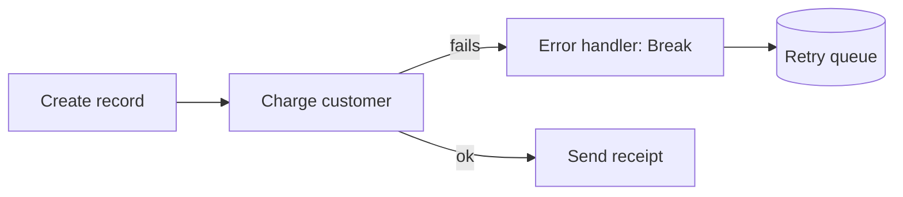

# Error Handling, Scheduling & Operations Cost

A scenario that works in a clean test and a scenario that survives the real world are two different things. The real world hands you a missing field, a rate-limited API, a malformed date. This phase is about the parts that keep automations alive — and the pricing model that decides what they cost.

## What happens when a module fails

By default, if a module errors, the whole run stops. The bundle that was in flight is abandoned, the scenario logs the failure, and — if it keeps happening — Make eventually deactivates the scenario and emails you. That last part bites people: a scenario you thought was running has been silently off for a week because of repeated errors.

You override the default by attaching an **error handler** to a module. Right-click a module, add an error handler, and you get a small branch that only runs *when that module fails*. On that branch you place a **directive** that tells Make what to do instead of stopping.

The directives, in plain terms:

| Directive | What it does | When to use |
|---|---|---|
| **Resume** | Substitute a value and carry on | A lookup failed but you have a sensible default |
| **Ignore** | Drop this bundle, keep the run going | One bad item shouldn't kill a batch |
| **Rollback** | Stop and undo this run's changes | Default; safest when steps must be all-or-nothing |
| **Commit** | Stop but keep what's been done | You want partial work preserved |
| **Break** | Park the bundle, retry it later | Transient failures (rate limits, brief outages) |

**Break** is the one worth knowing well. It saves the failed bundle into an **incomplete executions** queue and retries it on a schedule you set. So when an API is briefly down, you don't lose the data — Make holds it and tries again. You can also open the queue and re-run items by hand after you've fixed whatever was wrong.

A word on **rollback**: Make can undo changes within a run for apps that support transactions, but it can't un-send an email or un-post a Slack message — those leave the building immediately. Rollback protects database-style steps, not actions that touch the outside world. Order your modules with that in mind: do the reversible, internal work first, and the irreversible "tell someone" steps last.



## Scheduling: when does it run

Every scenario has a schedule, set with the clock icon on the trigger. The main choices:

- **Immediately** — for instant/webhook triggers, runs the moment data arrives.
- **At regular intervals** — every N minutes. The floor depends on your plan; lower-tier plans can't go below a 15-minute interval, paid plans go tighter.
- **Specific days/times** — "weekdays at 9am," "the 1st of every month."

Interval is where cost and freshness trade off. A scenario polling every minute is sixty checks an hour whether or not anything changed — and every check that wakes up costs at least something. Most "watch for new X" jobs are fine at 15 minutes. Reserve tight intervals for things that genuinely need to be near-real-time, and prefer an instant webhook trigger over fast polling whenever the source app offers one.

## The operations model — read this before you build big

Make charges in **operations**. One operation is one module executing once. Not one scenario run — one *module*, one *execution*.

This is the number that surprises people, so make it concrete. A 5-module scenario that runs once uses roughly 5 operations. Fine. Now add an iterator that splits an array of 100 items, with 3 modules after it. Each of those 3 modules runs 100 times. That single run is 300+ operations. Run it hourly and you're at 200,000+ operations a month from one scenario.

```text
Scenario: webhook → iterator(100 items) → lookup → format → create
Per run:  1 + 1 + 100 + 100 + 100  ≈ 302 operations
```

The trap is that operations scale with your *data*, not with how many scenarios you have. People build a tidy little flow, test it on 3 rows, and ship it. Then real traffic arrives with 3,000 rows and the operation count explodes. Plans come with a monthly operations allowance; blow through it and the scenario stops until you top up or the month resets.

Things that quietly multiply operations:

- **Iterators** over large arrays — the single biggest cause.
- **Polling triggers** on tight intervals — they cost even when there's nothing new.
- **Routers** — each branch a bundle takes runs its own modules.
- **Loops and repeated lookups** — one API call per item adds up fast.

How to keep it sane:

- Filter **early**. A filter right after the trigger drops bundles before they run through (and pay for) the rest of the chain.
- Aggregate when you can. One bulk "create many records" call beats 100 single creates — both in operations and in API rate limits.
- Widen polling intervals to the slowest your use case tolerates, and switch to webhooks where possible.
- Watch the operations log. Make shows operations per run; if one scenario is eating your allowance, that's where to optimize.

The mental model to leave with: **a scenario's cost is its module count times how many bundles flow through it.** Keep the bundle count down (filter early, aggregate, sane intervals) and the module count honest, and Make stays cheap. Let an iterator run wild on production-sized data and the bill — or the hard stop when you hit your allowance — will find you. Build the error handling so failures retry instead of dying, schedule no faster than you need, and watch the operations count the way you'd watch any meter that bills by the unit.
