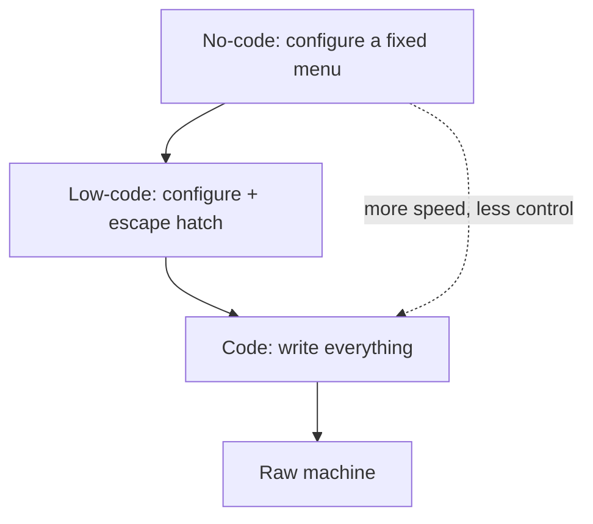

# The Spectrum: No-Code to Full Code

Forget the marketing for a minute. No-code, low-code, and code aren't three different products you buy. They're three settings on the same dial, and the dial measures one thing: **how much of the building you do by typing instructions versus by clicking, dragging, and filling in forms.**

Turn the dial all the way to one side and you're assembling software out of pre-made blocks in a visual editor. Turn it all the way to the other and you're writing every instruction by hand. Most real projects live somewhere in between, and many slide along the dial over their lifetime. The useful question is never "no-code or code?" in the abstract - it's "where on the dial does *this* job belong, today?"

## The three settings

**No-code** means you build by configuration. You drag a button onto a canvas, connect a form to a spreadsheet, pick "when a new row appears, send an email" from a menu. You never see or write the underlying instructions. The tool exposes a fixed menu of capabilities, and as long as your need fits the menu, you move fast.

**Low-code** means mostly configuration, with an escape hatch. You get the same drag-and-drop speed for the common 80%, but when you hit something the menu can't express, you can drop in a snippet - a formula, a small function, a custom query - to bend the tool to your will. Low-code assumes someone in the room can read and write a little code when it's needed.

**Code** means you write the instructions yourself, with a general-purpose programming language and the full toolbox around it. Nothing is off the menu because there is no menu. The cost is that nothing is pre-built either - you start closer to a blank page.

Here's the same job - "let customers book a 30-minute call" - across all three:

| Setting | How you'd build "book a call" |
|---|---|
| No-code | Sign up for a scheduling product, connect your calendar, share the booking link. Done in an hour. |
| Low-code | Build a booking form in an app builder, add a small rule to block double-bookings and a snippet to sync to two calendars at once. |
| Code | Write a service that manages availability, handles time zones, prevents conflicts, and sends confirmations - fully yours, fully custom. |

Notice the first option isn't really "building" at all - it's buying a finished tool. That's the honest far end of no-code: a lot of "no-code" is configuring someone else's product.

## Concrete examples of each

- **No-code:** a form tool that drops responses into a spreadsheet; an automation tool that watches your inbox and files attachments; a website builder where you pick a template and edit text in place; a database-with-a-pretty-face where your ops team tracks orders.
- **Low-code:** an internal-tools builder that auto-generates a UI on top of your database but lets engineers add custom queries and components; an automation platform where most steps are pre-built but one step runs a small custom function; a spreadsheet carrying genuinely intricate formulas (yes, a heavy spreadsheet is low-code).
- **Code:** the booking service above; a custom pricing engine; the mobile app your whole business runs on; anything where the logic is the product and has to be exactly right.

## What "no-code" actually generates under the hood

This is the part the demos skip, and it's the part that decides whether you'll be happy in a year.

When you drag a button and wire up a workflow, the tool isn't doing magic. It's recording your choices as **configuration** - a structured description of "a button here, when clicked do X, then Y." That config is stored in the vendor's system. At runtime, the vendor's own software reads your config and behaves accordingly. Some tools then generate real, conventional code from your config; others keep the config and *interpret* it live every time, never producing standalone code at all.

Two things follow from this, and they matter:

```text
1. The thing you built is described in the vendor's format,
   and it runs inside the vendor's software.

2. You usually cannot take the "code" with you, because in
   many tools there is no portable code - only configuration
   that only that vendor's software knows how to run.
```

So when a salesperson says "it's just generating code for you," ask the blunt follow-up: *can I export that code and run it without you?* For some low-code tools the answer is a genuine yes. For most pure no-code tools the honest answer is no - what you've built is a saved arrangement inside their product. That's not a dealbreaker. It's a fact to price in.

## The mental model to keep

Picture a ladder of abstraction. At the bottom rung is the raw machine; every rung above hides some detail to save you effort. Code sits a few rungs up (a language already hides the machine from you). No-code sits several rungs higher still - it hides the language too. Each rung up trades **control for speed**: you do less, but you can also *change* less.



Nobody picks the bottom rung for an internal form, and nobody picks the top rung for the engine their business depends on. The whole skill is reading the job and choosing the right rung - which is exactly what the next phase prepares you to do, by laying out what each rung actually costs.
