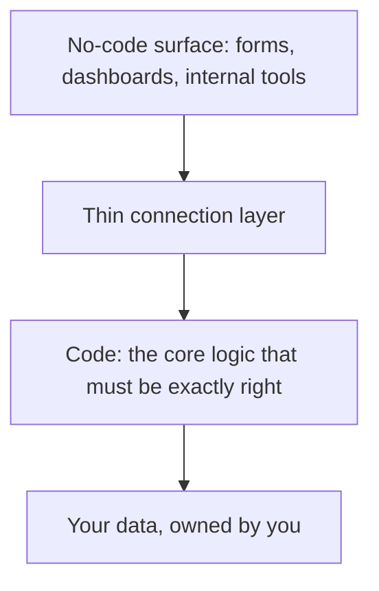

# A Decision Framework

You don't need a 40-row spreadsheet to choose a tier. You need a handful of honest questions, asked in order, and the discipline to act on the first one that gives a clear answer. Here's the short version, then the warning signs, then the pattern that lets you stop choosing sides.

## The questions, in order

Run down this list. The first strong "yes" usually points at your tier.

**1. Does a finished product already do this?**
If a scheduling tool, a form tool, or a help-desk tool already solves your problem, you're not building anything - you're buying. Buy it. This is the cheapest, fastest, lowest-maintenance answer there is, and it's the most overlooked. Don't build what you can rent.

**2. Is this logic the core of your business, or a chore around the edges?**
Edge chores - routing form responses, sending reminders, syncing two systems - are perfect no-code territory. Your *core* - the thing customers pay you for, the logic that has to be exactly right and uniquely yours - leans toward code, because that's the one place control is worth its price.

**3. How predictable are the requirements?**
If you can see the whole need today and it sits inside a tool's menu, no-code is a fine bet. If requirements are fuzzy and you expect to bend the rules in ways you can't yet name, you'll hit the ceiling - favor low-code or code.

**4. Who will own this in a year?**
If the answer is "a non-technical teammate, occasionally," keep it inside an approachable tool. If it's "our engineers, continuously," you'll want something they can version, test, and document like real software.

**5. What does it cost if it breaks at 2am?**
Low stakes - a form goes down, you fix it in the morning - tolerate no-code happily. High stakes - payments, customer data, the thing that stops revenue if it stops - demand the control and observability that code gives you.

```text
Quick read:

  Renting beats building?        → buy a finished product
  Edge chore, stable, low stakes → no-code
  Mostly fits but bends sometimes → low-code
  Core logic, fuzzy, high stakes  → code
```

These aren't gates that lock you in. They're a starting tier. Plenty of things begin as no-code and earn their way up the dial.

## Signs you've outgrown no-code

Tools rarely fail loudly. They fail by accumulating friction until one day you realize you're fighting the tool more than the problem. Watch for these:

- **You're stacking workarounds.** Every new requirement needs a clever hack to fit the menu. Workarounds-on-workarounds is the ceiling talking.
- **The bill outgrew the value.** You're paying more per month than a part-time developer would cost, and the curve is still climbing.
- **You're scared to touch it.** No one fully understands the workflow anymore, so changes happen with crossed fingers. That fear is real cost.
- **You keep exporting to do real work.** If the genuine logic keeps happening in spreadsheets or scripts *outside* the tool, the tool has become a form, not a system.
- **Performance or limits are biting.** You're hitting row caps, run quotas, or it's gotten slow, and the fix is "pay the next tier" forever.

One or two of these is normal life. Three or more, on something that matters, is the tool telling you it's time to move part of the job down the dial.

## The hybrid pattern: no-code front, code where it matters

Here's the move that resolves the whole debate: **you don't have to pick one tier for the whole system.** The strongest setups put each piece at the rung that fits it.

The common shape is a no-code or low-code surface - the parts that change often and don't need to be perfect - sitting on top of a small amount of real code for the parts that do.



Concretely:

- Keep your **data** in a place you own and can leave with - a real database - rather than trapped inside a tool's format. This alone defuses most lock-in.
- Use **no-code for the surface**: the forms, the dashboards, the internal tools your team clicks through daily. These change constantly and benefit from being fast to edit.
- Write **code for the core**: the pricing, the matching, the validation - the one or two pieces where being wrong is expensive and being unique is the point. Expose them so the no-code surface can call them.

This is why no-code and code were never really enemies. The skill isn't loyalty to a tier; it's reading each piece of the job and placing it at the right rung - buy the finished thing where you can, configure where you can, and write code only where the control is genuinely worth the cost.

Pick deliberately, watch for the warning signs, keep your data portable, and let the boring 80% be fast while the critical 20% is yours. That's the whole framework. Everything else is choosing well, one piece at a time.
