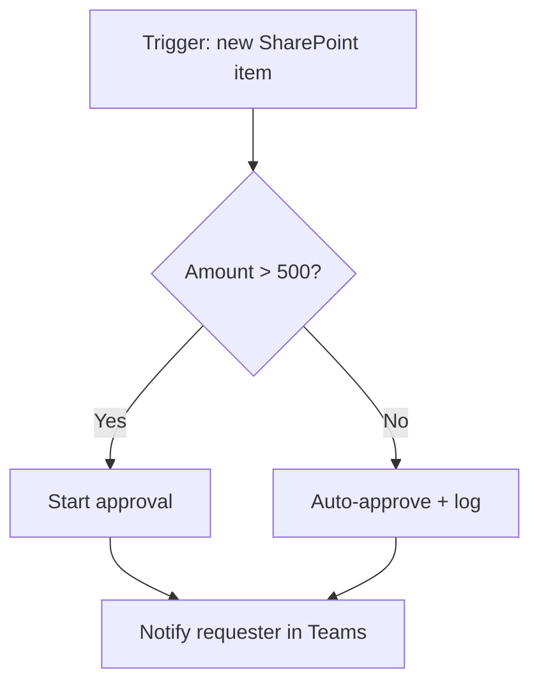

# Flows in the Microsoft World

Every Power Automate flow is the same shape: **when this happens, do these things.** The "when" is a trigger. The "do" is a sequence of actions. That's the whole mental model, and once it clicks, the rest is learning which triggers and actions exist.

A flow you build might be: *when an email arrives in this Outlook folder with an attachment, save the attachment to this SharePoint library, then post a message in this Teams channel.* One trigger, two actions. Power Automate watches Outlook for you, and when the email lands, it runs the rest top to bottom.

## The three kinds of cloud flow

Cloud flows run on Microsoft's servers — you build them once, and they keep running whether your laptop is open or not. There are three flavors, separated by what starts them.

| Type | What starts it | Example |
|------|----------------|---------|
| Automated | An event in some service | New file in SharePoint → notify a channel |
| Instant | A button you press | Tap a button in the Teams app → log "I'm out sick" |
| Scheduled | A clock | Every weekday at 8am → email a summary report |

Most of what people build is automated — react to a thing happening. Instant flows are handy when you want a human in the loop pushing the button. Scheduled flows are your recurring chores: the Monday report, the nightly cleanup, the monthly reminder.

There's a fourth thing people lump in — **desktop flows** for robotic process automation — but those click through apps on an actual machine and behave differently enough that they get their own phase later. For now, "flow" means cloud flow.

## Triggers and actions, concretely

A **trigger** is the single event at the top of the flow. A flow has exactly one. "When a new item is created in a SharePoint list." "When a new email arrives." "When a HTTP request is received." The trigger also hands you data: the new list item, the email's subject and body, who sent it. That data flows downward.

An **action** is a step that does something: send an email, create a file, update a row, call another service, post to Teams. You chain them. Each action can use the output of any step above it — the trigger's data, or the result of an earlier action. So step three can use the email subject from the trigger and the file name created in step two.

Between actions you add logic: **conditions** (if the amount is over $500, do this branch, otherwise that one), **loops** (for each attachment, save it), and **scopes** (group steps so you can wrap error handling around them). It looks like a vertical flowchart in the editor, and that's what it is.

## Connectors: the reason it exists

A flow is only as useful as the things it can touch. Those things are **connectors** — pre-built bridges to a service. The Office 365 Outlook connector knows how to read your mail and send it. The SharePoint connector knows how to create, read, and update list items and files. There are connectors for Teams, Excel, OneDrive, Planner, Forms, Dataverse, and hundreds beyond Microsoft's own walls — Salesforce, Twitter/X, Dropbox, SQL Server, Jira, and more.

Each connector exposes its own triggers and actions. The whole catalog runs into the hundreds, and that breadth is the real product. You're not wiring up APIs by hand — someone already wrote the bridge, you pick the trigger and fill in the boxes.

There's a catch, and it's the most important thing to internalize early: connectors are split into **standard** and **premium**. Standard ones (Outlook, SharePoint, Teams, OneDrive, Excel) are included with most Microsoft 365 business plans. Premium ones (SQL Server, the generic HTTP action, Salesforce, custom connectors, Dataverse in many cases) need a paid Power Automate plan on top. We'll take this split apart in the next phase, because it decides what your automation actually costs. For now, know that the line exists.

## Why it wins in a Microsoft shop

If your organization already pays for Microsoft 365, Power Automate is sitting in the license, integrated with the tools your colleagues already trust. That changes the math against a standalone competitor.

- **It's already paid for** (at the standard tier). No new vendor, no new invoice, no procurement cycle.
- **It already has your identity.** It signs in as you, through the same single sign-on, with the same security and compliance posture IT already vetted. A standalone tool means a new login and a new place your data lives.
- **It speaks Microsoft natively.** SharePoint, Teams, Outlook, and Excel connectors are first-party and deep. The flow can reach the document library, the channel, the calendar — the places your work actually lives.
- **IT can govern it.** Admins control it from the same console as the rest of 365 — who can build flows, what data can mix, which connectors are off-limits.

That bundle is hard to beat inside a Microsoft house. The flip side: outside a Microsoft house, you're paying for an ecosystem you don't use, and a lighter tool may serve you better. Power Automate's strength is gravity — it pulls work toward where your work already is. The next phase is where that gravity gets real: connectors, approvals, and how flows read and write your actual data.
