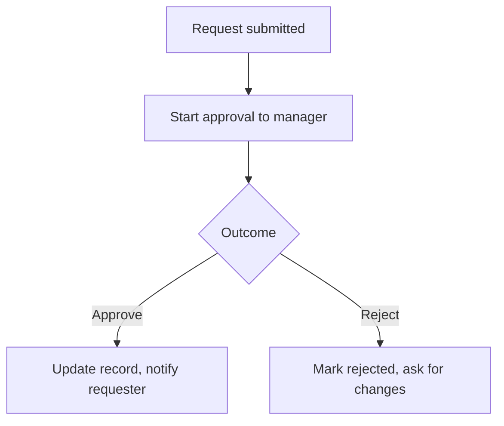

# Connectors, Approvals & Data

This phase is where you move from "I made a flow that pings Teams" to "I built something my team relies on." Three things matter: knowing which connectors cost extra, using the approval system Microsoft already built for you, and getting your flow to read and write real data - SharePoint lists, Dataverse tables - with a bit of expression glue.

## Standard vs premium: the line that costs money

The single most common surprise for new builders is dragging in a connector, finishing the flow, hitting save, and getting told they need a premium license. So learn the split before you build.

**Standard connectors** come with most Microsoft 365 business plans. The everyday ones:

- Office 365 Outlook, SharePoint, OneDrive for Business
- Microsoft Teams, Planner, To Do
- Excel (Online), Forms, Approvals, Notifications

**Premium connectors** need a paid Power Automate plan stacked on top of your 365 license. The ones that bite people:

- SQL Server, and most third-party databases
- The generic **HTTP** action - the moment you want to call any API that doesn't have its own connector, you've gone premium
- Salesforce, Jira, and many other non-Microsoft business apps
- Custom connectors (your own API wrapped as a connector)
- Dataverse, in many licensing scenarios

```text
RULE OF THUMB
  Staying inside Microsoft 365 (mail, files, lists, Teams)? → usually standard, included.
  Reaching out to a database, a raw API, or a third-party SaaS? → expect premium.
```

Microsoft has shifted its licensing over the years toward **per-user** and **per-flow** premium plans, and the exact names and prices change. Don't memorize a number - instead, before you build anything beyond plain 365, check what your tenant is actually licensed for. The connector picker flags premium connectors with a label; trust that flag and confirm with whoever owns the bill. A flow that works in the editor but can't run in production because nobody has the license is a classic, demoralizing trap.

## Approvals: the feature worth showing up for

If you build one thing in Power Automate, make it an approval. The **Approvals** connector is genuinely well done and saves you from reinventing the most common business workflow there is: "someone requested something, a human needs to say yes or no."

You add a **Start an approval** action. You pick the approver(s), write the title and details, and choose the type:

- **Approve/Reject – First to respond:** any one approver can decide.
- **Approve/Reject – Everyone must approve:** all of them have to sign off.
- **Custom responses:** your own buttons, like "Approve / Send back / Reject."

The approver gets a card - in Outlook, in Teams, or in the Power Automate app - with Approve and Reject buttons right there. They don't leave their inbox. Your flow then **waits** at that step. When the response comes back, the flow continues, and you branch on the outcome:



The flow can sit paused at that approval for hours or days - that's normal and expected. You get the responses, the comments, and a timestamp recorded automatically, which is exactly what you want when someone later asks "who approved this and when?"

## Reading and writing your data

Most useful flows revolve around a data store. In a Microsoft shop, that's usually a **SharePoint list** or a **Dataverse table**.

A **SharePoint list** is a structured table living in SharePoint - columns, rows, types. It's where small teams keep requests, trackers, and inventories. The SharePoint connector gives you the bread-and-butter actions: *When an item is created or modified* (trigger), *Get items*, *Create item*, *Update item*, *Get item*. Build a request tracker as a list, trigger a flow on new items, route an approval, and write the outcome back to the row. That pattern alone covers a huge amount of real office work.

**Dataverse** is the heavier option - a proper relational database underpinning the Power Platform, with relationships, security roles, and business rules. Reach for it when a SharePoint list stops being enough: thousands of rows, strict permissions, related tables that need to stay in sync. Note that Dataverse usually lands on the premium side of the license line, so factor that in.

## Expressions: the glue you'll eventually need

You can build a lot by filling in boxes. But sooner or later you need to *compute* something - format a date, default a blank field, build a string, do a small calculation. That's **expressions**, written in a formula language (it's the same Workflow Definition Language under the hood, and it looks like spreadsheet functions).

A few you'll reach for constantly:

```text
utcNow()                          -- right now, as a timestamp
formatDateTime(utcNow(),'yyyy-MM-dd')   -- today as 2026-06-30
concat('Hello ', triggerBody()?['Name'])   -- glue strings together
coalesce(item()?['Owner'], 'Unassigned')   -- fall back if blank
if(greater(item()?['Amount'], 500), 'High', 'Low')   -- inline decision
```

You add these in the same fields where you'd type plain text, via the expression editor. Don't go overboard - if a step is turning into a wall of nested expressions, that's a sign the logic belongs in a condition or a clearer set of steps. Reach for expressions to fill gaps, not to write programs inside a text box.

Get these three down - the connector split, approvals, and reading/writing your data with a little expression glue - and you can build the bulk of what an office actually needs. The last phase is the other world: desktop RPA, for the old apps that don't have a connector at all.
