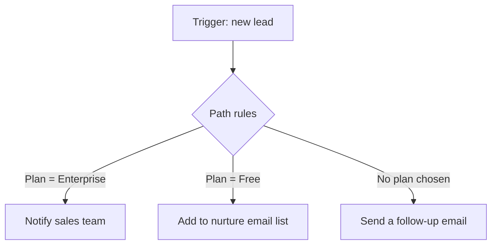

# Multi-Step Zaps, Filters & Formatting

A two-step Zap is a demo. Real work needs more: do several things in response to one event, skip the whole thing when conditions aren't met, take different routes depending on the data, and tidy up messy values before they land somewhere. That's what this phase is about.

## More actions, in order

After your trigger, you can stack actions, and they run strictly top to bottom. New Stripe charge → create the customer in your CRM → add a row to a revenue sheet → post in the team Slack. Four steps, one trigger.

The order matters for two reasons. First, each step can use the output of *any* step above it — so if step 2 creates a record and hands back its new ID, step 3 can use that ID. Second, if a step fails, the steps below it don't run. Put the steps that must happen earlier; put the nice-to-haves later.

## Passing data between steps

Every step produces **output** — named fields you can pull into later steps. The trigger outputs the email, name, and amount. A "create record" action outputs the ID of the thing it created. You insert these outputs into the fields of later steps, the same way you mapped fields in Phase 1.

Two habits keep this from biting you:

- **Always test each step before building the next one.** A step's outputs only become available to map after you've tested it. Build, test, then move down.
- **Watch for empty fields.** If a trigger field was blank in your test sample, Zapier may not even show it as a mappable option. Use a test record that has every field filled in.

## Filter: the brake pedal

A **Filter** step stops a Zap from continuing unless a condition is true. Place it right after the trigger (or anywhere you want a checkpoint). If the condition passes, the Zap rolls on; if it fails, the Zap halts there and the steps below don't run.

Say you only care about high-value orders:

```text
TRIGGER  →  New Stripe charge
FILTER   →  Only continue if  Amount  >  100
ACTION   →  Post in #big-sales Slack channel
```

A charge for $40 hits the filter and stops — silently and correctly. A charge for $250 sails through. Filters are how you stop a Zap from spamming you on every trivial event, and (important for your bill, as Phase 3 explains) a filtered-out run is cheap.

Common filter conditions: "exists / doesn't exist" (skip if no email), "text contains" (only support emails with "refund" in the subject), "greater than / less than" for numbers.

## Paths: branching

A **Filter** is one road with a gate. **Paths** give you a fork — different actions depending on the data. Each path has its own condition and its own set of actions.



Each branch runs only if its condition matches. This is your if / else-if / else. Reach for Paths when "it depends" enters the conversation — VIP customers go one way, everyone else another. Note that Paths are a feature of paid plans; on the free tier you'd approximate branching by running several separate Zaps, each with its own filter.

## Formatter: the cleanup crew

Real data is messy. A date arrives as `2026-06-30T14:00:00Z` but your sheet wants `June 30, 2026`. A name comes in as `  jane DOE ` with stray spaces and wrong casing. A phone number has dashes you don't want. **Formatter** is a built-in utility step (it's "by Zapier," not a separate app) that transforms values between steps.

What you'll use most:

| Formatter type | What it does | Example |
|---|---|---|
| Text | trim, change case, find/replace, split, truncate | `  jane DOE ` → `Jane Doe` |
| Date / Time | reformat dates, add or subtract time, change zones | ISO timestamp → `June 30, 2026` |
| Numbers | round, do arithmetic, format as currency | `19.99 * 12` → `239.88` |

A Formatter step takes a value in, transforms it, and outputs the cleaned-up version, which you then map into the next step instead of the raw one. Pattern: trigger → Formatter (clean the name) → action (use the cleaned name).

## Lookups: find before you act

Often you don't want to blindly *create* a record — you want to find an existing one and either update it or create it if it's missing. Many apps offer a **"Find or Create"** action (sometimes a separate "Lookup"). It searches for a match (say, a customer by email); if found, it hands you that record's ID; if not, it creates one. This is how you avoid duplicate contacts piling up every time the same person triggers a Zap.

```text
TRIGGER  →  New form submission
LOOKUP   →  Find CRM contact by email  (create if not found)
ACTION   →  Update that contact's "last seen" date
```

## Putting it together

A grown-up Zap reads like a recipe:

```text
TRIGGER   →  New paid invoice (Stripe)
FILTER    →  Continue only if Amount > 0  and  Email exists
FORMATTER →  Format amount as currency
LOOKUP    →  Find or create customer in CRM
PATHS     →  If first-time buyer → send welcome email
             If returning buyer  → send thank-you + upsell
ACTION    →  Append row to revenue sheet
```

Trigger to start, a filter to guard, a formatter to clean, a lookup to stay tidy, and paths to handle "it depends." That's the full vocabulary. Phase 3 covers what it costs to run all this, and the timing and duplication traps that catch everyone the first time.
