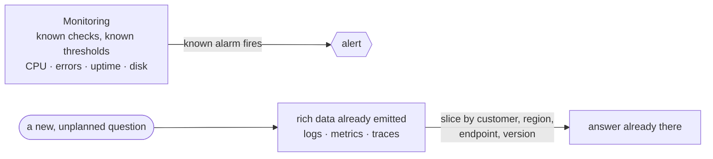

# Monitoring vs Observability

People throw these two words around as if they're the same thing, and that fuzziness is exactly why
"we have monitoring" so often fails to help when prod is actually on fire. You had dashboards. You had
alerts. And yet when the weird thing happened, you were back to guessing. The words name two genuinely
different capabilities, and seeing the line between them is the whole foundation for everything else in
this guide.

So before any tools, let's install the one idea the rest of this rests on.

## The mental model: questions you prepared for vs questions you didn't

**What monitoring actually is.** Monitoring is watching a fixed set of things you decided, *in advance*,
were worth watching. Is the service up? Is CPU under 80%? Is the error rate below some line? You picked
those questions ahead of time, wired up a dashboard or an alert for each, and now the system tells you
when one of those known measures crosses a known threshold.

Monitoring answers **questions you already knew to ask.** That's its strength and its ceiling in one
sentence.

**What observability actually is.** Observability is a property of your system: how well you can
understand its internal state *from the outside*, using the data it already emits — including for
questions you never thought to ask in advance. A system is observable when, faced with surprising
behavior, you can keep asking *"okay, but why?"* and the data has the answer waiting, without you having
to edit code, add a new log line, redeploy, and wait for the problem to happen again.

Observability answers **questions you didn't know you'd need to ask.**

**Why people get this wrong.** The common wrong picture is "observability is just monitoring with nicer
dashboards" or "it's the three tools you buy." Neither holds up. You can own every observability tool on
the market and still have an unobservable system if it only emits "request handled, 200 OK." And you can
have deep observability with humble tools if your system emits rich, queryable detail. The difference
isn't the logo on the dashboard — it's whether the data can answer a question nobody pre-planned.

## Known unknowns vs unknown unknowns

The cleanest way to hold the distinction is the language of *knowns* and *unknowns*.

- A **known unknown** is a problem you anticipated: "the disk might fill up." You don't know *when*, but
  you knew to watch for it. Monitoring is built for these — one alert per known unknown.
- An **unknown unknown** is the problem nobody saw coming: "checkout is slow, but only for users in one
  region, only on the new app version, only when they have more than 50 items in the cart." You can't
  pre-build an alert for a combination you never imagined. Observability is what lets you *discover* it
  after the fact, by slicing the data along dimensions you choose in the moment.

📝 **Known unknown / unknown unknown** — a known unknown is a risk you can name in advance (so you can
monitor it); an unknown unknown is one you can only recognize once it shows up (so you need to be able to
investigate it).

Most outages that hurt are unknown unknowns. If they were known, you'd have alerted on them and probably
prevented them. So the painful 2am incidents are, almost by definition, the ones monitoring alone can't
explain — which is exactly why observability matters.

## What "without shipping new code" really means

Here's the test that separates an observable system from a merely-monitored one, and it's worth burning
into memory.

When the surprising thing happens, do you say:

1. *"Let me query the data we already have and slice it by region and version"* — **observable**, or
2. *"Let me add a log line, open a PR, wait for it to deploy, and hope the problem happens again so I can
   catch it"* — **not observable enough.**

Option 2 is the slow, miserable loop. Every "let me add some logging and redeploy" is a confession that
the system couldn't answer the question with what it already emitted. The goal of observability is to make
option 1 the normal case: the data is rich enough, and queryable enough, that you debug by *asking*, not
by *editing*.

⚠️ **The gotcha: a green dashboard is not proof you're fine.** Monitoring can only ever be green on the
checks you thought to add. The most dangerous outage is the one your dashboards are silent about because
nobody predicted it. "All systems green" means "none of my *known* alarms is firing" — not "nothing is
wrong." Treat a quiet dashboard as the absence of *expected* bad news, not the presence of health.

**Why this saves you later.** Once this distinction is in your head, you'll stop expecting your dashboards
to explain novel problems — that was never their job — and you'll start judging your system by a sharper
question: *"When something weird happens, can I find out why with what I already have?"* That question
drives every practical decision in the next two phases: what to log, which metrics to keep, and when to
reach for a trace.

## Recap

1. **Monitoring** watches a fixed set of known things against known thresholds — it answers questions you
   prepared for in advance.
2. **Observability** is a property of the system: how well you can understand its internals from the
   outside and ask *new* questions of the data it already emits.
3. **Known unknowns** (anticipated risks) are monitoring's territory; **unknown unknowns** (surprises) are
   why observability exists.
4. The practical test: when something surprises you, can you investigate by *querying existing data*, or
   are you stuck *adding code and redeploying*?
5. A green dashboard means "no known alarm is firing," not "everything is healthy."

---

[← Guide overview](_guide.md) · [Phase 2: The Three Pillars →](02-the-three-pillars.md)
