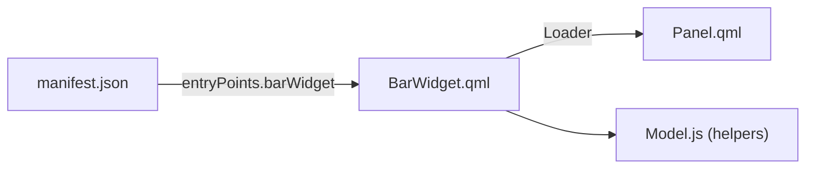

# Anatomy of a Plugin

Before you change anything, it helps to know what the shell looks for when it loads a plugin folder. The answer is short: one JSON file that describes the plugin, and the files that file points to. Every failure you will hit in the next phase, from "not listed" to "does nothing", traces back to this contract.

## The manifest

A plugin is a directory with a `manifest.json` and some QML. When you publish, the directory is a git repository with `manifest.json` at its root. Here is the complete development manifest from the official guide, for a clock widget:

```json
{
  "schemaVersion": 1,
  "id": "yourname.clock",
  "name": "Custom Clock",
  "version": "1.0.0",
  "author": "Your name",
  "license": "MIT",
  "description": "A small clock with a details panel for the Omarchy bar.",
  "kinds": ["bar-widget"],
  "entryPoints": { "barWidget": "BarWidget.qml" },
  "barWidget": {
    "displayName": "Custom Clock",
    "category": "Time",
    "allowMultiple": false,
    "defaultSection": "center"
  },
  "omarchy": { "clonedFrom": "omarchy.clock" }
}
```

| Field | What it does |
|---|---|
| `schemaVersion` | Must be exactly the number `1`. The string `"1"` is rejected. |
| `id` | Unique, namespaced identifier. Letters, digits, dots, dashes, underscores; must start with a letter or digit; no `..`; never starts with `omarchy.`. |
| `name` | Human-readable name. |
| `version` | Your version string. The marketplace shows up to 64 characters. |
| `author` | Shown in the marketplace. |
| `license` | Present in the official examples. Publishing requires a license anyway. |
| `description` | Short summary shown in the marketplace. |
| `kinds` | Non-empty array of what the plugin is. |
| `entryPoints` | Object mapping each kind to the QML file the shell loads. |
| `barWidget` | Extra block for bar widgets: `displayName`, `category`, `allowMultiple`, `defaultSection`, plus optional `defaults` and a `schema` list of settings. |
| `keepLoaded` | When `true`, keeps the plugin mounted between summons. |
| `omarchy.clonedFrom` | Development only. Remove before publishing. |

The local validator and the marketplace ask for slightly different fields. The validator insists on `schemaVersion`, `id`, `name`, `version`, `kinds`, and `entryPoints`. The marketplace listing additionally needs `author` and `description`. Fill in all of them from the start.

## Kinds and entry points

Each kind you claim needs a matching key in `entryPoints`. The official guide gives the usual file name for each:

| Kind | `entryPoints` key | Conventional file | Use it for |
|---|---|---|---|
| `bar-widget` | `barWidget` | `BarWidget.qml` | An item in the active bar |
| `panel` | `panel` | `Panel.qml` | A floating surface |
| `overlay` | `overlay` | `Overlay.qml` | A fullscreen surface |
| `menu` | `menu` | `Menu.qml` | A summoned menu |
| `service` | `service` | `Service.qml` | A headless singleton |
| `bar` | `bar` | `Bar.qml` | A full bar replacement |

The file name is a convention, not a rule: the shell README's minimal example uses `Widget.qml` for a bar widget. What is a rule is that every path is relative, contains no `..`, and points at a file that exists. A plugin can declare several kinds at once, as the built-in media plugin does.

One subtlety: the clock in the official guide has a details panel, but its manifest declares only `bar-widget`. `BarWidget.qml` loads `Panel.qml` itself with a `Loader`, so a nested panel does not need its own manifest kind.



## A real repository

Here is the layout of a real multi-kind plugin, the Missing Manual plugin from the previous guide ([omarchy-tmm](https://github.com/Topurrra/omarchy-tmm)). Its manifest declares `panel`, `service`, and `bar-widget`, plus `keepLoaded: true`:

```text
manifest.json
Panel.qml
Controller.qml
BarWidget.qml
Reader.qml
ResultList.qml
Service.qml
Markdown.js
Model.js
components/            small shared QML pieces (with a qmldir)
logo.png
bin/                   helper scripts the plugin runs
bindings.lua.fragment  keybinding lines for the user to append
extensions/omarchy-menu.jsonc   menu rows for the user to merge
README.md
INSTALL.md
LICENSE
```

Read it as a pattern, not a template. Entry points are at the top; supporting QML and JavaScript sit beside them; a plugin can ship helper scripts in `bin/`; and the two "fragment" files are things the user opts into, because a plugin installer never edits your config for you.

Four rules shape what a folder may contain:

- No symlinks anywhere inside the folder (the `.git` directory is skipped). A symlink could point a copied plugin back at arbitrary files on disk.
- Entry point paths must be safe relative paths.
- A plugin never needs a build step the installer runs for it. The installer clones and validates; it does not run anything from your repo.
- Document every external dependency. The tmm repo lists its requirements (`curl`, `python3`, optional `wl-copy`) in its README.

Try the manifest syntax yourself:

```exercise
[
  {
    "type": "json",
    "task": "Write the `kinds` and `entryPoints` part of a manifest as a JSON object for a plugin that is only a floating panel, using the conventional file name. Type a JSON object with exactly two keys: \"kinds\" and \"entryPoints\".",
    "expected": { "kinds": ["panel"], "entryPoints": { "panel": "Panel.qml" } },
    "hint": "kinds is an array of strings, and entryPoints maps the kind's key (panel) to a QML file name."
  }
]
```

Check yourself before moving on:

```quiz
[
  {
    "q": "omarchy plugin validate rejects your plugin with: kind 'panel' requires an 'entryPoints.panel' to load. What is wrong?",
    "choices": [
      "Panel.qml does not exist on disk",
      "The manifest claims the panel kind but has no panel key under entryPoints",
      "The id uses a reserved namespace"
    ],
    "answer": 1,
    "explain": "Each claimed kind needs its own key in entryPoints. A missing file gives a different message: entry point file not found.",
    "why": ["A missing file is reported as entry point file not found.", null, "A reserved id gives a message about the reserved omarchy.* namespace."]
  },
  {
    "q": "Which plugin id will validate?",
    "choices": ["omarchy.mywidget", "io.github.alex.tide-chart", "../widget"],
    "answer": 1,
    "explain": "The omarchy. prefix is reserved and anything with .. is invalid. A namespaced id such as io.github.alex.tide-chart is fine."
  },
  {
    "q": "Your bar widget shows a details panel when clicked. Do you need to declare panel in kinds?",
    "choices": [
      "Yes, every Panel.qml needs its own kind",
      "No, if BarWidget.qml loads Panel.qml itself, the bar-widget kind is enough"
    ],
    "answer": 1,
    "explain": "The official clock example keeps kinds as [\"bar-widget\"] and has BarWidget.qml load Panel.qml through a Loader."
  }
]
```

## Recap

1. A plugin is a folder with `manifest.json` plus the files it points to; publishing means a git repo with the manifest at its root.
2. The validator requires `schemaVersion` (the number 1), `id`, `name`, `version`, `kinds`, and `entryPoints`; the marketplace also needs `author` and `description`.
3. Each kind needs its matching `entryPoints` key, and every entry path must be relative, free of `..`, and exist on disk.
4. A bar widget's nested panel does not need its own kind if the widget loads it.
5. Plugin folders may not contain symlinks, and ids may not start with `omarchy.`.

Next up, [The Development Loop](02-the-development-loop.md): clone a working built-in and watch your edits reload live.
