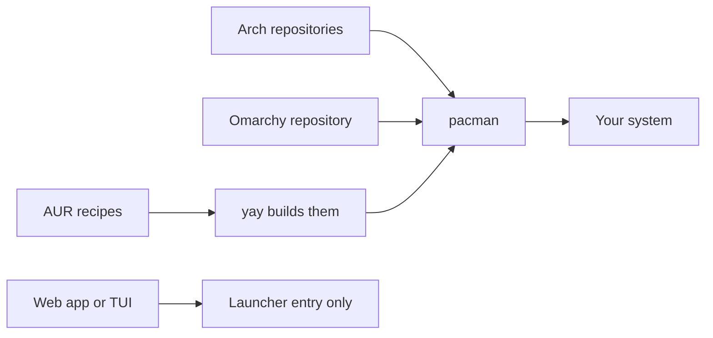

# Where Software Comes From

On Windows you download an installer from a website and click through it. On macOS you drag an app into a folder or use the App Store. Either way you are trusting whatever the download was.

Omarchy works differently. Software comes from a small number of named places, and a program called a package manager installs it from one of them. Once you know the places, "can I trust this" becomes a question with an answer.

## A package is a labeled box

A **package** is an archive of files plus a label that says what the software is, which version it is, and which other packages it needs. Those needs are **dependencies**: if an app needs a graphics library to run, the label says so, and the installer fetches the library too.

The **package manager** reads those labels. It installs the files, remembers exactly which files belong to which package, and can later remove them cleanly. On Omarchy the package manager is **pacman**, inherited from Arch Linux. It is not `apt`, and it is not `snap`.

That record-keeping is the reason Linux software does not rot the way a pile of Windows installers does. The system always knows what it installed.

## The four places software lives

| Source | What it is | Who vouches for it |
|---|---|---|
| **Arch repositories** | The official Arch collections (core, extra, multilib) | The Arch project's packagers |
| **Omarchy Package Repository** | Omarchy's own packages, including Omarchy itself | The Omarchy team, with signed packages |
| **The AUR** | The Arch User Repository: build recipes submitted by anyone | Nobody in particular. See Phase 4 |
| **Launchers** | Web apps and terminal programs wrapped as menu entries | The website or program you point them at |

The Omarchy manual's security chapter says the base install relies on Arch's core, extra, and multilib repositories plus the Omarchy Package Repository. Only a few optional installs, such as third-party browsers, pull from the AUR. So a fresh machine starts on the first two rows.

The AUR deserves its own phase because the manual's description of it is blunt: it "isn't vetted by the Arch team", it is "like RubyGems or npm", and anyone can upload.



*What just happened:* Packages from the two trusted repositories go straight to pacman. AUR recipes are built on your machine by a helper called **yay**, which hands the result to pacman. Web apps and TUIs are not installed software at all. They are launcher entries that open a URL or a terminal command.

## Rolling release: no version day

Ubuntu has versions such as 24.04, and you upgrade between them every so often. Arch has no such moment. It is a **rolling release**: packages move forward continuously, and one update brings the newest version of everything.

That is good for security, since a fix reaches you quickly. The Omarchy manual calls this out as a benefit. The cost is that new versions sometimes change how a program is configured. Omarchy softens this in two ways. Its stable channel follows a mirror of Arch that runs one month behind, so incompatibilities get caught first, and its update command takes a snapshot before changing anything. Phase 3 covers both.

## What the Install menu maps to

Open the Omarchy menu with `Super + Space` and choose **Install**. In version 4.0.4 the entries are:

| Entry | Source |
|---|---|
| **Package** | Arch and Omarchy repositories, through a filterable list |
| **AUR** | The AUR, through a filterable list |
| **Web App** | A launcher entry for a URL |
| **TUI** | A launcher entry for a terminal program |
| **Style** | Themes, backgrounds, fonts |
| **Service** | Apps such as 1Password, Dropbox, Spotify, Signal, Tailscale |
| **Development, Editor, Terminal, Browser, AI, Gaming, Windows** | Curated setups that install packages and configure them for Omarchy |
| **Preinstalls** | Restores the preinstalled apps if you removed them |

The curated entries do more than install a package. For example, the command behind _Install > Editor > Helix_ installs Helix and configures it to use the current Omarchy theme. When an entry exists for what you want, prefer it over a bare package.

The development entries are mostly managed by **mise**, a tool that installs language runtimes per user. For example, `mise use -g ruby` installs Ruby and makes it the global default. That is a different system from pacman, and the update command refreshes it too.

## Linux words you will meet

📝 **Terminology.**
- **Repository** - a server holding packages and an index of what it has.
- **Mirror** - a copy of a repository on another server, so downloads are fast.
- **Foreign package** - an installed package that is not in any of your configured repositories. On Omarchy these are typically AUR packages.
- **Orphan** - a package installed only as a dependency that nothing needs any more.

## Why this matters

Every question you will have next is a question about source. Is this safe to install? Where does it update from? How do I remove it completely? The answer follows from which of the four places it came from. Hold on to that table.

Check yourself before moving on:

```quiz
[
  {
    "q": "Which statement about the AUR matches the Omarchy manual?",
    "choices": [
      "It is vetted by the Arch team before packages appear",
      "It is not vetted by the Arch team, and anyone can upload",
      "It is the main source for Omarchy's own packages"
    ],
    "answer": 1,
    "explain": "The manual compares the AUR to RubyGems or npm: anyone can upload. Omarchy's own packages come from the Omarchy Package Repository.",
    "why": ["The opposite is true: nobody vets AUR uploads.", null, "Omarchy ships from its own repository, not the AUR."]
  },
  {
    "q": "You choose Install > Web App and add a site. What did you install?",
    "choices": [
      "A package from the Arch repositories",
      "A launcher entry that opens the URL in a frameless window",
      "A copy of the website's source code"
    ],
    "answer": 1,
    "explain": "Web apps are launcher entries. Nothing is installed in the pacman sense."
  },
  {
    "q": "What does 'rolling release' mean for your updates?",
    "choices": [
      "You reinstall the system every few years for a new version",
      "Packages move forward continuously, so one update brings newer versions of everything",
      "Only security fixes are ever delivered"
    ],
    "answer": 1,
    "explain": "There is no version-day upgrade. That is why a pre-update snapshot matters."
  }
]
```

## Recap

1. A package is files plus a label of dependencies, and pacman tracks every file it installs.
2. Software comes from the Arch repositories, the Omarchy repository, the AUR, or launcher entries.
3. The base install relies on the first two. The AUR is open to any uploader.
4. A rolling release has no version day. Omarchy's stable channel and pre-update snapshot reduce the risk.
5. The Install menu maps onto those sources, and curated entries configure the app for Omarchy.

Next up, [Installing, Removing, and Wrapping Apps](02-installing-removing-and-wrapping-apps.md): the real clicks and commands.
