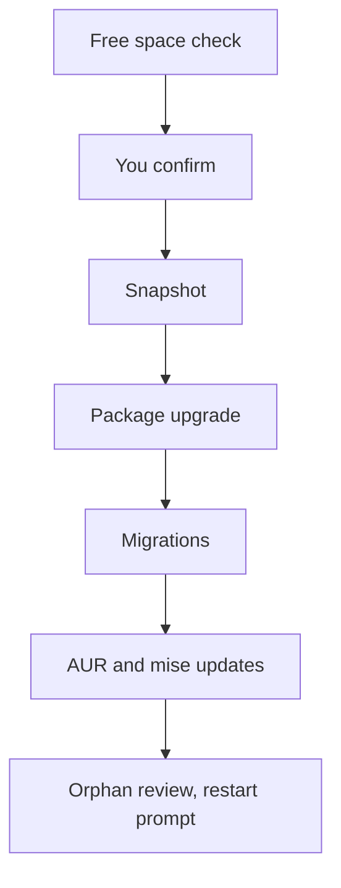

# Updating a Rolling Release Safely

A rolling release means the next update could change anything, and that is why people fear it. Omarchy's answer is a single blessed command that does the update in a fixed, safe order, and starts by taking a restore point.

This phase walks through what that command does so the progress output is no longer a wall of text, and shows how to undo an update that went wrong.

## Starting an update

There are three equivalent ways to start one:

- Click the **circle arrow** that appears to the right of the clock when a new Omarchy release exists.
- Choose _Update > Omarchy_ from the menu (`Super + Space`).
- Run `omarchy update` in a terminal. With `-y` it skips the confirmation, which is a promise not to be asked anything.

Unless you passed `-y`, it asks you to confirm first. The update runs in a terminal window and keeps a transcript at `/tmp/omarchy-update.log`.

## What happens, in order

Omarchy is installed as ordinary pacman packages from the Omarchy Package Repository, so updating Omarchy and updating the system are one transaction, followed by steps that need your user account.



Here is what each step is, taken from Omarchy's update script and its update-process notes.

1. **Free space check.** If the root filesystem has less than 10 GiB free, the update stops before asking you anything. An experienced user can bypass it by setting `OMARCHY_UPDATE_FORCE=1`, though freeing space is the better fix.
2. **Package cache prune.** Old versions are pruned so that two versions of each package stay. The cache is the only offline way to downgrade a package.
3. **Snapshot.** A system snapshot is created with snapper. If snapper is not installed the update carries on without one, and if the snapshot fails for any other reason it prints a warning and carries on. Watch for that warning, because a missing snapshot is not a snapshot.
4. **Keyring refresh.** The Omarchy and Arch keyrings, which verify package signatures, are brought up to date.
5. **Package upgrade.** The system packages update, including Omarchy.
6. **Migrations.** More on this below.
7. **Post-update hooks, then AUR packages** if you have any installed, then **mise-managed tools** such as AI agent launchers.
8. **Orphan review.** It lists packages nobody needs and asks before removing any, defaulting to no.
9. **Log analysis and restart check.** It scans the transcript for known failure patterns, then prompts for a reboot when the kernel or Hyprland changed. The Omarchy shell is always restarted after an update.

The order is deliberate. The notes say migrations ship with the new packages and are written against them, so nothing after the package step runs if the upgrade failed.

### Migrations: catching your config up

A **migration** is a small script that adjusts your own files to match the new release, for example moving a setting to a new name. They run per user after pacman finishes, because they may need your home folder, your desktop session, or `sudo`. Completion markers live in `~/.local/state/omarchy/migrations/`, so each migration runs once per user.

## Why raw pacman -Syu is blocked

On other Arch systems the update command is `pacman -Syu`. On Omarchy, typing it fails with a message pointing you to `omarchy update`. This is intentional: a direct upgrade would skip the snapshot, the migrations, and the configuration updates that Omarchy runs together with new packages.

Omarchy installs a pacman hook that detects a direct system upgrade and aborts the transaction before any package changes. The same applies to `yay -Syu`.

If you truly need to bypass it for one transaction, the guard prints how:

```bash
sudo env OMARCHY_ALLOW_DIRECT_PACMAN=1 pacman -Syu
```

If you do bypass it, the system tells you at your next login when migrations are pending, and clicking the notification opens a terminal running `omarchy migrate`. But you have still skipped the snapshot. The pacman manual notes that `-y` should typically be used together with `-u`, so do not run a refresh-only `pacman -Sy` followed by an install. Use Omarchy's tools.

## The four channels

| Channel | Follows | For whom |
|---|---|---|
| **stable** | Official Omarchy releases and a stable Arch mirror that runs one month behind | Everyone. New installs start here |
| **rc** | Release candidates, used for final validation before a major release | People helping polish |
| **edge** | The latest development builds and the newest Arch packages | Experienced users who can recover a broken system |
| **dev** | A git checkout of Omarchy in `~/omarchy`, combined with the edge packages | People working on Omarchy itself |

Switch under _Update > Channel_ or with `omarchy channel set <stable|rc|edge|dev>`. Check yours with `omarchy channel current`, and the installed version with `omarchy version`.

The one-month lag on stable is the safety margin. Arch changes land first on edge users, and the Omarchy team gets time to add the config fixes before stable sees them.

## Firmware is separate

BIOS, SSD, and dock firmware are not part of `omarchy update`. _Update > Firmware_ installs `fwupd` the first time you use it, then fetches whatever your hardware has waiting. Many firmware updates can only be written during a reboot, so expect a prompt.

## When an update goes wrong: the snapshot

If something breaks after an update, you roll back to the snapshot taken right before it.

1. **Restart** and pick the snapshot from the Limine boot menu. The Omarchy version at the time of each snapshot shows in the bottom-left corner.
2. After you boot in, a notification offers to start the restoration. You can also run `omarchy snapshot restore` yourself.

What a snapshot covers and does not cover is where people get hurt:

- It restores the **root filesystem**, not `/home`. It undoes a broken update. It does not recover lost personal files.
- Your `~/.config` stays as it is. If you roll back to an older program that expects a different config format, you sort that out by hand.
- Snapshots only work on installs that use the Limine bootloader, which is the default.
- Omarchy keeps a small number of snapshots. Its snapper policy keeps five numbered ones and takes none on a timer, so they come from updates and from `omarchy snapshot create`.

You can also take one yourself before anything risky:

```bash
omarchy snapshot create
```

If you turned on _Setup > Direct Boot_ to skip the boot menu, choose Limine from your BIOS boot menu first to reach the snapshots.

If your configuration files themselves are corrupted, `omarchy reinstall` reinstalls the default packages, puts you on stable, downgrades packages that are too new, and resets your configs. That last part overwrites your changes. [When Omarchy Breaks](/guides/when-omarchy-breaks) covers the whole recovery ladder.

⚠️ **Gotcha.** If a failed update tells you to retry, read the output above the error first. The transcript is at `/tmp/omarchy-update.log`. Copy it somewhere permanent if you plan to ask for help, since `/tmp` is a scratch folder.

## Your turn: read the plan

```exercise
[
  {
    "type": "predict",
    "task": "How many GiB of free space on the root filesystem does omarchy update require before it will start?",
    "accept": ["10", "10 gib", "10gib"],
    "hint": "The update stops before the confirmation prompt when free space is below this threshold."
  },
  {
    "type": "task",
    "task": "Without updating anything, find out which channel and version you are on, and which snapshots exist. Write down the two commands you used.",
    "reveal": "omarchy channel current and omarchy version. Snapshots are visible in the Limine boot menu, where the Omarchy version shows in the bottom-left corner.",
    "checklist": ["Ran omarchy channel current", "Ran omarchy version", "Know where snapshots are listed"]
  }
]
```

Check yourself before moving on:

```quiz
[
  {
    "q": "You are used to Arch and type sudo pacman -Syu. What happens on Omarchy 4.0.4?",
    "choices": [
      "It upgrades everything as usual",
      "A pacman hook aborts it and points you to omarchy update, because a direct upgrade would skip the snapshot and migrations",
      "It upgrades packages but not Omarchy itself"
    ],
    "answer": 1,
    "explain": "The guard aborts direct system upgrades unless you set OMARCHY_ALLOW_DIRECT_PACMAN=1 for one transaction.",
    "why": ["The guard blocks it.", null, "The guard stops the whole transaction."]
  },
  {
    "q": "After a bad update you restore a snapshot. What does it bring back?",
    "choices": [
      "Your root filesystem as it was before the update, but not your /home",
      "Everything, including documents you deleted yesterday",
      "Only your ~/.config files"
    ],
    "answer": 0,
    "explain": "Snapshots restore the root filesystem. Your home folder, including ~/.config, is left as it is."
  },
  {
    "q": "Why does the stable channel use an Arch mirror that runs one month behind?",
    "choices": [
      "So incompatibilities that need config changes are caught before they reach stable users",
      "Because new Arch packages are not allowed on Omarchy",
      "To save disk space"
    ],
    "answer": 0,
    "explain": "The delay gives the Omarchy team time to catch problems that need config changes."
  }
]
```

## Recap

1. Start an update from the circle arrow, _Update > Omarchy_, or `omarchy update`.
2. The order is free space check, confirm, snapshot, package upgrade, migrations, AUR and mise updates, orphan review, restart check.
3. Migrations adjust your own config files to the new release, once per user.
4. Raw `pacman -Syu` is blocked because it would skip the snapshot and migrations. `OMARCHY_ALLOW_DIRECT_PACMAN=1` bypasses it for one transaction.
5. Stable follows a one-month-behind Arch mirror, and edge and dev are for people who can recover a broken system.
6. A snapshot restores the root filesystem, not `/home`, and `omarchy snapshot create` takes one on demand.

Next up, [The AUR, Risk, and Reading a PKGBUILD](04-the-aur-risk-and-reading-a-pkgbuild.md): the one source nobody vets.
