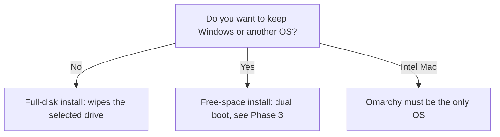

# Before You Install

Almost every regretted install comes from a skipped step before the installer even starts: no backup, a firmware switch nobody flipped, or a USB stick that was never checked. Ten minutes here turns the install into a non-event.

## Decide what the install will do to your drive

Omarchy installs from an ISO (a single file holding a bootable installer) in one of two modes:

- **Full-disk install** takes over the entire drive you select. It **wipes the drive**.
- **Free-space install** uses unallocated space on a drive, which is how you dual boot alongside Windows or another OS.

Either way the install defaults to encryption.



An Intel Mac is a special case: the manual says Omarchy must be the only operating system on it (Phase 3 covers that).

## Back up before anything else

A full-disk install erases the selected drive completely. A free-space install is gentler, but it still means shrinking a partition, and any disk operation can go wrong. Treat a backup as required, not optional.

Back up to a separate physical device: an external drive or a cloud service. Include:

- Documents, photos, and project folders.
- Browser bookmarks and saved logins (or confirm they sync to an account).
- Anything not reproducible: software license keys, authenticator app recovery codes, a password manager export.

Then verify the backup. Open a couple of files from the backup drive. A backup you have never opened is a hope, not a backup.

> ⚠️ **Gotcha.** Disk encryption is the right default, but it has no back door. If you forget the password, treat the data as gone. Pick a password you can remember, and store it somewhere safe.

## Hardware: what is and is not promised

The manual publishes no minimum RAM, CPU, or disk numbers. The homepage's claim that Omarchy runs on very old hardware is marketing, so do not rely on it. If you can, test on the exact machine with a virtual machine or a trial install before you commit your only computer. Phase 3 of [What Omarchy Actually Is](/guides/what-omarchy-actually-is) covers the realistic options.

Two hardware details do matter:

- **Use a wired or 2.4 GHz-dongle keyboard.** Full-disk encryption asks for your password at startup, and a Bluetooth keyboard cannot be used at that point, in the same way it cannot be used to enter a PC's BIOS. A cheap wired keyboard solves it.
- **Omarchy assumes a high-resolution display.** On an ordinary 1080p or 1440p screen, apps can look too big until you adjust one setting. Phase 4 shows how.

## Turn off Secure Boot and TPM

The manual is blunt: you must turn off Secure Boot and/or TPM in the BIOS to install Omarchy. The manual describes both as security schemes aimed at Windows and Microsoft-affiliated distributions, and says Omarchy cannot be installed with them on.

The BIOS (more precisely, the firmware setup screen) is a small program built into your computer that runs before any operating system. You reach it with a key you press right as the machine powers on. That key differs by maker, so check your laptop's or motherboard's manual. Inside, look for "Secure Boot" (usually under a boot or security tab) and for a TPM option. Menu names vary between makers.

> 💡 **Key point.** Write down each setting's original value before you change it, so you can tell what you altered. If you are dual booting, these settings affect every operating system on the machine.

If you want the background on what firmware does before the OS starts, see [How Your Computer Boots](/guides/how-your-computer-boots).

## Get the ISO and check it

Download the ISO from [omarchy.org](https://omarchy.org/). The files are hosted at `iso.omarchy.org`; for example, version 4.0.4 is at `https://iso.omarchy.org/omarchy-4.0.4.iso`. The ISO is under 6 GB.

A download can be corrupted or tampered with, so verify it. The release page for each version publishes a SHA-256 checksum (a fingerprint of the file). For 4.0.4 it is:

```text
ddeded2758c48318d201dfdac905ecb28f570441883f0c052ea3cd5d05acf92d
```

Compute the same fingerprint for your file and compare them.

On Windows, in PowerShell:

```powershell
Get-FileHash -Algorithm SHA256 .\omarchy-4.0.4.iso
```

On Linux, in a terminal:

```bash
sha256sum omarchy-4.0.4.iso
```

On macOS, the equivalent is:

```bash
shasum -a 256 omarchy-4.0.4.iso
```

If you download a newer version, take the checksum from that version's release page on [GitHub](https://github.com/basecamp/omarchy/releases), not from this guide. If the two do not match exactly, delete the file and download again.

Omarchy also publishes a signature for each ISO: add `.sig` to the ISO's address. The signing key fingerprint is `40DFB630FF42BCFFB047046CF0134EE680CAC571`, and you can check it at [keys.openpgp.org](https://keys.openpgp.org/search?q=pkgs%40omarchy.org). The checksum is enough for most people. The signature is for those who verify signatures as a habit.

## Write the ISO to a USB stick

The manual recommends [balenaEtcher](https://etcher.balena.io/) on Windows and Mac, and [caligula](https://github.com/ifd3f/caligula) on Linux. Writing the ISO **erases everything on the stick**, so use an empty one or one you do not need.

With Etcher: choose the ISO file, choose the USB stick as the target, and flash. Double-check the target. Picking your backup drive by mistake is a classic way to lose a backup, so unplug the backup drive before you start.

When it finishes, leave the stick plugged in and carry on to Phase 2.

Check yourself before moving on:

```quiz
[
  {
    "q": "What happens to the selected drive in a full-disk install?",
    "choices": ["Omarchy installs beside your existing data and leaves it alone", "The drive is wiped, so back up first", "Only the Windows partition is erased"],
    "answer": 1,
    "explain": "A full-disk install takes over the entire drive you select. A free-space install is the mode that coexists with another OS.",
    "why": ["That describes a free-space (dual boot) install, not full-disk.", null, "Full-disk wipes the whole selected drive, not one partition."]
  },
  {
    "q": "Why does the manual say to use a wired or 2.4 GHz-dongle keyboard?",
    "choices": ["Bluetooth keyboards are too slow to type in the installer", "You enter the encryption password at startup, where a Bluetooth keyboard does not work", "Omarchy does not support Bluetooth at all"],
    "answer": 1,
    "explain": "Full-disk encryption asks for your password at startup, and a Bluetooth keyboard cannot be used at that point. A wired or dongle keyboard can."
  },
  {
    "q": "Your computed ISO checksum does not match the one on the release page. What now?",
    "choices": ["Install anyway, it is probably fine", "Delete the file and download it again", "Edit the checksum to match"],
    "answer": 1,
    "explain": "A mismatch means the download is corrupted or altered. Download it again before writing it to a stick."
  }
]
```

## Recap

1. Full-disk install wipes the drive. Free-space install is the dual boot mode. Intel Macs must have Omarchy as the only OS.
2. Back up to another device and open a file from the backup to confirm it works.
3. Turn off Secure Boot and/or TPM in the BIOS, and use a wired or dongle keyboard.
4. Download the ISO from omarchy.org, compare its SHA-256 with the release page, and write it with balenaEtcher or caligula.

Next up, [The Install Walkthrough](02-the-install-walkthrough.md): booting the stick and answering the installer.
