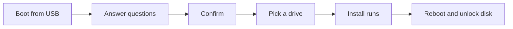

# The Install Walkthrough

You have a USB stick, a backup, and the firmware switches off. Now the installer itself, which is shorter than you expect: a handful of questions, one confirmation, and a progress screen. This phase walks through each question, what it controls, and which answers are hard to change later.



## Boot from the stick

Plug in the USB stick and power on. Most computers have a one-time boot menu key that lets you choose the USB stick for this boot only. The key varies by maker, so check your computer's manual. If the stick does not appear, the likely culprits are Secure Boot or TPM still being on (Phase 1) or a bad write, in which case flash the stick again.

On an Intel Mac you hold `Option` at power-on and choose the orange EFI Boot device. [Phase 3](03-dual-boot-and-special-installs.md) covers the Mac prerequisites.

## The questions

The installer asks you to describe your machine. Here is what each prompt wants, taken from the installer's own form.

| Question | What to enter | Rules |
|---|---|---|
| Keyboard layout | Pick yours from the list. English (US) is the default and leads the list. | Choose the layout your physical keys match. |
| Username | Your login name, like `dhh` in the installer's own example. | Lowercase letters, digits, underscore, and hyphen; no spaces. It must start with a letter or underscore. System names such as `root` are refused. |
| Password | One password, typed twice. | Used for your user, for root, and for disk encryption. It cannot be blank. |
| Full name and email | Optional. Press `Return` to skip. | Used for git, the version control tool. |
| Hostname | Your computer's network name. | Letters, digits, and dashes, up to 63 characters, not starting or ending with a dash. Leave it blank and you get `omarchy`. |
| Timezone | Pick from the list. | The installer guesses from your network connection when it can, and offers a searchable list when it cannot. |

> 📝 **Terminology.** **Hostname** is the name your machine announces to other machines on a network. It is not secret and you can leave it as `omarchy`.

The installer's wording and screen order may differ a little between versions. The questions are the same.

Two things deserve care:

- **The password does triple duty.** It logs you in, it is the root (administrator) password, and with encryption on it is the key that unlocks your drive at every boot. Choose something strong that you will remember. You can change the drive and user passwords separately later under _Update > Password_.
- **Choose a username you are happy with.** It is the name you will see on every login prompt.

If a rule is broken, the installer tells you in a short message and asks again. If you press `Esc` in the form, it unwinds to the start so you can correct an earlier answer.

## Confirm, then pick a drive

After the questions you get a summary screen to confirm. Read it. Then you select the drive for the installation. This is the step where full-disk mode wipes the drive and where a free-space install offers **Free space install** instead (Phase 3).

The install then runs on its own. The manual says it can finish in under a minute on the fastest machines and should not take more than 5 minutes even on an older one.

## Encryption, and the two Ctrl + C exits

Encryption is on by default. The two cases where you press `Ctrl + C` are rare, so know them before you hit the key by accident:

- `Ctrl + C` on the very first screen (keyboard selection) offers to prepare the machine for **another owner**. See Phase 3.
- `Ctrl + C` on the disk formatting confirmation switches to an **unencrypted** install. The manual says this is only for special cases, such as remote installs on protected computers or throw-away machines. For anything that can be lost or stolen, keep encryption on.

## First boot

When the install finishes, follow the installer's prompt to restart, and remove the USB stick so the machine boots from the drive. The bootloader is Limine, and its menu is titled "Omarchy Bootloader". Then comes the encryption prompt: type the password you chose, on your wired or dongle keyboard.

If a login screen appears, use the same user and password. Then you arrive at the desktop, where a notification invites you to open the keybindings menu. Phase 4 takes you from there.

## When it does not go as planned

| Symptom | Calm fix |
|---|---|
| The USB stick will not boot | Confirm Secure Boot and/or TPM are off, try another USB port, and re-flash the stick. |
| You cannot type the password at startup | You are likely on a Bluetooth keyboard. Use a wired or 2.4 GHz-dongle keyboard. |
| The installer complains about BitLocker (dual boot) | Turn off BitLocker in Windows first. See Phase 3. |
| Something else is wrong | Ask in the `#omarchy-help` channel on the [community Discord](https://omarchy.org/discord). |

Check yourself before moving on:

```quiz
[
  {
    "q": "The installer asks for one password. What does Omarchy use it for?",
    "choices": ["Only your login", "Your user account, root, and the disk encryption key", "Only the Wi-Fi network"],
    "answer": 1,
    "explain": "One password serves your user, the root account, and disk encryption when it is enabled. You can change the drive and user passwords separately later.",
    "why": ["It does more than log you in: it also unlocks the encrypted drive.", null, "Wi-Fi credentials are separate and are set from the network panel later."]
  },
  {
    "q": "You press Ctrl + C on the disk formatting confirmation. What did you choose?",
    "choices": ["An install for another owner", "An unencrypted installation", "To cancel the install and shut down"],
    "answer": 1,
    "explain": "Ctrl + C on the formatting confirmation switches to an encryption-less install. Ctrl + C on the very first (keyboard) screen is the other-owner option."
  },
  {
    "q": "You leave the hostname blank. What do you get?",
    "choices": ["The install fails", "The default hostname omarchy", "A random name"],
    "answer": 1,
    "explain": "A blank hostname falls back to omarchy."
  }
]
```

## Recap

1. Boot from the USB stick using your computer's one-time boot menu, with Secure Boot and TPM off.
2. Answer the questions: keyboard, username, password (also the encryption key), optional git name and email, hostname, timezone. Then confirm and pick a drive.
3. The install takes minutes. Encryption is on by default; the two `Ctrl + C` exits are for another owner (first screen) or no encryption (formatting confirmation).
4. At first boot you type the encryption password on a wired or dongle keyboard.

Next up, [Dual Boot and Special Installs](03-dual-boot-and-special-installs.md): keeping Windows, Intel Macs, and the unusual cases.
