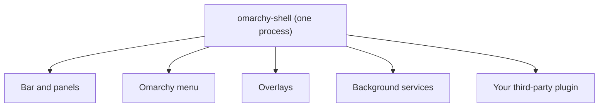

# What a Plugin Is, and What It Can Reach

You press `Super + Space` and a menu appears. You glance at the bar and see a clock and a row of status icons. Each of those is a plugin. Once you see that, "adding a plugin" stops being mysterious: you are adding one more piece to the same machinery that draws your desktop.

The second half of this phase is the part that matters for your safety: what a plugin you did not write is allowed to do.

## One process, many plugins

Omarchy's desktop runs as a single long-lived process called `omarchy-shell`, built on Quickshell. Almost everything you see on screen is a plugin inside it:

- the bar and the panels that drop down from it
- fullscreen overlays such as the emoji picker and the clipboard manager
- the Omarchy menu itself
- the lock screen and the dialog that asks for your password
- headless services that watch your battery or warm the screen at night



This design is why you can turn pieces of the desktop off, swap them, or add your own without touching Omarchy's source. It is also why a plugin is not a separate program: it is code loaded into the process that draws your screen.

## Two places plugins live

| Kind of plugin | Where it lives | Who owns it |
|---|---|---|
| First-party (ships with Omarchy) | `$OMARCHY_PATH/shell/plugins/` | Omarchy's package |
| Third-party (yours or from the internet) | `~/.config/omarchy/plugins/<id>/` | You |

Both are discovered at startup. Do not edit files under `$OMARCHY_PATH`: they belong to the package and the next update overwrites them. If you want to change a built-in, you clone it into your own folder instead (that is the first step of [Building Your Own Omarchy Plugin](/guides/building-your-own-omarchy-plugin)).

Every plugin has an `id`. Built-ins start with `omarchy.`, such as `omarchy.clock` and `omarchy.network`. That prefix is reserved: a third-party plugin cannot claim it.

## The six kinds

A plugin declares what it is in its manifest. The shell knows six kinds:

| Kind | What it is |
|---|---|
| `bar-widget` | A component the bar drops into one of its sections |
| `panel` | A floating window, persistent or summoned |
| `overlay` | A fullscreen surface |
| `menu` | A summoned menu surface |
| `service` | A headless singleton with no visible UI |
| `bar` | A full replacement for the built-in bar |

One plugin can be several kinds at once. The built-in media plugin is both a `service` and a `bar-widget`.

## What a plugin can reach

Here is the plain version, in the manual's own framing: plugins run as arbitrary, unsandboxed code, with everything your user account can reach.

Your user account can read your home folder, your SSH keys, your browser profile, and your documents. A plugin is code your user runs, so it can too. There is no permission prompt standing between a plugin and your files.

Omarchy does add a few guard rails, and it is worth knowing exactly what they are and are not:

- Third-party plugins get a limited interface scoped to their own service and lifecycle, not the full trusted interface that built-ins receive.
- Since 4.0.3, the third-party interface does not directly expose authentication services, and authentication state is kept outside the objects a plugin can reach.
- The installer itself never runs plugin code, never runs an install hook, and never asks for `sudo`. It copies files, checks the manifest, and flips an enabled bit.

> ⚠️ **Gotcha.** These are API boundaries, not a sandbox. Visual plugins share the shell's scene and can walk ordinary parent objects, so the manual's advice stands: only add repos you are willing to run, and read them before you enable them.

The marketplace does not change this. Its own publishing page says it validates listings, not plugin security.

## Installed does not mean running

A plugin that was added but not enabled is a folder on disk. The installer clones a repository, validates its manifest, and moves it into `~/.config/omarchy/plugins/<id>/`. It enables the plugin only if you pass `--enable` or answer yes to its "Enable now?" prompt. That gap is your review window, and the next phase uses it.

How does Omarchy know a third-party plugin is enabled? The rule is plain: a third-party plugin is on exactly when its `id` appears somewhere in `~/.config/omarchy/shell.json`, as a bar layout entry, as an entry in `plugins[]`, or as `bar.id`. Built-in non-bar plugins work the other way around: they are on by default and off only when listed in `disabledPlugins[]`.

A full `bar` plugin has no off state. There is always exactly one bar, so you replace it by enabling another one, and the built-in `omarchy.bar` is the safe path home.

Check yourself before moving on:

```quiz
[
  {
    "q": "A friend shares a git URL for an Omarchy plugin. What is the most accurate description of what it can do once enabled?",
    "choices": [
      "Nothing outside its own folder, because Omarchy sandboxes third-party plugins",
      "It runs inside your shell process as your user, so it can reach whatever your user account can reach",
      "It can only draw things on screen and cannot touch files",
      "It runs as root so it can change system settings"
    ],
    "answer": 1,
    "explain": "Plugins are unsandboxed code in the long-running shell process. The scoped interfaces limit which shell services a third-party plugin can ask for, but they are not a sandbox around your files.",
    "why": ["Third-party plugins are explicitly unsandboxed.", null, "Visual plugins share the shell's scene and run ordinary code with your user's access; they are not limited to drawing.", "The installer never asks for sudo and the shell runs as your user, not root."]
  },
  {
    "q": "Where does a plugin you add from git end up?",
    "choices": [
      "$OMARCHY_PATH/shell/plugins/",
      "/usr/share/omarchy/",
      "~/.config/omarchy/plugins/<id>/"
    ],
    "answer": 2,
    "explain": "Third-party plugins live under your config directory. The first-party folder belongs to Omarchy's package and gets overwritten by updates."
  },
  {
    "q": "Which plugin id could never belong to a third-party plugin?",
    "choices": ["tmm.manual", "omarchy.weather", "io.github.yourname.custom-clock"],
    "answer": 1,
    "explain": "The omarchy. prefix is reserved for built-ins, and the validator refuses it."
  }
]
```

## Recap

1. Omarchy's desktop is one `omarchy-shell` process, and the bar, menu, overlays, lock screen, and services are plugins inside it.
2. Built-ins live in `$OMARCHY_PATH/shell/plugins/`; your own and downloaded plugins live in `~/.config/omarchy/plugins/<id>/`.
3. A manifest declares one or more of six kinds: `bar-widget`, `panel`, `overlay`, `menu`, `service`, `bar`.
4. Third-party plugins are unsandboxed and run with everything your user account can reach; the scoped interfaces are guard rails, not a sandbox.
5. Added is not enabled: the installer never runs plugin code, and a third-party plugin is on exactly when its id appears in `shell.json`.

Next up, [Finding, Judging, and Managing Plugins](02-finding-judging-and-managing-plugins.md): where plugins come from, how to read one before you trust it, and the commands that manage them.
