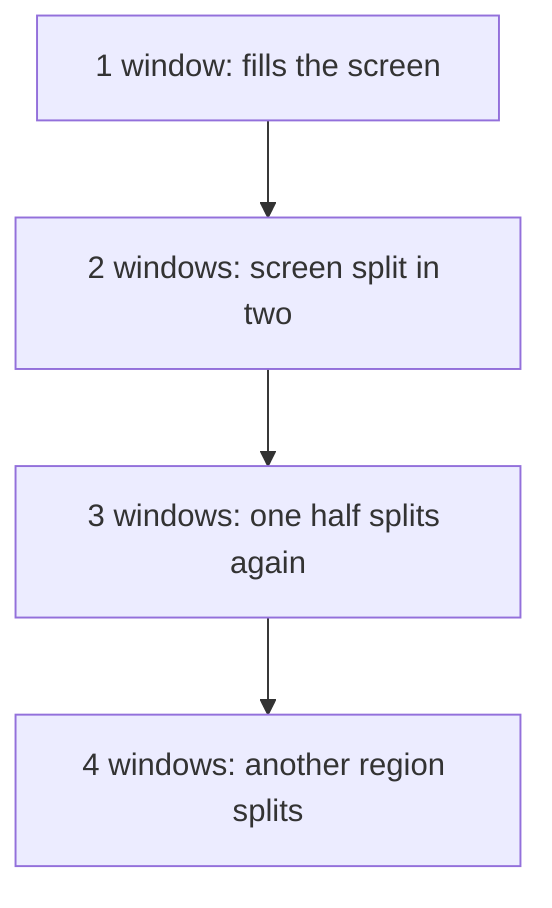

# The Tiling Mental Model

A stacking desktop is a pile of papers: you move them around and look for the one you need. A tiling desktop is a wall of panes of glass: every window has a spot, nothing hides anything, and the arrangement is automatic. Once you stop expecting a pile, most of the strangeness goes away.

## Windows share the screen

On Omarchy, the first window you open takes the whole screen. A second window splits it. A third splits the space again. You never drag, snap, or fish a window out from under another, because windows do not overlap.

Try it with two keys:

1. Press `Super + Return` for a terminal. It fills the screen.
2. Press `Super + Shift + Return` for a browser. The screen divides, and the two windows sit side by side.

*What just happened:* Hyprland, the tiling window manager under Omarchy, noticed a new window and gave it a share of the space. You did not choose a position. That removal of choice is the feature, because the arrangement costs you zero keystrokes.

## The dwindle layout

Omarchy's default layout is called **dwindle**. Its promise, in the manual's words, is that it keeps all the windows you open on a workspace visible at all times, even if it has to shrink them.

The mechanism is a binary tree of regions: the whole workspace is one region, and opening a window splits an existing region into two. Each split divides the space of one region between two windows, so windows get smaller the more you open.



The manual's own example reaches a four-way arrangement with a terminal, a browser, Activity, and the file manager. You can build it yourself:

- `Super + Return` for the terminal
- `Super + Shift + Return` for the browser
- `Super + Ctrl + T` for Activity, which is the `btop` system monitor
- `Super + Shift + F` for the file manager

Activity opens as a floating window at first. `Super + T` tiles it, which brings us to the second concept.

> 📝 **Terminology.** A *tiled* window is part of the layout and takes its share of space. A *floating* window sits on top like a classic desktop window, with its own size and position. `Super + T` toggles the focused window between the two.

## Flipping a split with Super + J

Two windows start out side by side. Press `Super + J` and they stack on top of each other instead. Press it again and they return to side by side. The manual describes this as toggling the window position between horizontal and vertical.

You are not moving a window to a new spot so much as flipping the direction of the split between it and its neighbor. In a tree-shaped layout, that is exactly the knob that matters: it changes how one pair of regions is cut.

You rarely need to think about the tree itself. Most of the time you open a window, close one with `Super + W`, and flip a pair with `Super + J` when the shape is wrong.

## Why bother with this?

Three reasons the layout beats a pile of windows once you adapt:

- **No window management.** Open an app and it is placed. Close it and the others expand to fill the gap.
- **Nothing is hidden.** You never lose a window behind another on the same workspace.
- **Keyboard-sized actions.** Because the arrangement is rule-based, every operation is one chord: focus, swap, resize, move to another workspace. The next phase covers them.

## Mouse still works, once you know the gesture

Hold `Super` and drag with the left mouse button to rearrange where a window sits. Hold `Super` and drag with the right mouse button to resize it. The mouse is a fallback, not the main tool, but it helps while you are learning.

## Your turn: build the four-way

```exercise
[
  {
    "type": "predict",
    "task": "You have a terminal and a browser side by side. Which hotkey stacks them on top of each other, and which hotkey returns them to side by side? Answer with the one hotkey that does both.",
    "accept": ["Super + J", "Super+J", "/^super\\s*\\+\\s*j$/i"],
    "hint": "It is the same key both ways. The manual calls it toggling window position."
  },
  {
    "type": "task",
    "task": "Build the manual's four-way: terminal, browser, Activity, and Files. After Activity opens as a floating window, tile it with `Super + T`. Then press `Super + J` and watch how the pair changes shape. Close all four with `Super + W` one at a time.",
    "reveal": "If Activity stays floating after Super + T, press Super + T once more. It is a toggle, so two presses return it to where it started.",
    "checklist": ["Terminal and browser tiled side by side", "Activity opened with Super + Ctrl + T", "Activity tiled with Super + T", "Flipped a split with Super + J", "Closed all windows with Super + W"]
  }
]
```

Check yourself before moving on:

```quiz
[
  {
    "q": "You open a second window and the first one shrinks to make room. What is happening?",
    "choices": [
      "The window manager is broken",
      "Tiling shares the screen between windows instead of stacking them",
      "The first window was minimized"
    ],
    "answer": 1,
    "explain": "Windows on a tiling desktop split the space between them. Nothing is minimized and nothing overlaps."
  },
  {
    "q": "What does Super + T do?",
    "choices": [
      "Opens a new terminal",
      "Toggles the focused window between tiling and floating",
      "Opens Activity"
    ],
    "answer": 1,
    "explain": "Super + T toggles tiling and floating. The terminal is Super + Return and Activity is Super + Ctrl + T.",
    "why": ["A new terminal is Super + Return.", null, "Activity is Super + Ctrl + T, with Ctrl added."]
  },
  {
    "q": "What is dwindle?",
    "choices": [
      "The default layout, which keeps every window on a workspace visible by splitting space",
      "A scrolling layout that lines windows up off the edge of the screen",
      "A setting that shrinks windows over time"
    ],
    "answer": 0,
    "explain": "Dwindle is Omarchy's default layout. The scrolling layout is the alternative, and it is covered in Phase 3."
  }
]
```

## Recap

1. Tiled windows share the screen: the first fills it, the second splits it, and nothing overlaps.
2. Dwindle is the default layout. Space is divided like a binary tree, and every window on a workspace stays visible.
3. `Super + T` toggles a window between tiled and floating. `Super + J` flips a pair between side by side and stacked.
4. Holding `Super` with the mouse moves and resizes windows when you need a fallback.

Next up, [Focus, Move, Swap, and Resize](02-focus-move-swap-resize.md): steering windows with the keyboard.
