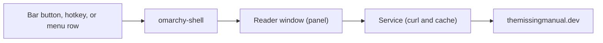

# What the Plugin Is and How to Install It

Looking something up usually means leaving your desktop for a browser tab. The plugin keeps the lookup where you already are: a keystroke opens a window with the whole Missing Manual library in it. This phase covers what you are installing, how to install it without trusting it blindly, and how to take it back out cleanly.

## What you are installing

An Omarchy plugin is a folder with a `manifest.json`, a small file that tells the shell what the plugin is and where its code lives. The shell is `omarchy-shell`, the single long-running program that draws your bar, your menus, and your panels. This plugin's id is `tmm.manual`, and its manifest declares three kinds of plugin at once.

| Kind | What it is here |
|---|---|
| `panel` | The reader: a floating window titled "The Missing Manual" |
| `service` | A headless worker with no window. It makes the network requests, keeps the cache, remembers what you read, and talks to an AI provider if you set one up |
| `bar-widget` | The book button on your bar |



The button, a hotkey, and a menu row all send the same kind of message to the shell, so all three open the same window. That is deliberate: the plugin's own code says the button, the keybinding, and the menu entries share one toggle path.

> 💡 **Key point.** The plugin is not a copy of the library on your disk. Each phase is fetched from themissingmanual.dev when you open it and saved in a cache (a folder of saved copies) so it can open again without the network. The plugin's README says it only reads from the library and never uploads anything; Phase 4 spells out exactly what each action sends.

Why a plugin instead of a browser tab? The README gives four reasons, and they are all about staying put. It is keyboard-first (you never need the mouse). It is themed, so its colors, fonts, and spacing follow your Omarchy theme. A phase you have read before still opens offline. And the same guides render in your terminal with a `tmm` command.

## Check your ground first

The plugin needs Omarchy 4 (its repo and the marketplace call this generation Quattro). The README says it is not compatible with Omarchy 3. It shells out to a few tools, so check they exist before you blame the plugin for anything:

```bash
command -v curl python3 wl-copy rsvg-convert
```

Each tool that is installed prints its path, and a missing one prints nothing. `curl` and `python3` are required. `wl-copy` is optional and powers click-to-copy. `rsvg-convert` is optional and draws diagrams; the README says Omarchy ships it, and Phase 4 covers what happens without it.

## What the marketplace listing tells you

The community marketplace at [plugins.omarchy.org](https://plugins.omarchy.org) is a directory you can search, and each plugin's card has a "Copy install command" button. The Omarchy manual points to it as the place to find and share plugins. The Missing Manual plugin is listed there, in the Developer Tools category, on [its own page](https://plugins.omarchy.org/plugin.html?id=tmm.manual).

For this plugin the copied command is:

```bash
omarchy plugin add https://github.com/Topurrra/omarchy-tmm.git --enable
```

Read it left to right. `omarchy plugin add` clones a git repository into `~/.config/omarchy/plugins/`, checks its manifest, and rescans the shell. `--enable` also turns it on; without that flag, Omarchy asks you first.

Here is the straight picture of what a listing promises. Omarchy's manual says plugins "run as arbitrary, unsandboxed code inside your long-lived shell process", which means with everything your user account can reach. The marketplace says it validates listings, not plugin security.

For this listing, the marketplace's registry records a review by a marketplace maintainer of one exact commit (21f23d8, the same commit the repository's `main` branch was on when this guide was written). The marketplace also says its install command clones the repository's current latest commit, so what you install can be newer than what was reviewed. That is why the careful install below is worth the two extra minutes. The general habit, and the review checklist, are in [Omarchy Plugins and the Marketplace](/guides/omarchy-plugins-and-the-marketplace).

## Install it, review first

Add it without `--enable`. Omarchy shows a warning and asks two yes-or-no questions (it uses a small terminal prompt tool called `gum`): whether to clone, and whether to enable now.

```console
$ omarchy plugin add https://github.com/Topurrra/omarchy-tmm.git

⚠️  Plugins run as arbitrary, unsandboxed code inside your long-lived
  omarchy-shell process. Only add repos you trust, and review the code
  before you enable it.

      URL: https://github.com/Topurrra/omarchy-tmm.git

...
Added tmm.manual into /home/you/.config/omarchy/plugins/tmm.manual
...
Enable it later with: omarchy plugin enable tmm.manual
```

*What just happened:* the lines marked `...` are the two yes-or-no questions and git's own clone messages. You answered yes to the clone and no to "enable now". Omarchy cloned the repository into a staging folder, validated the manifest, moved it to `~/.config/omarchy/plugins/tmm.manual/`, and told the shell to rescan. Nothing from the plugin has run yet.

Now read what you got. The manifest is short enough to read in full:

```json
{
  "schemaVersion": 1,
  "id": "tmm.manual",
  "name": "The Missing Manual",
  "version": "0.5.0",
  "author": "The Missing Manual",
  "license": "MIT",
  "description": "Search, browse and read The Missing Manual inside Omarchy, themed to your desktop",
  "kinds": [
    "panel",
    "service",
    "bar-widget"
  ],
  "keepLoaded": true,
  "entryPoints": {
    "panel": "Panel.qml",
    "service": "Service.qml",
    "barWidget": "BarWidget.qml"
  },
  "barWidget": {
    "displayName": "Missing Manual",
    "description": "Opens The Missing Manual",
    "category": "Launcher",
    "allowMultiple": false,
    "defaultSection": "right"
  }
}
```

The `kinds` and `entryPoints` are the three parts from the table. `"keepLoaded": true` tells the shell to keep the window loaded between openings, so state such as the reading theme you picked can survive closing and reopening the window. `defaultSection` asks for the right side of the bar.

Then look at the code that touches the outside world:

```bash
cd ~/.config/omarchy/plugins/tmm.manual
ls bin
grep -n "curl" Service.qml
```

`bin/` holds the helper scripts (`tmm`, `tmm-cap`, `tmm-diagrams`, `tmm-menu`, `tmm-cli-extract`), and they run as you, so skim them. `Service.qml` is the headless worker, and every address it talks to is built there. Per the README, `tmm-cap` runs each network request with a ceiling on reply size and run time.

When you are satisfied, enable it:

```console
$ omarchy plugin enable tmm.manual
Enabled tmm.manual
```

Omarchy keeps the enabled state in `~/.config/omarchy/shell.json`: a third-party plugin is on exactly when its id appears there. Confirm it, then open the window:

```console
$ omarchy plugin list | grep tmm.manual
tmm.manual                       enabled   third-party panel,service,bar-widget The Missing Manual
$ omarchy-shell shell summon tmm.manual
ok
```

*What just happened:* `summon` is a message to the running shell saying "open this plugin's window". It prints `ok` on success and `unknown` if the shell has no such plugin loaded. A book icon should now sit on the right of your bar, and clicking it toggles the window. If the icon is missing, place it yourself:

```bash
omarchy bar put tmm.manual --section right
```

> ⚠️ **Gotcha.** A disabled plugin answers a summon by doing nothing at all, which looks exactly like a broken install. If nothing happens, run `omarchy plugin list` and read the state column before you try anything else.

If you already reviewed the code and want one step, the marketplace command above does the clone and the enable together. In a terminal it also asks which bar section to use, with the right side preselected.

## Three extras that live outside the plugin folder

`omarchy plugin add` only puts files in the plugins folder. It never runs plugin code, install hooks, or `sudo`, so anything that lives elsewhere is opt-in. Set a shortcut for the folder first:

```bash
P=~/.config/omarchy/plugins/tmm.manual
```

**1. The `tmm` terminal command.** Copy the client onto your `PATH`:

```bash
mkdir -p ~/.local/bin
cp "$P"/bin/tmm ~/.local/bin/
chmod +x ~/.local/bin/tmm
```

**2. Rows in the Omarchy menu.** Omarchy reads one shared file, `~/.config/omarchy/extensions/omarchy-menu.jsonc`, for every menu entry you add. Copying a fragment over it would delete everything else in it, so the plugin ships a helper that merges instead:

```console
$ "$P"/bin/tmm-menu install
wrote /home/you/.config/omarchy/extensions/omarchy-menu.jsonc
  ours:  tmm, tmm.search, tmm.catalog, tmm.random, tmm.toggle
  other: none
Run: omarchy menu refresh
```

Then tell the menu to reload:

```bash
omarchy menu refresh
```

*What just happened:* `tmm-menu` added five entries, kept a `.bak` copy of your menu file beside it, and refused to write anything that would not parse. Open the Omarchy menu with `Super + Space` and you will find a "Missing Manual" row with Search Guides, Browse Catalog, Random Guide, and Toggle Manual under it. If you have other menu entries, they appear on the `other:` line and are left untouched.

> ⚠️ **Gotcha.** Run `tmm-menu` from the plugin folder as shown. INSTALL.md copies it into `~/.local/bin` and runs it from there, but in 0.5.0 a copy looks for its menu fragment next to itself, does not find it, and stops with `tmm-menu: fragment not found`. The `status` and `remove` actions do not need the fragment and work from anywhere.

**3. Hotkeys.** Omarchy's Hyprland config is Lua, and your personal bindings go in `~/.config/hypr/bindings.lua`. Add these three lines at the end of that file:

```lua
o.bind("SUPER + ALT + M", "Missing Manual", "omarchy-shell shell toggle tmm.manual")
o.bind("SUPER + ALT + B", "Missing Manual catalog", "omarchy-shell shell summon tmm.manual '{\"catalog\":true}'")
o.bind("SUPER + ALT + R", "Missing Manual random guide", "omarchy-shell shell summon tmm.manual '{\"random\":true}'")
```

These give you `Super + Alt + M` to open or close the window, `Super + Alt + B` to open on the catalog, and `Super + Alt + R` for a random guide. None of the three is bound in Omarchy 4.0.4's default bindings. Reload with `hyprctl reload` (the plugin's README uses this command), and run `omarchy menu keybindings --print` to see the bindings Omarchy knows about.

The `o` in those lines is a helper table that Omarchy defines before your config files load, which is why Omarchy's own `bindings.lua` template uses `o.bind(...)` with no setup line. The plugin ships a `bindings.lua.fragment` for these same three bindings, and in 0.5.0 it starts with `local o = require("default.hypr.helpers")`. On Omarchy 4.0.4 that module returns nothing (it defines the global `o`), so that line would replace `o` with `true` and the bindings after it would fail. Type the three lines above instead of appending the fragment.

## Update, disable, remove

Updating is a fast-forward pull of the plugin's git checkout:

```console
$ omarchy plugin update tmm.manual
tmm.manual is up to date.
```

When there is something new, Omarchy shows you the diff, asks before applying it, refuses if you have local changes it cannot fast-forward past, and rolls back if the new revision fails validation. Read that diff: it is your chance to review code that is about to run as you. Afterward the command rescans the shell for you. The repository has no tagged releases, so the version is the `version` field in `manifest.json`:

```console
$ grep version ~/.config/omarchy/plugins/tmm.manual/manifest.json
  "version": "0.5.0",
```

Two things live outside the plugin folder and do not update themselves: your copy of `tmm` in `~/.local/bin`, and the menu rows. Redo the `cp` or the `tmm-menu install` only when those files changed in the diff.

`omarchy plugin disable tmm.manual` turns it off and keeps the files. To remove it for good, undo the extras first, because `tmm-menu` lives inside the plugin folder you are about to delete:

```bash
P=~/.config/omarchy/plugins/tmm.manual
"$P"/bin/tmm-menu remove && omarchy menu refresh
omarchy plugin remove tmm.manual
rm -f ~/.local/bin/tmm
```

`omarchy plugin remove` asks for confirmation, disables the plugin, and deletes the folder (the repository is still on GitHub). Then delete the three `o.bind` lines from `~/.config/hypr/bindings.lua` and run `hyprctl reload`.

The plugin also leaves a cache and two small state files. The README lists `~/.cache/tmm/` for the cache, but the window asks the Qt toolkit where cache files belong, so confirm where yours landed before deleting:

```bash
find ~/.cache -maxdepth 3 -type d -name tmm
rm -f ~/.local/state/omarchy/tmm-recents.json ~/.local/state/omarchy/tmm-ui.json
```

Remove each folder `find` prints. If you set up the study chat in Phase 3, also delete `~/.config/tmm/`: it holds `ai.json`, which may contain an API key, and the README's uninstall list does not mention it.

Check yourself before moving on:

```quiz
[
  {
    "q": "You installed tmm.manual without --enable and said no to \"enable now\". You then run omarchy-shell shell summon tmm.manual. What happens?",
    "choices": [
      "Omarchy enables the plugin the first time you summon it",
      "Nothing visible happens, because the plugin is installed but disabled and a disabled plugin ignores a summon",
      "The window opens in a read-only mode"
    ],
    "answer": 1,
    "explain": "Omarchy installs plugins disabled unless you pass --enable or say yes to the prompt. Run omarchy plugin list to see the state, then omarchy plugin enable tmm.manual.",
    "why": ["Nothing in omarchy-shell enables a plugin on its own; only omarchy plugin enable (or --enable) does.", null, "There is no read-only mode. A disabled plugin does not open at all."]
  },
  {
    "q": "What does a marketplace listing for tmm.manual tell you?",
    "choices": [
      "The code has been security audited, so reviewing it yourself is optional",
      "Omarchy runs it in a sandbox, so it cannot touch your files",
      "A specific commit was checked and reviewed, but plugins run unsandboxed and the install command fetches the repository's current latest commit, so you should still read before you enable"
    ],
    "answer": 2,
    "explain": "The marketplace validates listings, not plugin security, and says verification is not a security audit. The install command clones the current upstream commit, which can be newer than the reviewed one.",
    "why": ["The marketplace explicitly says verification is not a security audit.", "Plugins run as arbitrary, unsandboxed code with your user permissions.", null]
  },
  {
    "q": "Why should you run tmm-menu install from the plugin folder instead of from a copy in ~/.local/bin?",
    "choices": [
      "A copy looks for its menu fragment next to itself, cannot find it, and stops with fragment not found",
      "A copy in ~/.local/bin is not executable",
      "~/.local/bin is not on your PATH on Omarchy"
    ],
    "answer": 0,
    "explain": "tmm-menu finds extensions/omarchy-menu.jsonc relative to where the script lives. In the plugin folder that file exists; beside a copy in ~/.local/bin it does not."
  }
]
```

## Recap

1. `tmm.manual` is three plugin kinds in one: a `panel` (the reader window), a `service` (network, cache, AI), and a `bar-widget` (the book button).
2. A marketplace listing means a checked and reviewed snapshot, not an audit. Plugins run as you, so add without `--enable`, read, then run `omarchy plugin enable tmm.manual`.
3. Confirm with `omarchy plugin list` and `omarchy-shell shell summon tmm.manual` (which prints `ok`). A disabled plugin ignores a summon silently.
4. The `tmm` command, the menu rows, and the hotkeys are opt-in extras outside the plugin folder. Run `tmm-menu` from the plugin folder, and type the three `o.bind` lines yourself.
5. `omarchy plugin update tmm.manual` pulls the new code after you read the diff. Clean removal means undoing the extras first, then `omarchy plugin remove tmm.manual`.

Next up, [Your First Ten Minutes in the Reader](02-your-first-ten-minutes.md): a keystroke-by-keystroke tour of the window you installed.
