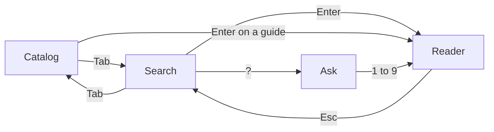

# Your First Ten Minutes in the Reader

The window is built to be driven by the keyboard, and it behaves differently from most apps: there is no text box to click, and the same letter can be text in one place and a command in another. Ten minutes of real keypresses will make that feel normal. Open the window and follow along.

## Minute 1: open it

Any of these opens the same window:

- Click the book icon on your bar.
- Press `Super + Alt + M`, if you added the hotkeys in Phase 1.
- Open the Omarchy menu with `Super + Space` and pick Missing Manual, if you added the menu rows.
- Run `omarchy-shell shell toggle tmm.manual` in a terminal.

You get a normal floating window (the README contrasts it with a fullscreen overlay), 1000 by 720 pixels to start with and no smaller than 640 by 560. It opens on the catalog, a list of categories, and the line along the bottom is a cheat card that changes with whatever you are doing. Glance at it often.

## The one idea: lists type, the reader obeys

The window has four views, and the keys mean different things in each:



In the **search** and **catalog** views, every printable character goes into a filter at the top. There is no field to click into first. In the **reader** and **ask** views, letters become commands: `n` is next phase, `y` is copy, `q` is quiz. So `n` types an "n" while you search and turns the page while you read.

`Esc` unwinds one layer at a time instead of closing everything: it dismisses an error, leaves a quiz, leaves the reader for the list you came from, steps up a catalog level, clears your query, and only then closes the window. Press it freely.

## Minute 2: search

Start typing: `git rebase`. After a short pause the window asks the site's search endpoint and shows up to 24 hits, each with a title, a phase number, and a one-line summary. The header reads `searching…` and then the result count. The terminal client asks the same endpoint, so it shows what the window would:

```console
$ tmm search "git rebase"
git-disaster-recovery/2       Rebase Without Fear
git-explained-like-a-human/0  Git, Explained Like You're a Human
git-with-other-people/0       Git With Other People - Branches, Pull Requests, and Not Stepping on Toes
pre-commit-hooks/1            What a Hook Actually Is
bisecting-a-bug/2             git bisect - Letting Git Drive the Search
```

*What just happened:* each line is `guide-slug/phase` and a title. A `/0` marks a hit on the guide as a whole rather than one phase, and the window opens those at phase 1. Your results will differ as the library grows.

| Key | What it does |
|---|---|
| any character | Add it to the search |
| `Up` and `Down`, or `Ctrl + N` and `Ctrl + P` | Move the cursor |
| `PgUp`, `PgDn`, `Home`, `End` | Jump |
| `Enter` | Open the highlighted hit |
| `Shift + Enter` | Accept a "Did you mean" suggestion, when one appears |
| `?` | Ask the guides about what you typed (Minute 6) |
| `Tab` | Switch to the catalog |
| `Ctrl + R` | Open a random guide |
| `Backspace`, `Ctrl + Backspace`, `Ctrl + U` | Delete a character, delete a word, clear the line |
| `Esc` | Clear the query, then close |

The "Did you mean" line appears only when the site sends back a spelling suggestion, so do not expect it on every typo.

## Minute 3: read a phase

Press `Enter` on a hit. From 900 pixels of width up, which includes the default size, the window switches to two columns: your results stay on the left and the reader fills the right, so you can keep browsing while you read. In a narrower window (a tiled slot, say) it uses one column instead.

The header shows something like `phase 2 of 4 · 8 min`: where you are in the guide and a rough reading time (words divided by 200, with code counting for less). A thin progress line under the text fills as you scroll. The reader draws headings, lists, quotes, tables, and code as themed blocks, and code is syntax-highlighted in cards.

| Key | What it does |
|---|---|
| `Up` and `Down`, or `j` and `k` | Scroll |
| `Space`, `PgDn`, `PgUp` | Page down and up |
| `g` or `Home` | Jump to the top |
| `Shift + G` or `End` | Jump to the bottom |
| `n` and `p`, or `Right` and `Left` | Next and previous phase |
| `y` | Copy the whole phase as Markdown |
| click a code block | Copy only that snippet |
| `o` | Open this phase in your browser |
| `Esc` or `Backspace` | Back to your list |
| `/` | Start a new search |
| `Tab` | Switch to the catalog |
| `s` | Fold the left column away for a full-width page (and bring it back) |
| `Ctrl + T` | Cycle the reading theme (Phase 3) |
| `Ctrl + K` | Open the study chat (Phase 3) |

Copying needs `wl-copy`. At the last phase, `n` shows "That was the last phase" instead of an error. Nothing in a guide is ever run: a code block is copied, a link opens in your default browser.

## Minute 4: answer the quiz

Press `Shift + G` to jump to the bottom. A phase that has a quiz ends with a card that says how many questions it holds. Press `q` to start answering in place.

| Key | What it does |
|---|---|
| `a` to `d`, or `1` to `4` | Answer the current question |
| `Up` and `Down`, or `j` and `k` | Move between questions |
| `m` | Retry only the questions you missed |
| `r` | Start over |
| `Esc` | Leave the quiz and keep reading |

An answer locks the first time you pick it. A right one says "Correct." and a wrong one says "Not quite.", each followed by the guide's explanation when it has one, and when the author wrote a reason for that specific wrong choice, you see that reason instead. At the end you get "You got 2 of 3." Everything else keeps working mid-quiz, so `n`, `p`, and `y` still do their usual jobs.

> ⚠️ **Gotcha.** On a phase with no quiz, `q` closes the window. That is by design: `q` means "quiz, or quit if there is nothing to quiz". `Shift + Q` always closes it. Your answers live only in the window and reset when you open a different phase, and the plugin has no account to report them to, so they do not count toward anything on the website.

## Minute 5: diagrams, and what it cannot run

Mermaid diagrams (the flowcharts in guides) are drawn right in the page in your theme's colors. They come from the picture the website already renders, recolored to your palette and turned into an image, and they repaint when you switch Omarchy themes. If one shows as a small card reading `Diagram · mermaid`, the plugin could not turn it into an image; Phase 4 covers why.

Some guides contain live widgets that run in a browser, such as a regex tester or an animated explainer. The window cannot run those, so it shows a card labeled `Interactive` with the widget's name. Hover over it and it reminds you to press `o` to open the phase on the web. Code that would run in the browser on the site appears here as an ordinary code card you can copy.

## Minute 6: ask a question

Type a question in the search view, such as `what is a branch`, and press `?`. The footer shows `? ask` whenever asking is available. The window sends your question to the site's answer service and shows an answer written from the guides, with the phases it used listed underneath as numbered sources.

| Key | What it does |
|---|---|
| `1` to `9` | Open that source in the reader |
| `Enter` | Open the first source |
| `Up` and `Down`, `j` and `k`, `Space` | Scroll |
| `y` | Copy the answer |
| `o` | Open the site's search page for your question in the browser |
| `Esc` or `Backspace` | Back to your results |

Three rules shape it. It only happens when you press `?`, never while you type, because each written answer spends part of the site's monthly AI budget. Questions are limited to 300 characters. And answers are saved on disk, so asking the same thing again is instant and free (the header says `cached`).

The service can also tell you "AI answers are not enabled on this host" or that the month's limit is spent. Neither is a failure of your setup, and search keeps working. This is the site's own answer service, not your own AI key; the study chat in Phase 3 is the one that uses your key.

One more thing happens automatically: if a search finds nothing and you stop typing for a moment, the window quietly asks the site's free retrieval endpoint and adds an `Ask the guides about...` row plus up to three `related` rows.

## Minute 7: jump around

The **catalog** has two levels: categories, then the guides inside one. Type to filter locally with no network, press `Enter` to open a category and again to open a guide, and press `Backspace` on an empty filter to climb back up. `Ctrl + R` opens a random guide from anywhere in the search, catalog, or reader view.

**Recents** is the list of the last 12 phases you opened. It appears on the empty search screen, so press `Tab` from the catalog or clear your query to see "Pick up where you left off". Each row carries a badge with the phase you last read.

> ⚠️ **Gotcha.** In 0.5.0, pressing `Enter` on a recents row opens that guide at phase 1, even though the badge shows a later phase. Press `n` to catch up. The code stores the phase number but opens recents rows without it.

Reopening the window from a closed state always starts at the catalog, so recents is one `Tab` away.

## Minute 8: pull the network cable

Every phase you open is saved in the cache, and each time you open it online the saved copy is refreshed. Without a network, here is what you can and cannot do:

| What you try | Offline result |
|---|---|
| Reopen a phase you have opened before | Works. The header ends with `offline` |
| Open a phase you have never opened | "Phase N is not available offline" |
| Search | Fails with "Search failed" |
| Open the catalog in a freshly started shell | Fails with "Could not load the catalog". It is fetched once per session and kept in memory only |
| Ask with `?` | Reports that the answer service is unavailable, unless you already asked that exact question and it was saved |
| Diagrams | May show as `Diagram · mermaid` cards, because they are pulled from the website's page |

Since the catalog and search need the network, jump straight to a cached phase with a summon payload, which is a small piece of JSON handed to the window:

```bash
omarchy-shell shell summon tmm.manual '{"slug":"git-from-zero","phase":2}'
```

That opens the exact phase from the cache. The other payload keys are `query`, `catalog`, and `random`:

```bash
omarchy-shell shell summon tmm.manual '{"query":"git rebase"}'
omarchy-shell shell summon tmm.manual '{"catalog":true}'
omarchy-shell shell summon tmm.manual '{"random":true}'
```

To read a whole guide offline, `tmm offline git-from-zero` downloads its EPUB (an e-book file) into the cache folder and prints the path. Open it in an e-reader app; nothing in the plugin reads it back.

## Minute 9: the same guides in your terminal

The `tmm` command from Phase 1 renders the same guides without the window.

| Command | What it does |
|---|---|
| `tmm search "git rebase"` | Aligned results, with a "did you mean" line on stderr when there is one |
| `tmm open git-from-zero/2` | Render a phase into your pager (`$PAGER`, or `less -R`) |
| `tmm read git-from-zero 2` | Render to standard output instead |
| `tmm list` | Every guide, with its category |
| `tmm categories` | The category names |
| `tmm random` | One random guide |
| `tmm recent` | What you last read, shared with the window |
| `tmm offline git-from-zero` | Download the EPUB into the cache |
| `tmm close` | Stop pagers started by `tmm open` |

```console
$ tmm read git-from-zero 2 | head -n 10


Your First Repository - init, add, commit, log
──────────────────────────────────────────────

Git is installed and knows your name. Now you'll actually use it: create a project, and take your first
real snapshot of it. Everything in this phase happens on your own computer - no internet, no GitHub, no
account. Git works perfectly well entirely alone, and starting here keeps the moving parts to a minimum.

Type along. Doing it once in your own terminal teaches more than reading it five times.
$ tmm recent
git-from-zero/2  Your First Repository - init, add, commit, log
```

*What just happened:* `tmm read` fetched the phase, saved a copy in its cache, drew the headings and rules in plain text because the output was piped, and added the phase to the recents file. The window reads that same recents file, but it loads it when the plugin loads, so newer entries from `tmm` may only appear after the plugin reloads. Colors follow the `NO_COLOR` setting and switch off whenever output is not a terminal. If `python3` is missing, `tmm` prints raw Markdown instead of rendered text.

`tmm --help` also lists `cheat`. It needs a site key that the public site does not hand out, so skip it.

## Minute 10: your turn

Do each of these once without touching the mouse.

1. Open the window, type `linux`, and open a hit with `Enter`.
2. Press `n` twice, then `p` once.
3. Jump to the bottom, press `q`, and answer the quiz.
4. Press `Esc` until you are back at the search view, then press `Tab` and open a category.
5. Press `Ctrl + R` for a random guide, then `Shift + Q` to close.

Check yourself before moving on:

```quiz
[
  {
    "q": "You are in the search view and type the letter n. What happens?",
    "choices": [
      "The letter n is added to your search, because in lists every printable character goes to the filter",
      "A new window opens",
      "The window jumps to the next phase"
    ],
    "answer": 0,
    "explain": "Search and catalog views type into a filter. Letters become commands (n, p, y, q) only in the reader and ask views.",
    "why": [null, "Nothing in the window opens a second window.", "Next phase is a reader command. In the search view there is no phase to move."]
  },
  {
    "q": "You are reading a phase that has no quiz and you press q. What happens?",
    "choices": [
      "Nothing, because there is no quiz",
      "A quiz is generated from the text",
      "The window closes"
    ],
    "answer": 2,
    "explain": "q starts the quiz when there is one and closes the window when there is not. Shift + Q always closes it."
  },
  {
    "q": "You read phase 3 of a guide yesterday. Now the network is down. Which of these still works?",
    "choices": [
      "Searching for a topic you have never opened",
      "Reopening phase 3, which the header marks offline",
      "Asking a question with ?"
    ],
    "answer": 1,
    "explain": "Phases you have opened are cached and fall back to the saved copy. Search, ask, and the catalog all need the network, and a phase you never opened is not in the cache.",
    "why": ["Search asks the website every time, so it fails offline.", null, "Asking also needs the website's answer service."]
  }
]
```

## Recap

1. In search and catalog views, letters go to a filter; in the reader and ask views, letters are commands. `Esc` unwinds one layer at a time.
2. Search as you type, `Enter` to read, `n` and `p` for phases, `y` to copy a phase, `o` to open it in the browser, `s` to fold the list in the wide layout.
3. `q` answers the quiz in place (and closes the window if there is no quiz). Answers lock on the first pick and are not saved anywhere.
4. `?` asks the site's answer service, only on a keypress, with numbered sources you open with `1` to `9`.
5. Offline, only phases you have opened before work. Use a summon payload such as `{"slug":"git-from-zero","phase":2}` to jump straight to one.
6. `tmm` renders the same guides in a terminal and writes to the same recents file the window reads.

Next up, [Making It Yours: Themes, Hotkeys, and the Study Chat](03-making-it-yours-and-the-study-chat.md): the reading theme, your own hotkeys, and the bring-your-own-key study chat with exactly where your key is stored.
