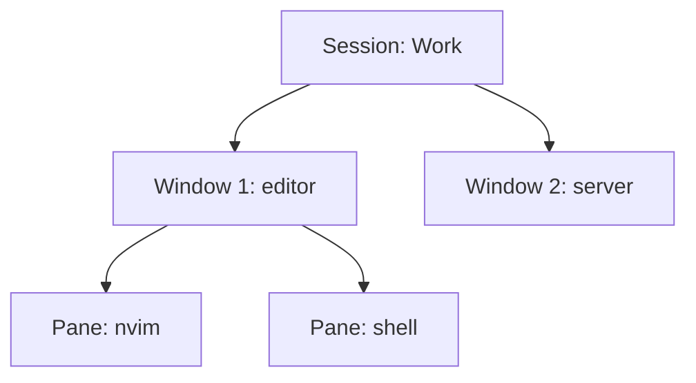

# Tmux: Sessions, Windows, and Panes

You are three hours into a long job in a terminal window, and you close the window by accident. On most setups the job dies with it. Tmux is the tool that makes that impossible: the work runs inside tmux, the window is only a view, and you can close it and come back later. It is also how you get tabs and splits in a terminal that has none, like Foot.

## The model: three nested things

Tmux manages **sessions**, which contain **windows**, which contain **panes**. A session is a workspace you can leave and return to. A window is like a browser tab. A pane is one shell, with several panes sharing a window.



Tmux keeps running in the background as its own process. When you close the terminal window, the session carries on. That is the **detach** idea: you leave, it stays.

## Starting and returning

Press `Super + Alt + Return`. Omarchy runs `tmux attach || tmux new -s Work`, so you reattach to an existing session if there is one, and otherwise create a session named `Work`. Close that window and press the same keys again, and you are back where you left off.

You can do the same from any terminal with the `t` alias. Tmux also works over SSH, so on a remote server you use the same keys you use at home (see [SSH and Keys](/guides/ssh-and-keys)).

## The prefix key

Tmux commands start with a **prefix** key so they do not collide with the programs inside. Omarchy's prefix is `Ctrl + Space` (`Ctrl + B`, the tmux default, also works). Press and release the prefix, then press the command key. This guide writes that as `Prefix + s`.

The status bar at the top of the screen shows `PREFIX` while tmux is waiting for the next key, `COPY` in copy mode, and `ZOOM` when a pane is zoomed. If tmux seems stuck, that bar tells you what state it is in.

## The keys worth learning first

Omarchy's tmux config is tuned for ergonomics, so many common actions have a no-prefix shortcut with `Alt`.

| Do this | With prefix | Without prefix |
|---|---|---|
| Split side by side | `Prefix + v` | `Alt + Shift + Enter` |
| Split top and bottom | `Prefix + h` | `Alt + Enter` |
| Close the pane | `Prefix + x` | `Alt + Escape` |
| Zoom a pane to full screen (again to restore) | `Prefix + z` | n/a |
| Move between panes | n/a | `Ctrl + Alt + Arrows` |
| Resize panes | n/a | `Ctrl + Alt + Shift + Arrows` |
| New window | `Prefix + c` | n/a |
| Go to window 1 to 9 | n/a | `Alt + 1` to `Alt + 9` |
| Previous or next window | n/a | `Alt + Arrow Left` or `Right` |
| Rename or kill a window | `Prefix + r`, `Prefix + k` | n/a |
| List sessions and switch | `Prefix + s` | n/a |
| New, rename, kill session | `Prefix + C`, `Prefix + R`, `Prefix + K` | n/a |
| Next or previous session | `Prefix + N`, `Prefix + P` | `Alt + Arrow Down` or `Up` |
| Detach | `Prefix + d` | n/a |

Notice the capital letters: `Prefix + c` makes a window and `Prefix + C` (with Shift) makes a session. Windows are numbered from 1, so `Alt + 1` is the first window.

The new splits open in the directory of the pane you split, which saves a lot of `cd`. The mouse is on, so you can click a pane to focus it and scroll with the wheel.

### Copying text

Copy mode is vi-style. Press `Prefix + [` to enter it, move with the usual vi motion keys, press `v` to start a selection and `y` to copy it. If you do not know vi keys, [Editing in the Terminal](/guides/editing-in-the-terminal) teaches them, and the same keys work in Neovim in [Phase 3](03-neovim-the-omarchy-way.md).

### Help is built in

- `Prefix + ?` shows tmux's keybindings in a popup.
- `Super + Alt + K` shows an annotated, searchable list from anywhere.
- `Prefix + :` opens the tmux command prompt.
- `Prefix + q` reloads `~/.config/tmux/tmux.conf` after you edit it.

If you break the config, _Update > Config > Tmux_ restores Omarchy's version and reloads tmux (see [Making Omarchy Comfortable](/guides/making-omarchy-comfortable)).

## Dev layouts: tdl and friends

Omarchy ships four shell functions that build a multi-pane workspace in one command. They only work inside tmux. Run `tdl` in a plain terminal and it stops with `You must start tmux to use tdl.`

| Command | Layout |
|---|---|
| `tdl <agent> [<second_agent>]` | Editor on the left (`$EDITOR .`), an AI agent on the right, a terminal along the bottom |
| `tds` | Four-way square: editor, a live diff watcher (`hunk diff --watch`), a terminal, and opencode |
| `tdlm <agent>` | One `tdl` window for every subdirectory of the current directory |
| `tsl <count> <command>` | A grid of panes all running the same command |

```text
tdl c

+---------------------------+----------+
|                           |          |
|   editor (nvim .)         |  agent   |
|                           |          |
+---------------------------+----------+
|   terminal                           |
+--------------------------------------+
```

`tdl` also renames the window after the current directory. With `tdlm`, move between the per-project windows with `Alt + 1`, `Alt + 2`, and so on. The shortcuts are `ic` for `tdl c`, `ix` for `tdl cx`, and `icx` for `tdl c cx`. The right-hand pane runs whatever command you pass, so the layouts are built for AI agents but you decide what goes in them. `tsl 4 c` gives you a four-pane grid of the `c` agent.

> ⚠️ **Gotcha**: the short agent aliases start agents in their auto-approve modes (`c` is `opencode --auto`, `cx` is Claude Code with `--permission-mode auto`, and `cy` is `codex --approve-for-me`). Omarchy's manual says so explicitly. Use them in projects where you are comfortable letting the agent act, and see [AI in the Terminal CLIs](/guides/ai-in-the-terminal-clis) for the habits that keep that safe.

The same layouts exist for Herdr, Omarchy's other terminal workspace manager, as `hdl`, `hds`, `hdlm`, and `hsl`. Herdr uses the same `Ctrl + Space` prefix, starts with `Super + Ctrl + Return`, and shows its keys on `Super + Ctrl + K`.

## Your turn: build a workspace

```exercise
[
  {
    "type": "task",
    "task": "Prove the session survives. Open tmux, start something long-running, close the window, and get it back.",
    "reveal": "1) Super + Alt + Return. 2) Run something long, such as btop or sleep 600. 3) Close the terminal window with Super + W. 4) Press Super + Alt + Return again: it reattaches and the program is still running.",
    "checklist": ["I split a pane with Alt + Enter", "I made a second window with Prefix + c and jumped back with Alt + 1", "I closed the terminal window and reattached with Super + Alt + Return", "I checked the keys with Prefix + ?"]
  }
]
```

Check yourself before moving on:

```quiz
[
  {
    "q": "You close the terminal window while a command is running inside tmux. What happens to the command?",
    "choices": [
      "It stops, because its window is gone",
      "It keeps running in the tmux session, and Super + Alt + Return reattaches to it",
      "It restarts from the beginning"
    ],
    "answer": 1,
    "explain": "Tmux runs as its own background process. Closing the window only detaches you from the session.",
    "why": ["That is what happens without tmux. Tmux sessions outlive the window.", null, "Nothing restarts. The program carries on where it was."]
  },
  {
    "q": "Which key splits the current pane into two side-by-side panes with no prefix?",
    "choices": [
      "Alt + Enter",
      "Alt + Shift + Enter",
      "Ctrl + Alt + Arrows"
    ],
    "answer": 1,
    "explain": "Alt + Shift + Enter splits beside. Alt + Enter splits below, and Ctrl + Alt + Arrows moves between panes.",
    "why": ["That splits the pane top and bottom.", null, "That moves focus between panes; it does not split."]
  },
  {
    "q": "You run tdl c in a plain terminal that is not inside tmux. What happens?",
    "choices": [
      "It starts tmux for you and builds the layout",
      "It stops with a message that you must start tmux first",
      "It builds the layout using Foot splits"
    ],
    "answer": 1,
    "explain": "The layout functions check for a tmux session and refuse to run outside one. Start tmux with Super + Alt + Return first."
  }
]
```

## Recap

1. Tmux has sessions, which contain windows, which contain panes. Sessions outlive the terminal window.
2. `Super + Alt + Return` attaches to your session or creates one named `Work`.
3. The prefix is `Ctrl + Space`. The no-prefix `Alt` shortcuts cover splits (`Alt + Enter`, `Alt + Shift + Enter`), pane focus (`Ctrl + Alt + Arrows`), and windows (`Alt + 1` to `9`).
4. `Prefix + ?` and `Super + Alt + K` show every key; `Prefix + q` reloads the config.
5. `tdl`, `tds`, `tdlm`, and `tsl` build dev layouts, but only inside tmux. The `c`, `cx`, and `cy` agent aliases run in auto-approve modes.

Next up, [Neovim the Omarchy Way](03-neovim-the-omarchy-way.md): the editor that fills the left pane of `tdl`.
