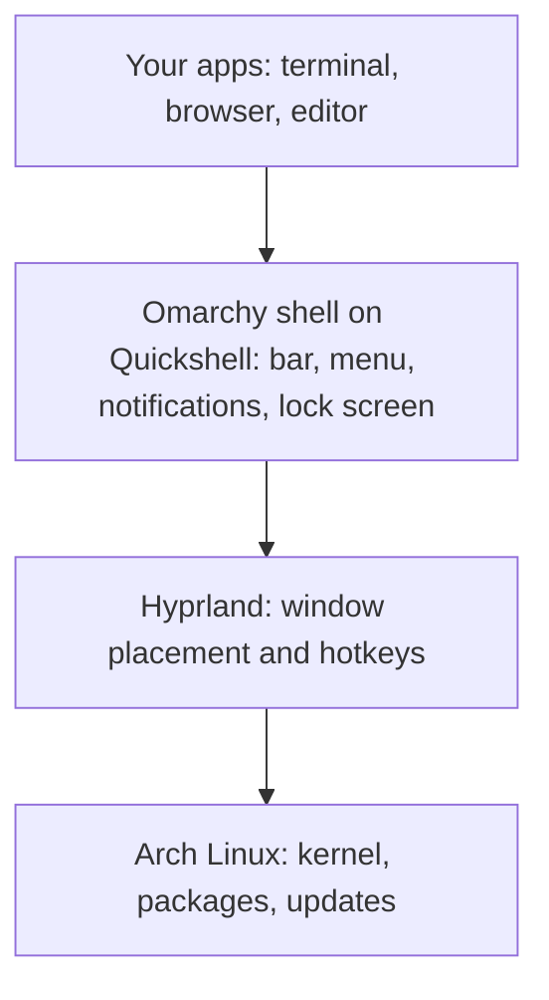

# Distro, Desktop, Window Manager: The Layers

The official one-line description of Omarchy names an "omakase" Linux distribution built on Arch, the Hyprland window manager, and Quickshell. That is a wall of unfamiliar nouns. Each noun is one layer of a stack, and once you can name the layers, the rest of Omarchy stops feeling like magic.

## A computer is a stack of layers

On Windows and macOS you never see the layers, because one company ships all of them as a single product. On Linux the layers are separate pieces, and different projects supply each one. Three words matter here.

- **Distribution (distro).** The Linux kernel (the core that talks to your hardware) plus a curated collection of software, a package manager that installs and updates it, and an installer. Ubuntu, Fedora, and Arch are distros.
- **Desktop environment (DE).** A complete, ready-made desktop: panels, settings app, file manager, window handling, and a consistent look. GNOME and KDE Plasma are the famous ones. Ubuntu's default desktop is a DE.
- **Window manager (WM).** One narrower job: decide where each window goes on screen, how it is moved, and what the hotkeys do. A **tiling** window manager arranges windows in non-overlapping tiles for you.

A DE usually includes a window manager as one of its parts. Omarchy takes the other route: it skips the bundled DE and builds a desktop from separate parts.

> 📝 **Terminology.** On modern Linux the program that draws windows and decides where they sit is called a compositor. Hyprland is one. For this guide, read "Hyprland" as "the window manager": it is the layer that places windows and reacts to your hotkeys.

## The stack Omarchy assembles



Read it bottom to top as "sits on":

- **Arch Linux** is the foundation: the kernel, the package manager (`pacman`), and the huge catalog of software. Arch is known for being a **rolling release**, which Phase 2 explains.
- **Hyprland** sits on top and runs the screen. It tiles your windows and listens for hotkeys.
- **Quickshell** is, in the manual's words, a desktop construction kit: tools for building the visible parts of a desktop. Omarchy 4 uses it to build one long-running program, the **Omarchy shell**, which provides the top bar, the menu and app launcher, notifications, on-screen volume and brightness indicators, control panels, the lock screen, and the pop-up that asks for your password when a program needs admin rights.
- **Your apps** run on top: a terminal, Chromium, Neovim, and the rest.

Earlier versions of Omarchy used a separate program for each of those shell jobs (Waybar for the bar, Walker for the launcher, and so on). Version 4, nicknamed Quattro, replaced them all with the single Omarchy shell. Old screenshots and tutorials may show the earlier arrangement, so check the version before you trust one.

## What "omakase" means

Omakase is the sushi-counter phrase for "I leave it up to you": you do not read a menu, you trust the chef. Applied to a computer, it means someone with strong taste has already chosen the editor, the browser, the theme, the fonts, the hotkeys, and how they fit together, so you start from a working, coherent system instead of assembling one from parts.

Contrast that with vanilla Arch, where you install everything yourself, and with Ubuntu, where the choices are made for a very broad audience. Omarchy's choices are deliberately opinionated: Neovim, a terminal-heavy workflow, tiling windows, and a consistent theme across the whole desktop.

The manual is clear that this is not an attempt to feel like Windows or macOS. It tells you to embrace the Linux side: some config files to edit by hand, and a lot of terminal.

## Who makes it

Omarchy is created by DHH (David Heinemeier Hansson), and its source lives in the `basecamp` organization on GitHub. The README calls it a modern, opinionated Linux distribution. The manual is written in his voice, which is why it has opinions.

Because Omarchy is Arch with a layer of choices on top, nearly everything you learn about the pieces (Hyprland, the terminal, `pacman`) is real, portable Linux knowledge. You are not locked into an Omarchy-only dialect.

## Where the manual lives

The official manual is at [omarchy.org/manual](https://omarchy.org/manual/). When this guide says "the manual," that is the one. It changes fast, and Omarchy 4 changed a lot, so for anything version-specific, prefer the manual over blog posts written for earlier versions.

Check yourself before moving on:

```quiz
[
  {
    "q": "Which layer of Omarchy decides where your windows sit on screen and reacts to hotkeys?",
    "choices": ["Arch Linux", "Hyprland", "Chromium"],
    "answer": 1,
    "explain": "Hyprland is the tiling window manager. Arch is the foundation underneath it, and Chromium is an app running on top.",
    "why": ["Arch supplies the kernel, the package manager, and the software catalog, not window placement.", null, "Chromium is an application that runs inside a window. It does not manage windows."]
  },
  {
    "q": "What does it mean that Omarchy is an \"omakase\" distribution?",
    "choices": ["It only runs on one brand of hardware", "Someone has already made the many choices for you (apps, theme, hotkeys) so you start from a coherent system", "It has no package manager"],
    "answer": 1,
    "explain": "Omakase means leaving the choices to the chef. Omarchy ships an opinionated, pre-assembled setup rather than a blank slate."
  },
  {
    "q": "What did Omarchy 4 (Quattro) do to the bar, launcher, notifications, and lock screen?",
    "choices": ["Moved each into its own separate program", "Replaced the separate programs with one long-running shell built on Quickshell", "Removed them entirely"],
    "answer": 1,
    "explain": "Version 4 rewrote the desktop shell in Quickshell, so the bar, menu, notifications, and lock screen live in one process."
  }
]
```

## Recap

1. A distro is a kernel plus software, a package manager, and an installer. A desktop environment is a bundled desktop. A window manager only places windows.
2. Omarchy assembles its desktop from parts: Arch Linux, Hyprland, and an Omarchy shell built with Quickshell.
3. "Omakase" means the choices are already made for you, on purpose, by one person with strong opinions.
4. Because the pieces are real Linux tools, what you learn carries over beyond Omarchy.

Next up, [The Four Big Shifts](02-the-four-big-shifts.md): how that stack changes the way you use a computer day to day.
