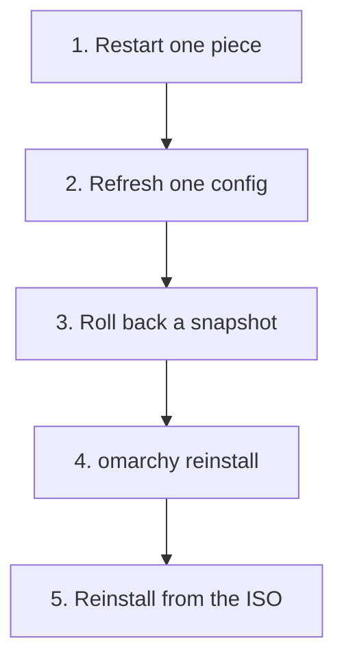

# The Cheat Card and the Repair Ladder

Something is wrong and your heart rate is up. Start with the table below, find the row that looks like your problem, and do the first thing in it. Most rows are one command or one menu click. The rest of this guide explains why each fix works, so that next time you can reason instead of look it up.

## The cheat card

| Symptom | Calm first move |
|---|---|
| An update finished and the desktop is broken or will not start | Restart, pick the snapshot from before the update in the boot menu. See [Phase 2](02-snapshots-and-rolling-back.md). |
| The update ended with an "initramfs generation may have failed" warning | Do not reboot yet. Read the update log. See [Phase 3](03-reading-logs-and-rescuing-a-dead-desktop.md). |
| The update refuses to start, complaining about disk space | Free space on `/` first. See [Phase 3](03-reading-logs-and-rescuing-a-dead-desktop.md). |
| The bar, menu, or panels are frozen or blank | _Update > Process > Shell_, or run `omarchy restart shell` |
| Wi-Fi, Bluetooth, audio, or the trackpad stopped working | _Update > Hardware_ and pick the one that broke. See [Phase 4](04-hardware-gremlins-getting-help-and-reinstalling.md). |
| You edited a config and now a key, monitor, or setting misbehaves | Put your backup back, or `omarchy refresh config hypr/bindings.lua` (it saves a timestamped backup of your version first) |
| Everything looks huge on a normal-density monitor | Set `local omarchy_gdk_scale = 1` in `~/.config/hypr/monitors.lua` |
| External speakers are silent | Pick them as the output in the Audio panel (`Super + Ctrl + A`) |
| Caps Lock does nothing | Working as designed: it is the compose key. See [Phase 4](04-hardware-gremlins-getting-help-and-reinstalling.md). |
| Locked out after too many wrong passwords | The manual's fix is a text login on `Ctrl + Alt + F2`. See [Phase 3](03-reading-logs-and-rescuing-a-dead-desktop.md) for the caveat. |
| You need to ask for help | `omarchy debug`, then the `#omarchy-help` channel. See [Phase 4](04-hardware-gremlins-getting-help-and-reinstalling.md). |
| Your configs look corrupted beyond repair | `omarchy reinstall` (this overwrites your config changes) |

## Three layers, three owners

The table looks like a grab bag, but every row follows one idea. Your Omarchy machine is built from layers that different people own, and a repair only helps if it touches the layer that is broken.

| Layer | Where it lives | Who owns it | What repairs it |
|---|---|---|---|
| Running programs | Memory | Nobody, it resets | Restarting the piece |
| Your config and files | `~/.config`, the rest of your home folder | You | Your backup, `omarchy refresh config`, `omarchy reinstall configs` |
| Omarchy and system packages | `/usr/share/omarchy` and the rest of the system | Omarchy and pacman | A snapshot rollback, `omarchy reinstall pkgs` |

The manual puts it in one sentence: the dotfiles in `~/.config` are your files, and the files in `/usr/share/omarchy` belong to Omarchy. Updates replace the second kind and leave the first alone.

That split has a consequence people miss. **A snapshot rollback rewinds the system layer, not your home folder.** If you broke `bindings.lua`, rolling back will not fix it, because `bindings.lua` was never part of what gets rewound. And if an update broke the system, editing your config will not fix it. Naming the layer before you act is most of the skill.

> 💡 **Key point.** Before you run anything, ask: "Did I change this, or did an update change this?" Your own edit means a config-layer fix. An update means a system-layer fix, and the rollback is your first move.

## The repair ladder

Fixes are ordered from smallest to largest. Climb only as far as you need, because each rung touches more than the last.



1. **Restart one piece.** Restarting the shell, Wi-Fi, audio, or trackpad costs nothing and clears most "it worked five minutes ago" problems. Reaching for a reboot first throws away the clue of which piece failed.
2. **Refresh one config.** `omarchy refresh config <path>` copies the shipped version of one file into `~/.config` and saves yours next to it as a timestamped `.bak` file.
3. **Roll back a snapshot.** Rewinds the system to the moment before the last update. Your home folder stays as it is.
4. **`omarchy reinstall`.** Reinstalls the default Omarchy packages and resets your configs to the defaults. Your config changes are overwritten.
5. **Reinstall from the ISO.** A full reinstall. A full-disk install wipes the drive you select, so back up first.

The manual's own advice for a bad update matches this order: try the rollback, then run `omarchy debug` to ask for help, and only then reinstall the defaults.

⚠️ **Gotcha.** The ladder is not a straight line for every problem. A dead Wi-Fi service belongs on rung 1 and never needs rung 3. A bad update goes straight to rung 3 and skips 1 and 2. Match the rung to the layer, not to how frightened you feel.

Check yourself before moving on:

```quiz
[
  {
    "q": "You edited ~/.config/hypr/bindings.lua an hour ago and a hotkey now misbehaves. Which repair targets the right layer?",
    "choices": [
      "Roll back to the snapshot from the last update",
      "Restore your backup of bindings.lua, or run omarchy refresh config hypr/bindings.lua",
      "Reinstall from the ISO"
    ],
    "answer": 1,
    "explain": "bindings.lua lives in your home folder, which is your layer. A snapshot rollback rewinds the system but not /home, so it would not touch this file at all.",
    "why": [
      "A rollback restores the root filesystem, not your home folder, so your edited file stays exactly as it is.",
      null,
      "That works but wipes a drive to fix one file. Always take the smallest rung that touches the broken layer."
    ]
  },
  {
    "q": "Who owns the files in /usr/share/omarchy?",
    "choices": ["You, so edit them freely", "Omarchy, and updates overwrite them", "Nobody, they are temporary"],
    "answer": 1,
    "explain": "Those files belong to Omarchy and come from packages, so an update replaces them. Put your changes in ~/.config instead."
  },
  {
    "q": "The Wi-Fi died after a suspend and nothing else is wrong. What is the best first move?",
    "choices": [
      "Restart only the Wi-Fi piece from Update > Hardware",
      "Run omarchy reinstall",
      "Roll back the last snapshot"
    ],
    "answer": 0,
    "explain": "Restarting one subsystem is the smallest rung and clears most it-worked-a-minute-ago problems. It also tells you which piece failed."
  }
]
```

## Recap

1. Find your symptom on the cheat card and do its first move before anything else.
2. Three layers: running programs, your files in `~/.config` and your home folder, and Omarchy's system files.
3. A snapshot rollback rewinds the system but not `/home`, so it cannot fix a config you edited.
4. Climb the ladder from smallest to largest: restart a piece, refresh a config, roll back, `omarchy reinstall`, ISO.
5. Ask "did I change this, or did an update?" before you pick a rung.

Next up, [Snapshots and Rolling Back](02-snapshots-and-rolling-back.md): how the safety net is made, and how to use it.
