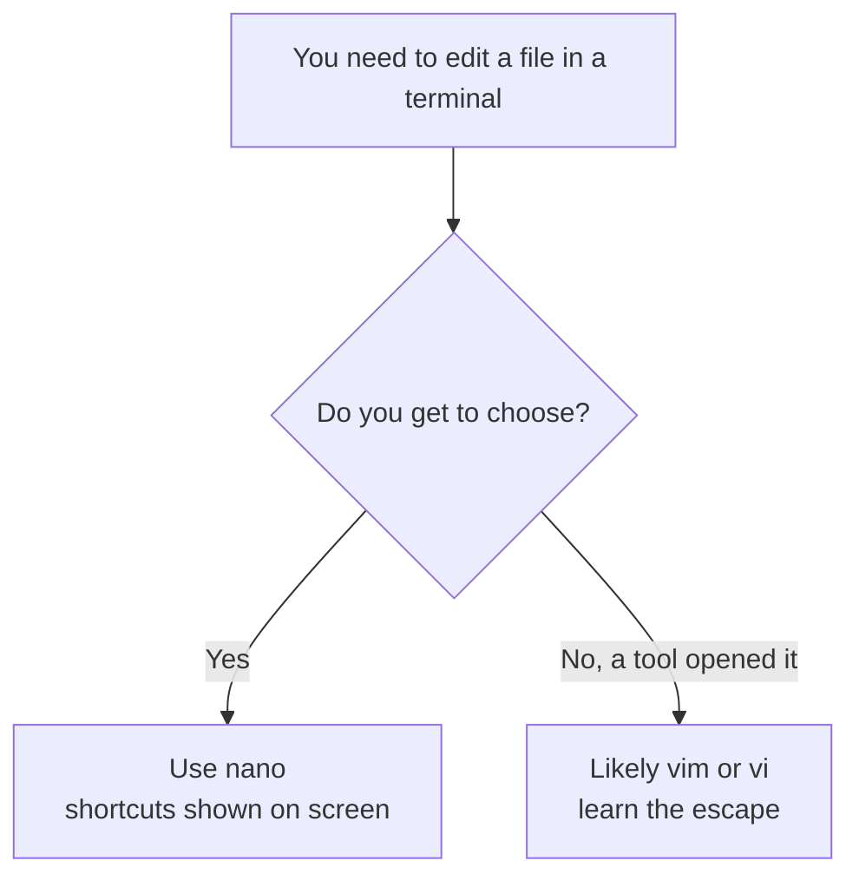

# Why edit in the terminal at all

It's a fair question. You have a perfectly good editor on your laptop - VS Code, Notepad, whatever you
like - with a mouse and menus and a friendly Save button. So why would anyone choose to edit text inside a
terminal window, with no mouse and cryptic key combinations? The real answer is that most of the time you
*don't* choose it. Something puts you there, and you need to be able to handle it without panic.

## The moment it actually happens to you

Here's the realistic scene. You connect to a server - a machine in a data center you'll never physically
touch - to fix a setting. You open the connection over **SSH** (the standard way to get a shell on a remote
machine), and you land at a prompt:

```console
$ ssh ada@web-prod-01
ada@web-prod-01:~$ nano /etc/nginx/nginx.conf
```
*What just happened:* You logged into a remote server and asked to edit its web-server config file. There
is no desktop on that machine - no windows, no taskbar, nothing to click. The *only* interface is this text
prompt, and the only way to change that file is a text editor that also lives in the terminal. That's the
whole reason this skill exists: on the machines that run the actual internet, the terminal editor isn't a
preference, it's the only door.

This isn't an edge case. The vast majority of servers run a desktop-free version of Linux precisely *because*
a graphical interface wastes memory and adds attack surface they don't need. So the machines you'll fix,
deploy to, and debug are exactly the ones where you can't reach for a mouse.

## The three situations that drop you into an editor

You'll meet a terminal editor in three common ways. Recognizing which one you're in tells you what to do:

- **You opened it on purpose.** You typed `nano somefile` or `vim somefile` to change a file. You chose the
  editor, so you know which one you're in.
- **A tool opened it *for* you.** Some commands hand you an editor to fill in. The classic is `git commit`
  with no message - it pops you into an editor to type your commit message, and on many systems that editor
  is **vim**. This is the single most common way people end up trapped in vim without ever choosing it.
- **It's the only thing installed.** A stripped-down server might have `vi` (vim's older sibling) and
  nothing friendlier. You don't get a vote; you use what's there.

💡 **Key point.** The reason "how do I quit vim" is one of the most-asked questions on the entire internet
is situation two: a tool drops people into vim, they've never seen it, and there's no visible exit. By the
end of this guide that exact situation will be a non-event for you.

## The mental map: which editor, and which to reach for

Two editors cover almost everything you'll meet. Here's the calm version of when each shows up:



**nano - the gentle one.** `nano` is a small, friendly editor that works the way your instincts expect:
you type, the text appears, the arrow keys move the cursor, and a menu of shortcuts sits at the bottom of
the screen *the whole time*. There's nothing hidden. If `nano` is installed - and it usually is - it's the
right pick whenever the choice is yours. Phase 2 makes you fluent in it in about ten minutes.

**vim - the powerful one that's everywhere.** `vim` (and its ancestor `vi`) is on essentially every
Unix-like system that exists, including the most stripped-down ones. It's genuinely powerful once you learn
it, but it has a famously steep first step, because it has *modes* - and not knowing about modes is exactly
what traps people. Phase 3 explains that one idea and hands you the guaranteed way out.

⚠️ **Gotcha.** `nano` is *usually* installed but not *always*, especially on minimal servers and inside
small containers. `vi`/`vim` is the one you can count on being present everywhere. That's the practical
reason it's worth knowing at least enough vim to open a file, make a change, and quit - even if `nano` is
your daily driver.

## For builders

When you're scripting setup for a server or writing instructions for your team, prefer changing config
files with non-interactive tools - `sed`, `tee`, or writing the whole file with a redirect - rather than
telling people to "open it in an editor and change line 14." Interactive editing doesn't automate and isn't
repeatable. Save the hands-on editor for the times you're genuinely poking at one machine by hand; for
anything you'll do twice, let a command do it so it's saveable and shareable.

## Recap

1. On servers and over **SSH** there's often no desktop and no mouse - a terminal editor is the only way to
   change a file.
2. You meet one in three ways: you opened it on purpose, a tool (like `git commit`) opened it for you, or
   it's the only editor installed.
3. **nano** is the gentle default - it shows its shortcuts on screen. Reach for it whenever the choice is
   yours.
4. **vim**/`vi` is everywhere, including the most minimal machines, so it's worth knowing the basics even if
   nano is your favorite.
5. The infamous "stuck in vim" panic comes from a tool dropping you in without warning - and it ends once
   you understand modes.

Let's start with the editor you can use the moment you learn it.

```quiz
[
  {
    "q": "Why do so many servers have no graphical editor like Notepad or VS Code available?",
    "choices": ["Editing text is illegal on servers", "Many servers run desktop-free Linux to save memory and reduce attack surface", "Mice don't work over a network", "Graphical editors only exist on Windows"],
    "answer": 1,
    "explain": "Most servers deliberately skip a desktop environment, so the terminal - and a terminal editor - is the only interface available."
  },
  {
    "q": "What's the most common way people end up inside vim without ever choosing it?",
    "choices": ["The OS opens vim at startup", "A tool like `git commit` drops them into vim to type a message", "Pressing the spacebar launches vim", "vim opens whenever you log in over SSH"],
    "answer": 1,
    "explain": "Running `git commit` with no message opens an editor - often vim - which is why 'how do I quit vim' is so widely asked."
  },
  {
    "q": "Which editor can you rely on being present even on the most stripped-down servers?",
    "choices": ["nano", "VS Code", "vi/vim", "Notepad"],
    "answer": 2,
    "explain": "vi/vim ships on essentially every Unix-like system; nano is usually but not always installed."
  }
]
```

---

[← Guide overview](_guide.md) · [Phase 2: nano - the gentle default →](02-nano-the-gentle-default.md)
