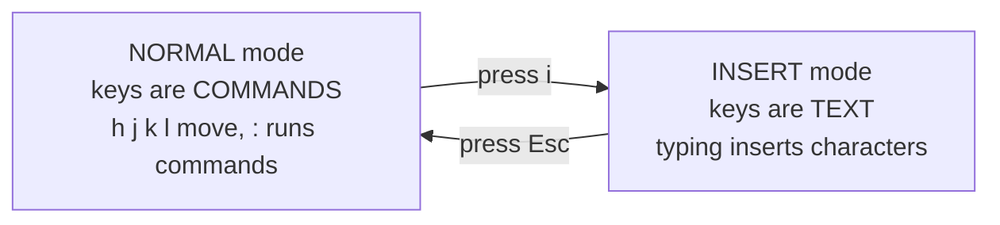

# vim: the mode that traps everyone, and the way out

If a tool dropped you into vim right now and you need out, here it is first, no theory required: press
**`Esc`**, then type **`:q!`** and press **Enter**. That quits and discards any changes. To save your work
on the way out instead, press **`Esc`**, type **`:wq`**, and press Enter. That's the famous escape, and the
rest of this phase explains *why* it works so it stops feeling like a magic spell.

## The one idea behind everything: modes

The thing nobody told you the first time, the thing that makes vim feel broken when you don't know it:
**vim has modes**. The same keys on your keyboard do *completely different things* depending on which mode
you're in.



**Normal mode** is where vim starts. Letter keys are *commands*, not text - `i` doesn't type "i", it means
"start inserting"; `x` deletes a character. This is why beginners panic: they start typing, the cursor jumps
around and things vanish, because vim is reading every keystroke as a command. Nothing is broken.

**Insert mode** is where you actually type text - letters appear, Backspace deletes, Enter makes a new
line, exactly as expected. This is the mode you spend your typing time in.

💡 **Key point.** The entire "vim is impossible" experience comes from not knowing you start in *normal*
mode. Switch to insert before typing, switch back to normal before giving commands. Two modes, one toggle -
learn it and vim stops fighting you.

## Switching between the two modes

Two keystrokes run the whole dance:

- **Press `i`** (in normal mode) to enter **insert mode**. Think *i* for *insert*. Now type normally.
- **Press `Esc`** (in insert mode) to return to **normal mode**. `Esc` always takes you back to normal,
  from anywhere. When in doubt, press `Esc`.

When you're in insert mode, vim usually shows `-- INSERT --` at the very bottom of the screen so you can
tell. If you don't see it, you're in normal mode.

```text
~
~
-- INSERT --
```
*What just happened:* the `-- INSERT --` marker confirms you're in insert mode, so keys now become text.
(The `~` lines just mark empty rows below the file - not content.) Press `Esc` and the marker disappears -
you're back in normal mode.

⚠️ **Gotcha.** When you're lost, your reflex should be **`Esc`**. It's harmless to press in normal mode (it
stays put) and it always escapes insert mode. Pressing `Esc` first is what makes the `:wq` / `:q!`
commands work - those commands are only understood in normal mode, so you *must* leave insert mode before
typing them.

## The colon: giving vim a command

In normal mode, pressing **`:`** moves the cursor to the bottom of the screen and lets you type a command,
ending with Enter. The colon commands you actually need are short:

```text
:w      → write (save) the file, stay open
:q      → quit (only works if there are no unsaved changes)
:wq     → write then quit (save and exit)  ← the common one
:q!     → quit, force, discarding changes   ← the escape hatch
```
*What just happened:* These four cover everything for survival. `:w` saves, `:q` quits a clean file, `:wq`
does both in one go, and `:q!` forces a quit even with unsaved changes. The `!` means "I mean it, do it
anyway" - it's what you use when you've made a mess and want to bail without saving.

📝 **Why `:q` sometimes refuses.** If you try `:q` after changing the file, vim stops you with
`E37: No write since last change` - it's refusing to silently lose your edits, the same protective instinct
nano has. Your two real answers are `:wq` (keep the changes) or `:q!` (throw them away). vim won't decide
for you.

## The full survival workflow

Put the pieces together and editing a file in vim is a clear sequence:

```console
ada@laptop:~$ vim notes.txt
```
That opens in **normal mode** - don't start typing yet. Now the loop, step by step:

```text
1. vim somefile     → opens in NORMAL mode (keys are commands)
2. press  i         → switch to INSERT mode (you see -- INSERT --)
3. type your edits  → text behaves normally now
4. press  Esc       → back to NORMAL mode
5. type  :wq  Enter → save and quit
```
*What just happened:* the complete, safe round trip - open, `i` to insert, type, `Esc`, `:wq`. The two
moments that trip everyone are step 2 (enter insert mode before typing) and step 4 (press `Esc` before
`:wq`). Once those are muscle memory, vim is just an editor with one extra concept.

## When you've made a mess and want out clean

You mashed keys in confusion and don't know what state the file is in. Here's the calm exit - the scenario
from the top of the phase, now with the *why* attached:

```text
1. Press  Esc       → guarantees you're in NORMAL mode
2. Type   :q!       → quit, discard ALL changes
3. Press  Enter     → you're back at the shell, file untouched
```
*What just happened:* `Esc` gets you to normal mode no matter what you'd been doing, and `:q!` quits while
throwing away every change since you opened the file - none of it hits disk. This is the sequence to
remember for life; it's the answer to "help, I'm stuck in vim."

## A few normal-mode moves worth knowing (optional)

You can survive on insert mode and `Esc` alone, but a handful of normal-mode commands make vim pleasant.
Press `Esc` first to be sure you're in normal mode, then:

- **`h` `j` `k` `l`** - move the cursor left, down, up, right. (The arrow keys also work in modern vim; the
  letters are the classic muscle memory.)
- **`x`** - delete the character under the cursor.
- **`dd`** - delete (cut) the whole current line.
- **`u`** - undo the last change. Press it repeatedly to walk back through your edits.
- **`/word`** then Enter - search forward for `word`; press `n` for the next match.

💡 **Key point.** That `u` for undo is the gentle companion to `:q!`. If you only damaged one thing, you
don't have to throw away everything with `:q!` - press `Esc`, tap `u` until the damage is undone, then save
normally with `:wq`. Undo first, nuke only as a last resort.

## vi vs vim - the same survival skills

On older or minimal systems the command might be `vi` rather than `vim` ("vim" stands for *vi improved*).
For everything in this guide - modes, `i`, `Esc`, `:wq`, `:q!` - they behave the same. The escape you
learned works in both. If `vim` isn't found, try `vi`; if `vi` opens, you already know what to do.

## For builders

If a tool keeps dropping you into vim and you'd rather it didn't, add `export EDITOR=nano` (or
`export EDITOR=vim`) to your shell startup file - `git commit` and `crontab -e` will honor it. Either way,
knowing the `Esc` → `:wq` / `:q!` escape means you're never trapped again, regardless of what a tool throws
at you. (Shell itself still shaky? [/guides/the-terminal-and-shell](/guides/the-terminal-and-shell) and
[/guides/linux-from-zero](/guides/linux-from-zero) are the natural next reads.)

## Recap

1. vim's one big idea is **modes**: in **normal mode** keys are commands; in **insert mode** keys are text.
2. Press **`i`** to enter insert mode (you'll see `-- INSERT --`); press **`Esc`** to return to normal mode.
3. Colon commands run in normal mode: `:w` save, `:q` quit, **`:wq`** save-and-quit, **`:q!`** quit and
   discard.
4. The universal escape: **`Esc`** then **`:q!`** then **Enter** quits and throws away every change - the
   file on disk is untouched.
5. `u` undoes one change at a time, so you can fix a small mistake instead of discarding all your work; and
   `vi` behaves like `vim` for all of this.

That's it - you can now open, edit, save, and (the part everyone feared) *quit* both editors you'll ever
meet in a terminal, on your laptop or on a server you've never seen.

```quiz
[
  {
    "q": "You opened vim and start typing your text, but the cursor jumps around and characters vanish. What's actually going on?",
    "choices": ["vim is broken and needs reinstalling", "You're in normal mode, where keys are commands, not text", "The file is read-only", "Your keyboard is in the wrong language"],
    "answer": 1,
    "explain": "vim starts in normal mode, where letters are commands. Press i to enter insert mode before typing text."
  },
  {
    "q": "You've made accidental edits and want to quit vim WITHOUT saving them. What's the sequence?",
    "choices": ["Type :wq and press Enter", "Press Esc, type :q!, press Enter", "Press Ctrl+X", "Type :save then quit"],
    "answer": 1,
    "explain": "Esc guarantees normal mode, and :q! forces a quit while discarding all changes - the file on disk stays untouched."
  },
  {
    "q": "What's the difference between :wq and :q! in vim?",
    "choices": ["They're identical", ":wq saves then quits; :q! quits and discards changes", ":wq quits without saving; :q! saves", ":wq works only in insert mode"],
    "answer": 1,
    "explain": ":wq writes (saves) and then quits, while :q! force-quits and throws away any unsaved changes."
  }
]
```

---

[← Phase 2: nano - the gentle default](02-nano-the-gentle-default.md) · [Guide overview](_guide.md)
