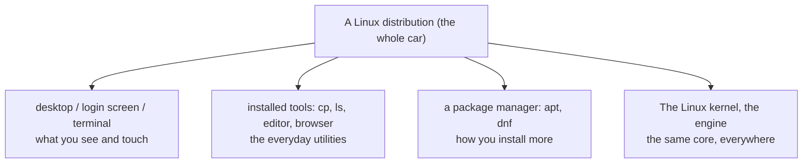

# What Linux Actually Is

Before a single command, let's fix the one confusion that makes Linux feel bewildering from the outside:
the word "Linux" gets used for two different things, and nobody tells you which one they mean.

Get this one idea straight and the whole landscape - the distros, the penguin, the arguments online -
suddenly clicks into place.

## Linux is the engine, not the car

**What it actually is.** Strictly speaking, *Linux* is a **kernel** - the core program that sits between
your software and your hardware and manages the machine. It's the thing that decides which program gets
the CPU right now, where each program's data lives in memory, and whether a program is even allowed to
open a file.

> ⏭️ If "kernel" is a fuzzy word, [The Manager in the Middle](/guides/what-an-operating-system-is) builds
> that idea from scratch. The one-line version: the kernel is the trusted core of the operating system
> that actually talks to the hardware, and everything else asks it for help.

But a kernel on its own is like a car engine sitting on a workshop floor. Powerful, essential - and not
something you can *drive*. To get a usable computer, you need everything wrapped around the engine: a way
to log in, a terminal, tools to copy files and install software, maybe a desktop with windows and a mouse.

That whole assembled package - kernel **plus** all the surrounding software - is a **distribution**
("distro" for short). Ubuntu, Fedora, and Debian are distributions. They are the car. Linux is the engine
inside all of them.

📝 **Terminology.** *Kernel* = the core that manages hardware. *Distribution / distro* = the kernel
bundled with all the extra software that makes a complete, usable system. When someone says "I run
Ubuntu," they mean a distro; the Linux kernel is humming away inside it.

## Why there are a hundred distros (and why that's less scary than it looks)

Here's the part that overwhelms newcomers: search "Linux distributions" and you'll find *hundreds*.
Ubuntu, Fedora, Debian, Arch, Mint, Pop!_OS, Manjaro, Alpine, on and on. It looks like a hundred
different operating systems to learn.

It isn't. **They are overwhelmingly the same thing underneath** - the same Linux kernel, and largely the
same core tools (the `ls`, `cd`, and `cp` commands work the same on all of them). A distro is mostly a set
of *choices and defaults* layered on top:

- **How you install software** - Debian and Ubuntu use a tool called `apt`; Fedora uses `dnf`. (We cover
  this in [Phase 2](02-getting-around.md).)
- **What comes pre-installed** - which desktop, which default apps, which versions.
- **How new vs. how stable** - Debian prizes rock-solid stability (older, battle-tested software); Fedora
  ships newer software sooner; Ubuntu sits in between and aims for friendliness.
- **Who maintains it and why** - a company, a community, a particular philosophy.

Why so many? Because Linux is *open* (more on that below), anyone can take an existing distro, change the
defaults to suit a purpose, and release their own. Ubuntu itself is built on top of Debian. Mint is built
on top of Ubuntu. It's less "a hundred rival operating systems" and more "a family tree of the same OS
with different preferences."

💡 **Key point.** Learning "Linux" is not learning a hundred systems. Learn the shared core once - files,
permissions, the package manager, services - and you can sit down at almost any distro and find your way.
The differences are mostly *which command installs software* and *what's on by default*.

⚠️ **Gotcha.** The one place the distro choice genuinely matters early on is the package manager. A
tutorial that says `apt install` assumes Debian/Ubuntu; on Fedora the same step is `dnf install`. When a
command "doesn't exist," the usual cause is that it's the other family's tool - not that you did something
wrong. Knowing your distro's family tells you which to use.

## Where Linux actually runs (spoiler: nearly everywhere)

People think of Linux as a niche desktop for enthusiasts. The reality is almost the opposite - Linux is
one of the most widely deployed pieces of software on Earth; you just rarely see its face:

- **Servers.** The large majority of the machines that run websites and online services run Linux. When
  you load almost any web page, a Linux machine somewhere served it.
- **Android.** Every Android phone runs on the Linux kernel. If you've used an Android device, you've been
  running Linux without thinking about it.
- **Devices everywhere.** Wi-Fi routers, smart TVs, cars, point-of-sale terminals, the Raspberry Pi on a
  hobbyist's desk - a huge amount of the embedded world runs Linux.
- **The cloud.** When you "rent a server" from a cloud provider, you are nearly always renting a Linux
  machine.

**Why this saves you later.** This is exactly why learning Linux is worth your time even if your personal
laptop runs Windows or macOS. The moment you deploy code, rent a server, work with containers, or touch
almost any backend, you are standing on Linux. Being comfortable here isn't an exotic specialty - it's a
core part of the floor you'll be walking on for your whole career.

## Free and open source - what that really buys you

You'll hear Linux called "free and open source." That's two promises, and they're worth separating:

- **Free** - you don't pay for it. You can download a full, complete distro and run it on as many machines
  as you like, no license fee.
- **Open source** - the actual source code is public. Anyone can read it, study how it works, suggest
  changes, or build their own version from it. It's not a black box you have to trust blindly; it's a
  workshop with the doors open.

📝 **Terminology.** *Open source* = the source code is published under a license that lets anyone read,
modify, and redistribute it. *Free* here means both "no cost" and "free as in freedom to change it" - the
Linux world cares about both meanings.

This is *why* there can be so many distros, *why* a router manufacturer can put Linux on its hardware
without paying anyone, and *why* a global community keeps improving the same kernel. The openness isn't a
side note - it's the reason the whole ecosystem exists and the reason Linux ended up everywhere.

## Recap

1. **Linux is a kernel** - the core that manages the hardware. By itself it's an engine, not a drivable car.
2. A **distribution** (Ubuntu, Fedora, Debian…) is that same kernel **plus** the surrounding software that
   makes a complete, usable system.
3. The hundreds of distros are **mostly the same thing** - same kernel, same core tools - differing mainly
   in their package manager, defaults, and how new vs. stable their software is.
4. Linux runs **nearly everywhere it matters** - most servers, every Android phone, countless devices, and
   the cloud - which is why learning it pays off no matter what your own laptop runs.
5. It's **free and open source**: no cost, and the code is public for anyone to read and build on - which
   is the reason the whole ecosystem and all those distros exist.

Now that you know what you're sitting in front of, let's learn to move around inside it - starting with a
filesystem layout that catches every newcomer off guard.

---

[← Guide overview](_guide.md) · [Phase 2: Getting Around →](02-getting-around.md)
